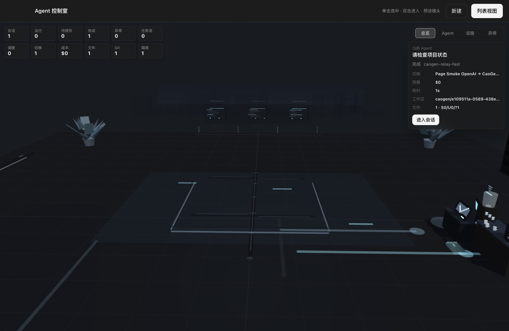

<div align="center">

<p><a href="./README.md">简体中文</a> | <strong>English</strong></p>


# CaoGen

## A multi-vendor AI work desktop. Bring your own keys, run the models you choose, and fail over by policy when a service becomes unavailable.


[Download](https://github.com/ChaoYuZhang001/CaoGen/releases) · [Quick Start](#quick-start) · [Discussions](https://github.com/ChaoYuZhang001/CaoGen/discussions) · [Contribute](#contribute-to-caogen) · [Roadmap](#roadmap--long-term-vision-under-construction)


</div>

## What is CaoGen?

CaoGen is an open-source, vendor-neutral, local-first AI work desktop that brings multi-provider models, your local projects, and the tools needed to complete work into one Electron app. You use your own API keys and treat providers as replaceable compute while project directories, worktrees, tools, and review stay in your desktop workflow.

It gives users one reviewable local workspace for multiple models, projects, files, tasks, and tools.

> “The models you choose” means models reachable through CaoGen's OpenAI-compatible or native Anthropic Messages HTTP runtimes. Availability still depends on protocol compatibility, account access, network conditions, and quota. The base distribution embeds no external Agent SDK or CLI.

| Capability | CaoGen today | Evidence boundary |
|---|---|---|
| Providers and models | Multiple providers, BYOK, and custom compatible services | Only configured, protocol-compatible targets are in scope |
| Failure recovery | Controlled failover across backup keys and configured providers | External accounts, networks, and quota can still block requests |
| Local workflow | Local projects, Git worktrees, Diff, terminal, and file tools | High-risk actions remain subject to permission and acceptance gates |
| Openness | AGPL-3.0-only with separate commercial licensing | The v0.1.7 macOS Intel x64 installer is Developer ID signed and Apple-notarized |

This table describes the current product structure. It does not claim that every model, provider, or external network condition has been validated; see [STATUS.md](./STATUS.md) for exact boundaries.

## Current progress

As of 2026-07-28, the PRD has 64 P0s: 21 verified, 19 partially complete, 23 project targets, and 1 foundation only. This snapshot comes from the [1.0 acceptance matrix](./docs/1.0-ACCEPTANCE-MATRIX.md), not a version-completion percentage; the published `v0.1.7` is a signed wedge release, not 1.0 stable.

> **Seeking one first-time Intel Mac user** for a private, 30-minute v0.1.7 install, Provider setup, and read-only task drill. Eligibility, privacy boundaries, and the volunteer format are in [Discussion #9](https://github.com/ChaoYuZhang001/CaoGen/discussions/9). Never post keys, Provider URLs, or project paths.

## Core capabilities available today

- **Connect multiple providers with BYOK**: configure multiple providers and API keys, custom base URLs, gateways, or local OpenAI-compatible services for common compatible model sources such as DeepSeek, Kimi, and GLM.
- **Route work and fail over automatically**: choose targets by capability, cost, speed, budget, and health; for recoverable quota, rate-limit, server, or network failures, try a backup key first and then a configured healthy provider.
- **Isolate task changes**: create a dedicated Git worktree for a session, inspect diffs and conflicts before merging, export or apply patches, and discard the isolated workspace when needed.
- **Finish work inside one workbench**: use an integrated terminal, file browser, text editor, browser, Diff and Git tools, plus previews for HTML, Markdown, JSON, CSV, images, PDF, and Office documents.
- **Inspect a live 3D office**: visualize real session state including running, approval, completed, failed, provider, cost, subtask, and worktree/Git signals. The current release uses robot office assets; the ink-animation character direction remains roadmap work.



## Quick Start

1. **Download**: for macOS Intel x64, use the signed and notarized [v0.1.7 release](https://github.com/ChaoYuZhang001/CaoGen/releases/tag/v0.1.7). Windows x64 remains on v0.1.5. There are no current macOS Apple Silicon arm64 or Linux release assets.
2. **Add a provider and key**: open Settings, select a provider template or enter the base URL of a compatible service, then add your own API key. Keys are never committed to this repository.
3. **Run your first task**: create a session, select a local project directory or use an unassigned session, then try: `Read this project and tell me how it starts, which files matter most, and the three highest-value issues. Do not change anything yet.`

> The v0.1.7 macOS Intel x64 installer is Developer ID signed, Apple-notarized, and Gatekeeper-verified. Windows x64 v0.1.5 is a retained older release; download only from this repository's Releases and verify the corresponding release notes. Formal 1.0 acceptance and release readiness are tracked in [STATUS.md](./STATUS.md).

Run from source:

```bash
git clone https://github.com/ChaoYuZhang001/CaoGen.git
cd CaoGen
npm install
npm run dev
```

## Roadmap / Long-term vision (under construction)

CaoGen's long-term direction is a vendor-neutral Agent Work OS built around persistent Goals, WorkItems, digital workers, Artifacts/Evidence, acceptance, and recovery, alongside a richer 3D office experience. These are roadmap goals, not a claim about features available today; read the [active execution plan](./docs/PLAN.md), [Project Charter](./docs/PROJECT-CHARTER.md), [Product Requirements](./docs/PRODUCT-REQUIREMENTS.md), and [Current Status](./STATUS.md) for the intended scope and verified progress.

## Contribute to CaoGen

**We are looking for people who want to build reliable, vendor-neutral, local-first AI work infrastructure in the open.**

- Read [CONTRIBUTING.md](./CONTRIBUTING.md) for local setup, the six-link architecture path, and the pull request workflow.
- Start with the [good-first-issue drafts](./docs/good-first-issues.md) or the live GitHub [good first issues](https://github.com/ChaoYuZhang001/CaoGen/issues?q=is%3Aissue%20state%3Aopen%20label%3A%22good%20first%20issue%22).
- Use [GitHub Discussions](https://github.com/ChaoYuZhang001/CaoGen/discussions) for experience reports, questions, and improvement ideas. See [SUPPORT.md](./SUPPORT.md) for routing and the 48-hour initial-response commitment.
- Open a [bug report](https://github.com/ChaoYuZhang001/CaoGen/issues/new?template=bug_report.yml), [feature request](https://github.com/ChaoYuZhang001/CaoGen/issues/new?template=feature_request.yml), or pull request.

Report security issues privately through [SECURITY.md](./SECURITY.md). CaoGen is licensed under [AGPL-3.0-only](./LICENSE), with a separate [commercial license](./COMMERCIAL-LICENSE.md) available.
