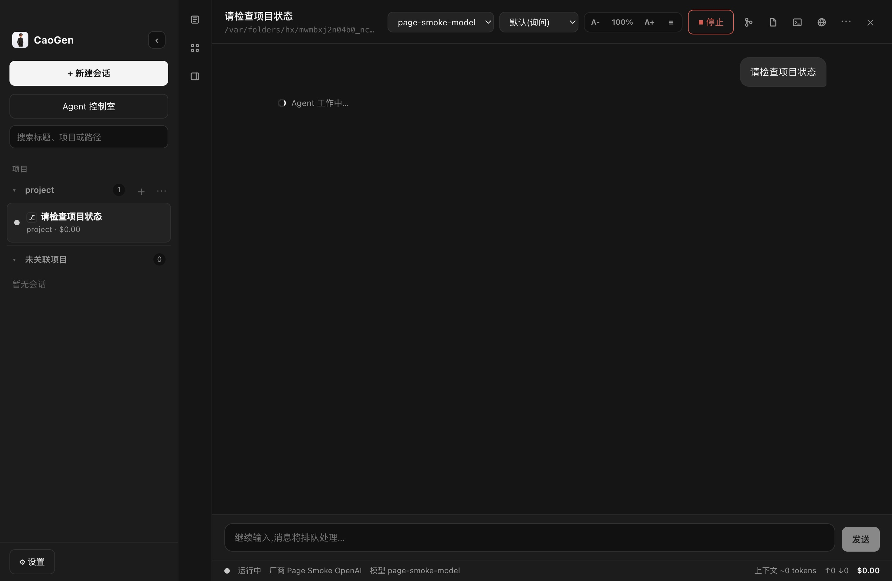

<div align="center">

<p><a href="./README.md">简体中文</a> | <strong>English</strong></p>


# CaoGen

## Use your own keys to get real work done locally. Fail over by policy when a service is unavailable, and review every change.


[Download](https://github.com/ChaoYuZhang001/CaoGen/releases) · [Quick Start](#quick-start) · [Discussions](https://github.com/ChaoYuZhang001/CaoGen/discussions) · [Contribute](#contribute-to-caogen) · [Roadmap](#roadmap--long-term-vision-under-construction)



</div>

## What CaoGen helps you do

CaoGen is an open-source, vendor-neutral, local-first multi-vendor AI work desktop. Users connect configured model providers with their own API keys and manage multiple models, projects, files, tasks, and tools in one place. When a service fails, CaoGen can try another configured key or compatible provider while keeping the project, records, and review flow under CaoGen's control.

It is built for two groups:

- **People who want AI to finish everyday work**: organize research, write documents, work with tables, and inspect final outputs without first learning routing, Git, or task graphs.
- **Professional users managing several projects and keys**: inspect sessions, terminal, files, browser, diffs, Git, worktrees, cost, and approvals in one workbench.

The current public release can:

- Configure multiple model providers, API keys, custom endpoints, and local compatible services.
- Select execution paths by task, cost, speed, quality, and health while recording route changes.
- Run changes in isolated Git worktrees and inspect diffs, conflicts, tests, and patches before merge.
- Use terminal, files, browser, Git, and previews for PDFs, images, and Office documents in the app.
- Inspect real session, approval, failure, cost, and workspace state in the 3D office.

## Current status

`v0.1.8` is the current public release. `main` contains unreleased development work. Treat the notes and checksums on each GitHub Release as the public capability boundary; unreleased source is not a stable product claim.

> **Source versus release boundary**: the public `v0.1.8` Intel x64 installers remain fixed on Electron `40.10.2`. Current `main` source is validating Electron `41.10.3` and dependency security updates, but it is not a new formal release. After clean-candidate gates pass, these changes must ship under a later patch version; they must not replace or republish `v0.1.8`.

> **First-time-user acceptance remains open**: the target is a private, 30-minute install of a supported release asset, Provider setup, and read-only task drill. Eligibility, privacy boundaries, and the volunteer format are in [Discussion #9](https://github.com/ChaoYuZhang001/CaoGen/discussions/9). Never post keys, Provider URLs, or project paths.


## Quick Start

| Platform | Current entry | Trust state |
|---|---|---|
| macOS Intel x64 | [v0.1.8 DMG / ZIP](https://github.com/ChaoYuZhang001/CaoGen/releases/tag/v0.1.8) | Developer ID signed, Apple-notarized, and stapled |
| Windows x64 | No current v0.1.8 installer | The historical unsigned preview is not a current formal release |
| macOS Apple Silicon / Linux | No current installer | Build from source |

1. **Download and verify the source**: use only this repository's GitHub Releases and verify SHA-256 values in the Release Notes.
2. **Add a provider and key**: open Settings, select a provider template or enter the base URL of a compatible service, then add your own API key. Keys are never committed to this repository.
3. **Run your first task**: create a session, select a local project directory or use an unassigned session, then try: `Read this project and tell me how it starts, which files matter most, and the three highest-value issues. Do not change anything yet.`

> macOS and Windows have different signing states. Use the corresponding GitHub Release notes as the authority for each platform's signing and trust state.

Run from source:

```bash
git clone https://github.com/ChaoYuZhang001/CaoGen.git
cd CaoGen
npm install
npm run dev
```

## Roadmap / Long-term vision (under construction)

CaoGen's long-term direction is a vendor-neutral Agent Work OS built around persistent Goals, WorkItems, digital workers, Artifacts/Evidence, acceptance, and recovery, alongside a richer 3D office experience. These are development directions, not claims about released capabilities. Follow GitHub Releases, Issues, and Discussions for public progress.

## Contribute to CaoGen

**We are looking for people who want to build reliable, vendor-neutral, local-first AI work infrastructure in the open.**

- Read [CONTRIBUTING.md](./CONTRIBUTING.md) for local setup, the six-link architecture path, and the pull request workflow.
- Start with the live GitHub [good first issues](https://github.com/ChaoYuZhang001/CaoGen/issues?q=is%3Aissue%20state%3Aopen%20label%3A%22good%20first%20issue%22).
- Use [GitHub Discussions](https://github.com/ChaoYuZhang001/CaoGen/discussions) for experience reports, questions, and improvement ideas. See [SUPPORT.md](./SUPPORT.md) for routing and the 48-hour initial-response commitment.
- Open a [bug report](https://github.com/ChaoYuZhang001/CaoGen/issues/new?template=bug_report.yml), [feature request](https://github.com/ChaoYuZhang001/CaoGen/issues/new?template=feature_request.yml), or pull request.

Report security issues privately through [SECURITY.md](./SECURITY.md). CaoGen is licensed under [AGPL-3.0-only](./LICENSE), with a separate [commercial license](./COMMERCIAL-LICENSE.md) available.
