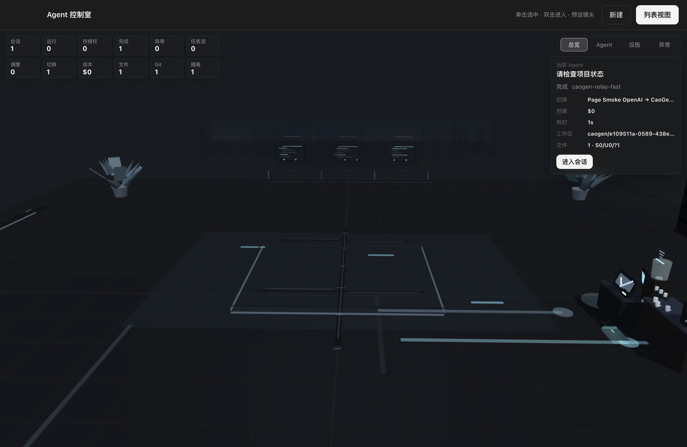

<div align="center">


# CaoGen（草根）

### 国产开源 · 多厂商不绑定 · AI 编码桌面工作室


**不绑厂商、不锁模型、不乱改主目录，你的桌面你做主。**

[立即下载](https://github.com/ChaoYuZhang001/CaoGen/releases) | [快速开始](#-3-分钟快速开始) | [路线图](./ROADMAP.md) | [反馈问题](https://github.com/ChaoYuZhang001/CaoGen/issues)

</div>

---

## 核心优势

| 不绑定任何厂商 | 真隔离不搞乱代码 | 为开发者而生 |
| :--- | :--- | :--- |
| Claude、OpenAI、DeepSeek、Qwen、Kimi、智谱、Grok、网关和本地模型都能接。余额不足、限流或服务异常时可自动切到健康 Provider。 | 每个任务可独立 Git worktree，AI 改代码不污染主目录。合并前先看 Diff，不想要的改动直接丢掉。 | 不是聊天套壳。内置终端、文件编辑、Diff、Git、预览、浏览器批注、多 Agent 编排和 3D 办公区。 |

一句话：**CaoGen 想把 Claude Code / Codex / Gemini CLI / Cursor / Cline / Aider 的高频编码工作流，收进一个可控、可审、可并行的桌面工作台。**

## 界面预览

| 主界面 | 3D 办公区 |
| :---: | :---: |
|  |  |

> 3D 办公区不是装饰：每个会话对应一个工位，运行中、等待审批、完成、失败、成本气泡和子代理消息流都来自真实会话状态。

## 为什么选 CaoGen？

| 痛点 | CaoGen | 常见限制 |
|---|---|---|
| 厂商绑定 | 支持 Claude / OpenAI 协议、国产模型、网关和本地模型；Provider 可自由切换 | 单厂商产品容易被余额、限流、账号、模型策略卡住 |
| 多任务乱改代码 | 每个任务可独立 worktree，合并前有 Diff、patch、冲突检查和回滚 | 多个 Agent 直接改同一目录时容易互相覆盖 |
| 代码安全边界 | 本地桌面应用，密钥加密落盘；代码只发给你自己选择的模型或工具服务 | 闭源 SaaS 边界不透明，难审计真实上传内容 |
| 成本 | MIT 开源免费；预算闸门可限制会话、Provider 和月度花费 | 订阅费和模型费叠加，重度使用成本不可控 |
| 国产适配 | 内置 DeepSeek / Qwen / Kimi / 智谱 / 豆包等常用模板，支持国内镜像配置 | 国际产品经常需要额外网关或网络处理 |
| 桌面体验 | 终端、浏览器、Git、预览、文件编辑、3D 多任务视图在一个工作台里 | CLI 强但不可视，简单套壳又缺少工程控制 |

## 核心功能

### 多模型支持

- Claude Agent SDK 默认引擎，与 Claude Code 同源。
- OpenAI 引擎支持 Responses API 与 Chat Completions 两种协议。
- 常用 Provider 模板：OpenAI、DeepSeek、Kimi、智谱 GLM、Grok、Qwen、百川、豆包、本地 OpenAI 兼容服务、one-api/new-api 网关。
- Chat Completions 兼容模型可通过工具调用循环读文件、改代码、跑命令，不只是聊天。
- 智能路由、故障切换、模型健康记录和预算闸门已接入。
- Codex CLI / Gemini CLI 引擎是实验性路径：Codex 已做真对话验证，Gemini 依赖用户本机 CLI 登录状态。

### 编码核心能力

- `@` 文件引用、文件补全、多图粘贴/拖拽、图片 OCR。
- 命令执行、文件读写、精确搜索替换、代码/符号检索、依赖查看等原生工具。
- Diff 审查、逐 hunk stage/discard、应用内 Git 提交。
- Worktree 合并审查、patch 导出/应用、冲突文件查看、PR/MR 创建（`gh` / `glab`）。
- `Esc Esc` / `/rewind` 检查点回溯；空闲时可即时重建引擎截断上下文，运行中下次 resume 截断。
- 可配置 Docker 沙箱、系统 shell 模式和宽松模式；敏感操作进入权限审批。

### 多 Agent 与多任务

- 主 Agent 一次最多派发 33 个子 Agent，并行处理复杂任务。
- 子代理结果自动回灌父会话，由父 Agent 汇总成败、冲突风险和合并顺序。
- DAG 任务调度已接入，可表达任务依赖、失败重试和断点恢复。
- DAG 自动合并属于高风险工作流，适合在测试仓库或明确验证命令下使用。
- 任务快照与会话历史持久化，重启后可恢复上下文。

### 桌面原生体验

- 内置终端，不用切出应用跑命令。
- 内置文件浏览和文本编辑器。
- HTML / Markdown / Text / CSV / JSON / 图片 / PDF 预览。
- 内置浏览器，支持选区批注、DOM 圈选、元素截图、控制台错误和网络失败观测。
- 系统通知和防休眠：任务完成、失败、等待审批时能提醒。
- GUI 自动化支持 Windows/macOS 路径，但默认关闭，属于高风险能力，需要显式授权。

### 特色功能

- 写实 3D 办公区：多会话、多 Provider、成本、状态、父子 Agent 消息流可视化。
- 项目记忆、分层记忆和记忆建议，确认后才沉淀。
- Claude / Codex plugin、skill、agent、MCP 扫描，支持启停、投递给 Agent 和 MCP 运行态探测。
- 自动 Skill 学习、复用和优化的基础链路已接入。
- 本地 Routines：可创建、编辑、运行、记录 run log；云端 Runner 不在当前版本范围内。
- 中英双语、深色/浅色/跟随系统主题。
- VS Code / JetBrains 插件与 IDE Bridge 正在推进，当前按实验性能力看待。

## 3 分钟快速开始

1. **下载安装**：从 [Releases](https://github.com/ChaoYuZhang001/CaoGen/releases) 下载对应系统安装包。
2. **添加模型**：打开设置，选择 Provider 模板，填入 API Key。DeepSeek、Qwen、Kimi、Claude、GPT、Grok、本地模型都可以。
3. **打开项目**：选择你的代码目录，新建会话，让 AI 开始读代码、改代码、跑测试、看 Diff。

第一次建议试这个提示词：

```text
帮我阅读这个项目，指出最重要的入口文件、启动方式和当前最值得修的 3 个问题。先不要改代码。
```

## 下载安装

从 [GitHub Releases](https://github.com/ChaoYuZhang001/CaoGen/releases) 下载最新版本：

- **macOS**：下载 `.dmg`，拖入「应用程序」。
- **Windows**：如当前最新版本没有 Windows 安装包，可先使用上一版 Windows NSIS 安装包。
- **Linux**：`package.json` 已配置 AppImage 打包目标；如果最新 Release 未上传 Linux 资产，请先从源码运行或自行打包。

> **macOS 首次打开说明**：当前安装包未签名，首次打开会被拦截。右键点击应用图标 → 选择「打开」→ 弹窗里再点「打开」即可；也可以在「系统设置 → 隐私与安全性」底部点「仍要打开」。之后正常双击即可。

也可以直接从源码运行，见下方「开发与贡献」。

## 常见问题

**Q: 必须要有 Claude 账号才能用吗？**

A: 不需要。Claude 引擎需要 Claude 登录或 `ANTHROPIC_API_KEY`，但 OpenAI 引擎可以直连任意 OpenAI 兼容模型，例如 DeepSeek、Qwen、Kimi、Grok、网关或本地模型。

**Q: 支持本地模型吗？**

A: 支持。只要你的本地服务提供 OpenAI 兼容接口，例如 Ollama、vLLM、LM Studio 或 one-api/new-api，就可以用 Chat Completions 协议接入。

**Q: AI 改坏我的代码怎么办？**

A: 建议新会话开启 worktree 隔离。AI 在独立 worktree 里改，合并前你可以看 Diff、导出 patch、检查冲突；不想要就丢掉。检查点回溯也可以恢复聊天上下文和代码改动。

**Q: 会上传我的代码吗？**

A: CaoGen 没有自己的云端代码托管服务。代码会留在本机，但你发给 Agent 的上下文和工具结果会发送给你选择的模型 Provider 或本地/网关服务；请按自己的保密要求选择 Provider。

**Q: 和 Claude Code / Codex 比怎么样？**

A: CaoGen 的目标不是替代单个模型 CLI 的所有细节，而是把多模型、多会话、worktree 隔离、Diff、浏览器、终端、插件和 3D 多任务视图整合到一个桌面工作台里。

**Q: 现在适合正式生产使用吗？**

A: 当前是 beta。核心编码链路已经可试用，但项目状态仍明确标注未达最终发布标准；高风险任务请先用测试仓库或 worktree 隔离。

## 开发与贡献

欢迎提交 Issue 和 PR。

### 本地运行

```bash
git clone https://github.com/ChaoYuZhang001/CaoGen.git
cd CaoGen
npm install
npm run dev
```

### 构建与测试

```bash
npm run typecheck  # TypeScript 类型检查
npm run build      # 构建生产产物到 out/
npm start          # 预览构建产物
npm run test:deep  # 深度测试矩阵，当前脚本编排 65 项，失败即停
```

需要真实厂商 Key 的端到端脚本不进 CI，适合本机手动跑：

```bash
CHAT_E2E_KEY=sk-... npx electron scripts/chat-protocol-e2e.cjs
CHAT_E2E_KEY=sk-... npx electron scripts/orchestration-e2e.cjs
CHAT_E2E_KEY=sk-... npx electron scripts/stress-32-agents.cjs
CHAT_E2E_KEY=sk-... npx electron scripts/coding-agent-e2e.cjs
```

## 架构速览

```text
src/
  shared/types.ts        主/渲染进程共享类型、IPC 协议、事件模型
  main/
    engine.ts/engines.ts 引擎接口与注册表
    agentSession.ts      Claude Agent SDK 会话封装
    openaiEngine.ts      Responses / Chat Completions 原生编码 Agent
    codexEngine.ts       Codex CLI 实验性适配器
    geminiEngine.ts      Gemini CLI 实验性适配器
    sessionManager.ts    多会话、子代理、DAG、预算、历史
    providers.ts         Provider、密钥加密、模型列表探测
    worktreeMerge.ts     worktree 合并审查、patch、PR/MR
    browserView.ts       内置浏览器、批注、页面观测
    pluginRegistry.ts    plugin/skill/agent/MCP 扫描
    routineStore.ts      本地 Routines
  preload/index.ts       contextBridge 暴露 window.agentDesk
  renderer/src/          React + Zustand UI
```

新增能力遵循「主进程模块 → IPC → preload → 类型 → store → UI」链路；提交前至少跑通 `npm run typecheck` 和 `npm run build`。

## 项目状态

- 当前版本：**v0.1.3 beta**。
- v0.1.3 基于当前 `main` 打包，优先发布 macOS 安装包。
- 已验证过的关键链路包括 DeepSeek 原生编码 Agent、Codex CLI 真对话、子代理编排、OpenAI 双协议、32 并发压测和多项 Electron mock E2E。
- 仍需实测/收口：Apple Silicon 真机启动复验、Gemini CLI 登录后的真对话、N1 迁移 30 分钟真人计时、Linux 包发布验证。

后续路线图见 [ROADMAP.md](./ROADMAP.md)，完整需求边界见 [REQUIREMENTS.md](./REQUIREMENTS.md)。

## 开源协议

本项目基于 [MIT License](./LICENSE) 开源。你可以自由使用、修改、分发和商用，只需保留版权与许可声明。

---

<div align="center">
<sub>CaoGen · 国产开源 AI 编码桌面工作室 · 不绑厂商，不锁模型</sub>
</div>
