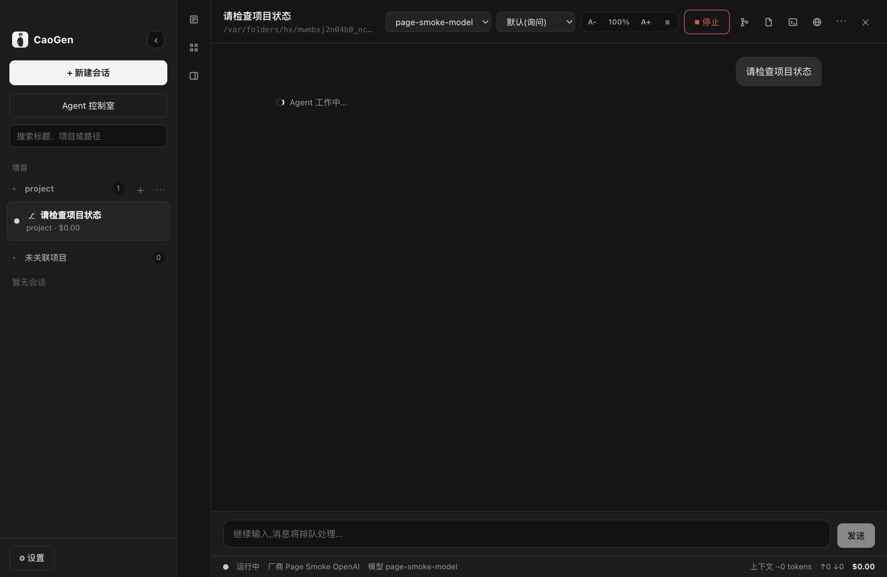

# CaoGen

<p>
  
  
  
  
  
  
</p>

> 🐳 国产原创 · Agent Work OS · 多厂商 AI 编码桌面工作室 · 开源(MIT)

多会话并行的桌面 AI 编码 Agent,正在升级为 **原生 Agent Work OS**。CaoGen 不做 Agent 启动器,不做配置搬运工具;目标是把桌面控制、代码执行、多模型调度、Skills/MCP、长期记忆、多 Agent 交付集成进一个 CaoGen 任务系统。完整目标与里程碑见 [ROADMAP.md](./ROADMAP.md)。

当前以 Claude Agent SDK 为默认引擎(与 Claude Code 同源),OpenAI 引擎同时支持 **Responses** 与 **Chat Completions** 两种协议,在桌面层提供 CLI 给不了的体验:

> **任何厂商模型都是真编码 Agent,不只是聊天**:OpenAI 引擎内置原生工具调用循环(bash / 读写文件 / 精确编辑 / 列目录,带权限审批与路径牢笼)——选 DeepSeek / 通义千问 / Grok / 网关 / vLLM·Ollama 本地模型,**无需安装任何外部 CLI**,就能在 CaoGen 里改代码跑命令(已用 DeepSeek 真实 E2E:模型自主创建/编辑文件、执行命令,7/7 通过)。全部厂商内置 Provider 预设;Claude 引擎走 Anthropic 协议,DeepSeek/Kimi/智谱官方端点亦可直连。

- **多会话并行** — 同时在多个项目上运行 Agent,侧栏一键切换,互不阻塞
- **真子代理编排(闭环)** — 主 Agent 一次派发最多 33 个子 Agent 并行;全部完成后结果**自动汇总回灌父 Agent**,由其总结成败、评估冲突、给出合并顺序(32 并发实测:派发 655ms,全部完成 2s)
- **Worktree 隔离 + PR** — 每个 Agent 默认独立 Git worktree;合并前冲突风险明示,可一键生成 patch / 应用回主工作区 / 创建 PR(gh/glab)
- **跨厂商故障切换** — 厂商余额耗尽/限流/宕机时自动切到健康厂商重试,任务不中断,切换过程在聊天流透明标注
- **原生编码 Agent(零外部依赖)** — OpenAI 引擎内置工具调用循环:bash/read/write/edit/list 五工具、按权限模式审批(默认询问/自动接受编辑/规划只读/跳过)、文件操作路径牢笼、40 轮防失控;DeepSeek 真实 E2E 7/7
- **多引擎架构** — Engine 接口 + 注册表:Claude Agent SDK(默认)、OpenAI(Responses/Chat 双协议 + 原生工具)、Codex CLI、Gemini CLI(可选外挂)
- **迁移级交互** — `@` 文件、多图粘贴/拖拽、图片 OCR(macOS Vision 零依赖)、斜杠命令、`Esc Esc` / `/rewind` 检查点回溯(对话回退**即时**截断 SDK 上下文)
- **内置浏览器批注** — 选区批注 + **DOM 圈选**(悬停高亮点选元素、按元素裁剪截图)+ 页面只读观测(文本/控制台错误/网络失败)一键发给 Agent 复验
- **Hooks** — 文件修改后 / 每轮结束后自动执行自定义 shell 命令(如格式化/跑测试),输出回显时间线
- **插件生态** — 扫描 Claude/Codex 的 plugin/skill/agent/MCP,启停持久化、一键投递给 Agent;**MCP 运行态探测**(stdio 真握手 / http 可达性)
- **工作台能力** — 分屏、内置终端/编辑器、HTML/PDF/CSV/JSON/图片预览、可逐块 accept/reject 的 Diff 查看器、应用内 Git 提交
- **记忆与自动化** — 跨会话记忆(确认制)、主动开工建议、本地 Routines 定时自执行、完成通知与防休眠(均可在设置开关)
- **预算闸门** — 会话/Provider/全局三级预算,超限拦截发送,32 并发也烧不穿
- **中英双语界面** — 全部 UI 文案 zh/en 可切换;白天/夜晚/跟随系统三主题
- **权限掌控** — 敏感操作逐条审批,或随时切换权限模式(默认 / 自动接受编辑 / 规划 / 跳过)
- **成本仪表盘** — 每轮 token 用量、上下文规模、累计费用实时显示
- **会话恢复** — 历史会话持久化,一键恢复上下文继续工作
- **写实 3D 办公区** — 每个会话一个工位,小人动画/厂商配色/成本气泡由**真实会话状态**驱动,父子工位间飞行消息包呈现真实编排流

## Agent Work OS 主线

当前 `main` 已合入第一波原生 Work OS 能力:

| 模块 | 状态 | 说明 |
|---|---|---|
| CaoGen Drive | 已合入 | `Spark / Core / Forge / Command / Genesis` 五档任务驾驶模式,统一模型路由、预算、权限、沙箱和验证策略 |
| Quickbar | 已合入 | 全局入口的主进程/预加载/渲染链路,面向截图、文件投递、剪贴板和窗口上下文 |
| Desktop Control | 已合入 | macOS System Events / AXUIElement 路径,带权限边界和 GUI 工具 schema |
| Code Forge | 已合入 | worktree/repo diff 汇总、验证命令、patch、commit、PR 尝试和结构化交付报告 |
| Skill Fabric | 已合入 | Skills/MCP 能力视图、匹配和调用边界,兼容本地技能库 |
| Memory Loop | 已合入 | 任务复盘、失败复盘、偏好学习和工作流建议草稿 |
| Personal OS | 已合入 | 本地常驻助理、Routines、主动建议和个人工作流入口 |
| Control Center | 已合入 | Provider、模型、密钥状态、MCP、Skills、CLI 工具统一管理视图 |
| Genesis | 已合入(计划层) | 可生成结构化多 Agent 编排、worker lanes、隔离策略、验证门禁和交付报告;尚不宣称真实创建子会话、自动合并、推送或发布 |

这些能力的定位是 **Native Integration**,不是导入 Claude、Codex、OpenClaw、Hermes 或 ccswitch 的配置。CaoGen 会吸收它们的用户价值,但不复制竞品代码,也不伪造外部工具已经完成的能力。

下一阶段并行执行表见 [Work OS Phase 2 Parallel Plan](./docs/WORKOS-PHASE2-PARALLEL-PLAN.md)。当前边界:本地 `test:deep` 已全绿;`v0.2.0` 仍需 P2 required 外部证据、N1 真人迁移记录和发布打包门禁。

## 界面预览



> 侧栏多项目并行、六大能力一览;切到 **🏢 3D 办公区**,每个会话是一个工位,一眼看出谁在写码、谁在等审批。

## 下载安装

从 [Releases](https://github.com/ChaoYuZhang001/CaoGen/releases) 下载对应平台安装包(macOS `.dmg` / Windows NSIS / Linux AppImage)。

> **macOS 首次打开**:当前安装包未签名,下载后 **右键点 App 图标 → 打开 → 再点「打开」** 即可(只需绕行第一次);或在 系统设置 → 隐私与安全性 底部点「仍要打开」。

也可以直接从源码运行,见下方「开发」。

## 运行前提

- Node.js ≥ 20
- 至少一个可用的模型来源(任选其一):
  - 已登录 Claude Code(`claude` CLI)或设置 `ANTHROPIC_API_KEY`(Claude 引擎)
  - 任意厂商 API Key —— 设置页选预设(DeepSeek / Qwen / Grok / 网关 / 本地 Ollama 等),
    OpenAI 引擎 Chat Completions 协议直连,无需 Claude 账号
- 可选:装有 `codex` / `gemini` CLI 的用户,可额外选用这两个 CLI 作为会话引擎(复用其原生沙箱/账号);**不装也不影响任何功能**——CaoGen 自带完整编码 Agent 能力

## 开发

```bash
npm install
npm run dev        # 启动开发模式(HMR)
```

## 构建 / 校验 / 测试

```bash
npm run typecheck  # TS 类型检查(主进程 + 渲染进程)
npm run build      # 产物输出到 out/
npm start          # 预览构建产物
npm run test:deep  # 深度测试:typecheck/build/集成/模块冒烟/
                   # Electron IPC/OpenAI mock E2E/页面操作等串行门禁
npm run test:p2    # P2 本地 smoke:技能、模型、国内生态本地桩、IDE bridge、OpenAI P2 工具
npm run test:p2-required # P2 required 外部门禁;无真实环境/凭据时预期失败并给出缺口
npm run workos:release-doctor -- --refresh # 刷新轻量审计并汇总 v0.2.0 阻塞/分工/停止条件
npm run test:n1-migration-audit # 审计真人 N1 30 分钟迁移记录(需本地私有 JSON 记录)
npm run test:release-packaging-audit # 审计 release 版本号、macOS 资产和禁止上传文件
npm run test:release-notes-audit # 审计 v0.2.0 发布说明草稿是否过度宣称/漏掉阻塞项
npm run test:github-release-audit # 审计公开 GitHub Release 资产名、版本和敏感上传物
npm run test:github-release-audit:read-text # 额外读取公开 latest*.yml/json/md/txt 小文本资产并扫描密钥
npm run secret:scan # 扫描跟踪/暂存/未跟踪文件,阻止密钥/证书/生成物入库
npm run secret:scan:history # 发布前扫描当前树和 Git 历史中的疑似密钥/敏感文件
```

需要真实厂商 Key 的端到端脚本(不入 CI,本机手动跑):

```bash
# Chat Completions 真对话 E2E(流式 + usage + 多轮上下文)
CHAT_E2E_KEY=<your-api-key> npx electron scripts/chat-protocol-e2e.cjs

# 真子代理编排闭环 E2E(派发→子代理真实跑完→自动回灌→父 Agent 总结)
CHAT_E2E_KEY=<your-api-key> npx electron scripts/orchestration-e2e.cjs

# 32 子代理并发压测(吞吐/时延/成本统计 + 结果正确性抽查)
CHAT_E2E_KEY=<your-api-key> npx electron scripts/stress-32-agents.cjs

# 原生编码 Agent E2E(模型经工具调用真实创建/编辑文件、执行命令)
CHAT_E2E_KEY=<your-api-key> npx electron scripts/coding-agent-e2e.cjs
```

## 密钥与公开仓库纪律

真实密钥、webhook、证书、签名材料、`.env`、私钥和平台 token **不得提交**。本仓库只允许出现环境变量名、脱敏占位符和测试专用假值。

- 在设置页输入的 Provider 密钥由主进程加密/脱敏保存,渲染进程只看到 `hasToken` 状态。
- 本地开发密钥放在 shell 环境、系统钥匙串或未跟踪的 `.env.local` 中。
- 提交前至少运行 `npm run secret:scan`,发布前加跑 `npm run secret:scan:history`,并人工复核 `git status --short` 与即将提交的 diff。
- 不提交 `test-results/`、`out/`、`dist/`、`node_modules/`、`model-stats.json`、插件构建产物、`.env`、证书、私钥、keystore、provision profile 或签名材料。
- GitHub Releases 只允许上传安装器/更新元数据:DMG、mac zip、Windows installer、AppImage、blockmap、`latest*.yml`。不要上传本地证据包、测试报告、`.env`、证书、私钥、日志或源码构建目录。
- 发布或编辑 Release 后,先跑 `npm run test:github-release-audit:required -- --tag vX.Y.Z`;对 `latest*.yml` 这类小文本元数据再跑 `npm run test:github-release-audit:read-text:required -- --tag vX.Y.Z`。如果网络无法读取文本资产,不能把“文本内容已审计”当成已证明。
- 如果任何真实 token 曾经外发、推送或作为 Release 资产公开,必须先从公开位置删除,再在对应平台撤销/轮换;仅从 Git 删除不足以让旧凭据失效。

## 打包分发 / 发布

CaoGen 通过 GitHub Releases 分发(不上架 App Store)。macOS 出 `.dmg`,Windows 出 NSIS 安装器,Linux 出 AppImage。

最新稳定版见 [GitHub Releases](https://github.com/ChaoYuZhang001/CaoGen/releases)。Work OS 里程碑发布应使用新版本号,并在 `npm run typecheck`、`npm run build`、`npm run test:deep`、`npm run secret:scan:history`、`npm run test:release-packaging-audit:required`、`npm run test:release-notes-audit:final`、`npm run test:github-release-audit:required`、打包产物和真实外部门禁完成后再创建 Release。发布或编辑 Release 后,对目标 tag 再跑 `npm run test:github-release-audit:required -- --tag vX.Y.Z`,并对公开小文本元数据加跑 `npm run test:github-release-audit:read-text:required -- --tag vX.Y.Z`。当前 P2-005 IDE 证据已由 VS Code Extension Host 与 JetBrains runIde recorder 证明;`v0.2.0` 仍需 P2-001 Windows GUI evidence、P2-004 国内真实网络/工具调用 parity、N1 真人迁移记录和打包门禁。发布说明草稿见 [Release Notes v0.2.0 Draft](./docs/RELEASE-NOTES-v0.2.0-DRAFT.md),草稿门禁见 [Release Gate v0.2.0 Draft](./docs/RELEASE-GATE-v0.2.0-DRAFT.md)。

```bash
npm run dist:mac   # 产出 dist/CaoGen-<version>.dmg(+ .zip,供自动更新)
npm run dist       # 按当前平台打包
npm run dist:dir   # 只出未压缩 app 目录(调试打包用)
```

### macOS:签名与"首次打开"

当前配置产出的是**未签名**包(`build.mac.identity: null`)。够用来自建分发,但用户首次打开会遇到 Gatekeeper 拦截。两种发布档位:

**A · 未签名(当前默认,零成本)**
产物可直接传 GitHub Releases。用户首次打开需绕行一次:

> 下载 `.dmg` → 拖入「应用程序」→ **右键点 App 图标 → 打开** → 在弹窗里再点「打开」。
> 或:双击被拦后,去 **系统设置 → 隐私与安全性**,在底部点「仍要打开」。
> 之后每次正常双击即可,只需绕行第一次。

把上面这段放进 Release 说明,能省掉大量"打不开"的反馈。

**B · 签名 + 公证(推荐公开分发,需 Apple 凭据)**
让用户**双击即开、零警告**,是不上架却公开分发的行业标准做法。需要:

1. Apple Developer 账号($99/年),申请 **Developer ID Application** 证书并装入钥匙串。
2. 一个用于公证的 **app-specific password**(或 App Store Connect API Key)。
3. 改 `package.json` 的 `build.mac`:去掉 `identity: null`(或设为证书名),并加公证配置:
   ```jsonc
   "mac": {
     "hardenedRuntime": true,
     "gatekeeperAssess": false,
     "notarize": { "teamId": "<你的 TeamID>" }
   }
   ```
   公证凭据通过环境变量提供:`APPLE_ID`、`APPLE_APP_SPECIFIC_PASSWORD`、`APPLE_TEAM_ID`。
4. 重新 `npm run dist:mac` 即产出已签名、已公证的 `.dmg`,无需改动任何代码。

> 签名/公证与「上架 App Store」是两回事:公证只是让 Apple 盖一个"扫描过、无恶意软件"的章,分发渠道仍是你自己的 GitHub Releases。

### 自动更新

`src/main/updater.ts` 已接 `electron-updater`(运行时探测:未打包 / 未装依赖时降级为 no-op,绝不静默下载)。启用真实自动更新:把 `package.json` 的 `build.publish` 里占位 URL 换成真实发布地址(generic 静态服务器或 github provider),发版时用 `electron-builder --publish always` 上传 `latest-mac.yml` + 安装包即可。查到新版本只**通知**,下载/安装由用户在 UI 显式确认。

## 架构

```
src/
  shared/types.ts        主/渲染进程共享类型(IPC 协议、事件模型)
  main/
    index.ts             应用生命周期与窗口
    agentSession.ts      单会话封装:一个长驻的 Agent SDK query(流式输入)
    sessionManager.ts    多会话注册表 + 事件广播 + 历史持久化
    ipc.ts               类型化 IPC handler
    settings.ts/history.ts  userData 下的 JSON 持久化
    pushable.ts          可推送 AsyncIterable(SDK 流式输入通道)
  preload/index.ts       contextBridge 暴露 window.agentDesk
  renderer/src/          React UI(zustand 状态,事件驱动渲染)
```

主进程通过 `@anthropic-ai/claude-agent-sdk` 的流式输入模式维持每个会话的长驻 agent 进程;
`canUseTool` 回调把权限决策转发到 UI;`includePartialMessages` 提供逐字流式;
`resume` 支持跨重启恢复会话上下文。

## 参与贡献

CaoGen 是开源项目,欢迎任何形式的参与:

- 🐛 **提 Issue** — bug、功能建议、使用问题都欢迎
- 🔧 **提 PR** — 修 bug、加功能、完善文档;请先跑通 `npm run typecheck` 和 `npm run build`
- 💡 **方向讨论** — 路线图见 [ROADMAP.md](./ROADMAP.md),需求规格见 [REQUIREMENTS.md](./REQUIREMENTS.md)

开发约定:主/渲染进程共享类型集中在 `src/shared/types.ts`;新增能力遵循「主进程模块 → IPC → preload → 类型 → store → UI」六环链路;保持中英双语文案(`src/renderer/src/i18n.ts`)。

## 开源许可

本项目基于 [MIT License](./LICENSE) 开源。你可以自由使用、修改、分发(含商用),只需保留版权与许可声明。

---

<sub>CaoGen · 国产原创 AI 编码桌面工作室 · 以 Claude Agent SDK 为默认引擎,多厂商可配置</sub>
