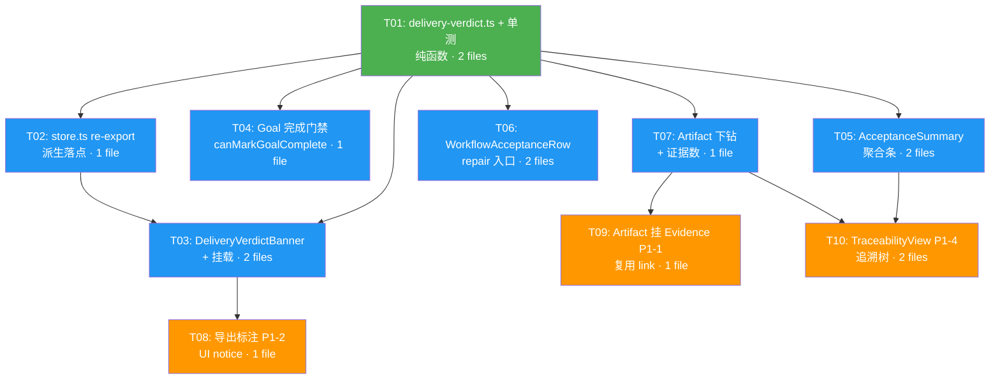

# 增量架构设计:ART-005 — 统一结果工作台的「真·可验证交付闭环」

> 文档版本:v1.0
> 编写日期:2026-07-30
> 前置依赖:WB-P0(已 commit)、WB-P1(已 commit)、D0(已 commit)
> 关联 PRD:`docs/PRD-ART-005-verifiable-delivery.md`(v1.0,权威)
> 架构师:高见远
> 范围:仅 **store → UI 环**(第 5–6 环);不新增 IPC、不改 `shared/types.ts`(除 additive)、不动 `preload/`、`src/main/` 完成门禁

---

## 1. 实现方案与框架选型

### 1.1 技术栈

沿用现有技术栈,**无新增框架或第三方运行时依赖**:

- Electron 40 + React 18 + TypeScript
- Zustand(渲染层状态管理)
- 纯函数派生(`deriveDeliveryVerdict`)——无副作用、可单测

### 1.2 核心设计原则(来自 PRD 不破坏清单 + 六环链路)

1. **判定口径唯一**:`DeliveryVerdict` 仅由 `snapshot.acceptances[].status` 集合推导,**不读** `goal.status` / `TaskRun.status` / `WorkItem.status` 作为判定依据(仅作辅助展示)。
2. **零新增链路**:verdict 在渲染层由纯函数派生,不写 main、不加 IPC、不改 `StudioResultSnapshot` 既有字段形状。
3. **复用优先**:Goal 完成门禁、Acceptance 验收动作、Evidence 必填/豁免必填理由校验,全部复用现有 `WorkflowAcceptanceRow` + `reviewWorkflowAcceptance` + `createWorkflowEvidenceLink`,不新建写入口。
4. **范围克制**:本棒是「收口闸门」——收口到统一结果工作台、解耦模型自报完成;不新建 producer / 执行层。任何会牵动 main 或新增 IPC 的设计一律标红(见 §9)。

### 1.3 关键技术挑战与方案

| 挑战 | 方案 |
|------|------|
| verdict 派生且可单测,不污染 UI | 抽独立纯模块 `delivery-verdict.ts`,`deriveDeliveryVerdict(snapshot)` 为纯函数;store.ts re-export 作为「store 层派生」落点 |
| 「模型自称完成 ≠ 完成」硬落地 | 横幅 + Goal 完成门禁守卫 `canMarkGoalComplete(verdict)`;任何正向完成 CTA 必须过该守卫 |
| Artifact→Evidence 双向可达(P1-1) | 复用 `createWorkflowEvidenceLink`(relation `supports`/`verifies`),不新增 IPC |
| failed 行展示 repair 入口 | `WorkflowAcceptanceRow` 增加 **additive** 可选 props `repairWorkItemId?` / `onOpenRepair?`,不改既有动作与校验 |
| 导出标注(P1-2)不伪造完成 | 不改动 main 导出契约;verdict ≠ verifiable 时由 **UI 显著提示**(导出前/后 notice),报告文件本身不变 |
| 脏树保护 | 本棒仅改 `StudioResultPanel.tsx`、`WorkflowAcceptanceRow.tsx`、`store.ts`、`panels.ts`(不动)、新增 `delivery-verdict.ts`/横幅/聚合/追溯组件;不回滚/覆盖/提交无关 WIP(含 `src/main/git/pull-request-effect.ts`) |

---

## 2. 文件列表(标 新增/修改)

### 2.1 新增文件

| # | 文件路径 | 职责(一句话) |
|---|---------|--------------|
| F01 | `src/renderer/src/store/delivery-verdict.ts` | 纯函数 `deriveDeliveryVerdict(snapshot)`、`canMarkGoalComplete(verdict)`、`DeliveryVerdict`/`DeliveryVerdictDetail` 类型;store 层派生的唯一真相源 |
| F02 | `src/renderer/src/store/delivery-verdict.test.ts` | 纯函数单测:覆盖「全 passed/waived = verifiable」「含 failed/pending/verifying = not_done」「Run completed 但 Acceptance failed → not_done」 |
| F03 | `src/renderer/src/components/workbench/DeliveryVerdictBanner.tsx` | 顶部「交付判定」横幅组件,沿用 `statusTone` 配色 |
| F04 | `src/renderer/src/components/workbench/AcceptanceSummary.tsx` | Acceptance 状态聚合条(pending/verifying/passed/failed/waived 计数)+ 下钻锚点 |
| F05 | `src/renderer/src/components/workbench/TraceabilityView.tsx` | (P1-4)Artifact→Evidence→Acceptance 跨实体追溯视图(缩进树/mermaid) |

### 2.2 修改文件

| # | 文件路径 | 改动(一句话) |
|---|---------|--------------|
| F06 | `src/renderer/src/store.ts` | re-export `deriveDeliveryVerdict`/`canMarkGoalComplete`(满足「store 层派生」);可选新增 `useDeliveryVerdict` 选择器;**不新增状态字段** |
| F07 | `src/renderer/src/components/workbench/StudioResultPanel.tsx` | 挂载 `DeliveryVerdictBanner`(头部下方、Tab 之上);接 `useResultAcceptanceReview` 的聚合;在 `EvidenceView` 接入 `AcceptanceSummary`;在 `ArtifactView` 增强 `ArtifactRow` 的 evidence 展示与下钻按钮;接 `TraceabilityView`;导出 `save` 增加 verdict 标注 notice;应用 `canMarkGoalComplete` 守卫(无绕过 CTA) |
| F08 | `src/renderer/src/components/WorkflowAcceptanceRow.tsx` | **additive**:新增可选 props `repairWorkItemId?` / `onOpenRepair?`;当 `status==='failed'` 且提供 `repairWorkItemId` 时渲染 repair 入口(复用 `openSubagentPanel`/`openTool('tasks')` 契约,不新增 IPC);既有 `passed/failed/waived/retest` 动作与 Evidence 必填/豁免必填理由校验**不变** |

### 2.3 不改但需验证不受影响的文件

| 文件 | 理由 |
|------|------|
| `src/renderer/src/components/workbench/panels.ts` | 本棒不新增面板(PRD 不破坏清单);`StudioResultPanel` 仍走 `'result'` 注册 |
| `src/main/` 整个目录(含 `git/pull-request-effect.ts` 等 WIP) | 六环链路铁律:不动主进程;无关 WIP 不回滚/覆盖/提交 |
| `preload/` 整个目录 | 无 preload 暴露变更 |
| `src/shared/types.ts` | 无 `AgentDeskApi` 变更;本棒类型仅在 `delivery-verdict.ts` 内 additive 定义 |
| `src/renderer/src/components/workbench/WorkbenchRoot.tsx` | 面板注册表/keep-alive 不动 |
| WB-P0 TaskStrategy 相关代码 | 策略层不触及 |

---

## 3. 数据结构与接口

### 3.1 `delivery-verdict.ts`(F01,新增)

```typescript
// src/renderer/src/store/delivery-verdict.ts
import type { StudioResultSnapshot } from '../../shared/studio-result-types'

/** 交付判定:仅两种取值,口径统一为 acceptances 状态集合 */
export type DeliveryVerdict = 'verifiable' | 'not_done'

/** verdict 派生详情:计数 + 辅助展示用的模型自报完成信号(不参与判定) */
export interface DeliveryVerdictDetail {
  verdict: DeliveryVerdict
  total: number
  passed: number
  waived: number
  failed: number
  pending: number
  verifying: number
  /**
   * 辅助信号:模型是否自报过完成(任意 run.status==='completed' 或 goal.status==='completed')。
   * 仅用于横幅文案「模型运行已结束,但验收未通过」,绝不参与 verdict 计算。
   */
  modelReportedDone: boolean
}

/**
 * 纯函数:从 snapshot.acceptances 推导交付判定。
 * 规则(来自 PRD P0-1 / AC-1):
 *  - 全部 acceptance ∈ {passed, waived} → verifiable
 *  - 存在任意 {pending, verifying, failed} → not_done
 * 不读取 goal.status / TaskRun.status / WorkItem.status。
 */
export function deriveDeliveryVerdict(snapshot: StudioResultSnapshot): DeliveryVerdictDetail {
  const acceptances = snapshot.acceptances ?? []
  let passed = 0, waived = 0, failed = 0, pending = 0, verifying = 0
  for (const a of acceptances) {
    switch (a.status) {
      case 'passed': passed++; break
      case 'waived': waived++; break
      case 'failed': failed++; break
      case 'pending': pending++; break
      case 'verifying': verifying++; break
    }
  }
  const total = acceptances.length
  const notDone = failed > 0 || pending > 0 || verifying > 0
  const modelReportedDone =
    snapshot.goal?.status === 'completed' ||
    snapshot.runs.some((r) => r.status === 'completed')
  return {
    verdict: notDone ? 'not_done' : 'verifiable',
    total, passed, waived, failed, pending, verifying,
    modelReportedDone
  }
}

/** Goal 完成门禁守卫:verifiable 才允许标记完成;not_done 一律阻断(AC-3) */
export function canMarkGoalComplete(verdict: DeliveryVerdict): boolean {
  return verdict === 'verifiable'
}
```

### 3.2 `DeliveryVerdictBanner.tsx`(F03,新增)

```typescript
// src/renderer/src/components/workbench/DeliveryVerdictBanner.tsx
import type { DeliveryVerdictDetail } from '../../store/delivery-verdict'

export function DeliveryVerdictBanner({ detail }: { detail: DeliveryVerdictDetail }): React.JSX.Element {
  const tone = detail.verdict === 'verifiable' ? 'good' : 'bad' // 沿用 statusTone 配色语义
  const label = detail.verdict === 'verifiable'
    ? '可验收(verifiable)'
    : `未通过/未验收(not done) — 待验收 ${detail.pending} · 验收中 ${detail.verifying} · 失败 ${detail.failed}`
  const hint = detail.verdict === 'not_done' && detail.modelReportedDone
    ? '模型运行已结束,但验收未通过,Goal 未完成'
    : ''
  return (
    <div className={`studio-result-verdict status-${tone}`} role="status" data-studio-result-verdict={detail.verdict}>
      <span className="studio-result-verdict-dot" aria-hidden="true" />
      <strong>交付判定</strong>
      <span>{label}</span>
      {hint && <span className="studio-result-verdict-hint">{hint}</span>}
    </div>
  )
}
```

### 3.3 `AcceptanceSummary.tsx`(F04,新增)

```typescript
// src/renderer/src/components/workbench/AcceptanceSummary.tsx
import type { DeliveryVerdictDetail } from '../../store/delivery-verdict'

export function AcceptanceSummary({ detail }: { detail: DeliveryVerdictDetail }): React.JSX.Element {
  return (
    <div className="studio-result-acceptance-summary" data-studio-result-acceptance-summary>
      <span>本 Goal 验收:</span>
      <span className="status-warn">pending {detail.pending}</span>
      <span className="status-warn">verifying {detail.verifying}</span>
      <span className="status-good">passed {detail.passed}</span>
      <span className="status-bad">failed {detail.failed}</span>
      <span className="status-warn">waived {detail.waived}</span>
    </div>
  )
}
```

### 3.4 `WorkflowAcceptanceRow.tsx`(F08,additive props)

```typescript
// 在现有 props 基础上 additive 扩展:
export function WorkflowAcceptanceRow({
  acceptance,
  evidence,
  onRefresh,
  repairWorkItemId,        // 新增:来自 reviewWorkflowAcceptance 结果的 repair.workItemId
  onOpenRepair             // 新增:(workItemId) => void,复用 openTool('tasks')/openSubagentPanel
}: {
  acceptance: WorkflowAcceptanceRecord
  evidence: WorkflowEvidenceRecord[]
  onRefresh: () => Promise<void>
  repairWorkItemId?: string
  onOpenRepair?: (workItemId: string) => void
}): React.JSX.Element {
  // ... 现有渲染不变 ...
  // 在 failed 分支(原 FailedAcceptanceReview 旁)新增:
  //   {acceptance.status === 'failed' && repairWorkItemId && onOpenRepair && (
  //     <button data-acceptance-repair onClick={() => onOpenRepair(repairWorkItemId)}>查看返工 WorkItem</button>
  //   )}
}
```

### 3.5 store.ts(F06,派生落点)

```typescript
// src/renderer/src/store.ts
// re-export:满足 PRD「store 层派生」表述,UI 统一从 store 域导入
export { deriveDeliveryVerdict, canMarkGoalComplete } from './delivery-verdict'
export type { DeliveryVerdict, DeliveryVerdictDetail } from './delivery-verdict'

// 可选:装饰器式选择器(供组件 useMemo 调用,非必须)
// export function useDeliveryVerdict(snapshot: StudioResultSnapshot | undefined): DeliveryVerdictDetail | undefined {
//   return useMemo(() => (snapshot ? deriveDeliveryVerdict(snapshot) : undefined), [snapshot])
// }
```

### 3.6 StudioResultPanel 挂载点(变更示意)

```
StudioResultPanel
 ├─ <header> 刷新 / 导出  (现有)
 ├─ <DeliveryVerdictBanner detail={verdict} />        ← 新增:头部下方、Tab 之上
 └─ <ReadyResult>
     ├─ <nav tabs> summary / artifacts / evidence / timeline
     ├─ summary    : 现有 SummaryView(可加 verdict 小标)
     ├─ artifacts  : <ArtifactView> 内 ArtifactRow 增强(证据数 + 下钻按钮)
     ├─ evidence   : <AcceptanceSummary> + <WorkflowAcceptanceRow>×(带 repair 入口)
     │              + Evidence 列表 + Tests 列表(现有)
     ├─ timeline   : 现有
     └─ (P1-4) <TraceabilityView> 作为 evidence/独立区块
```

### 3.7 类关系图(mermaid)

见 `class-diagram-art-005-verifiable-delivery.mermaid`。

---

## 4. 程序调用流程

### 4.1 verdict 派生并渲染(主链路)

1. `StudioResultPanel` 挂载 → `useStudioResult(sessionId)` → `getStudioResultSnapshot(sessionId)` → `snapshot`。
2. `ReadyResult` 收到 `snapshot` → 调用 `deriveDeliveryVerdict(snapshot)`(纯函数)→ `DeliveryVerdictDetail`。
3. `DeliveryVerdictBanner` 渲染 `verdict`;若 `not_done` 且 `modelReportedDone`,横幅文案提示「模型运行已结束,但验收未通过」。
4. `EvidenceView` 收到 `acceptanceReview`(来自 `useResultAcceptanceReview`)→ 顶部 `AcceptanceSummary` 聚合条(计数来自同一 `deriveDeliveryVerdict` 结果,或就地由 `acceptances` 计算)。

### 4.2 Artifact → Evidence 下钻

1. `ArtifactView` 渲染 `ArtifactRow`,展示 `artifact.evidenceIds.length`(已挂证据数)+ `artifact.acceptanceIds` 关联数。
2. 点击「下钻证据」按钮 → `onDrillEvidence(artifact)` → `StudioResultPanel` 置 `evidenceDrill = { artifactId }` 并 `setTab('evidence')`。
3. `EvidenceView` 用 `evidenceDrill` 过滤/高亮对应 `StudioResultEvidence` 与 `WorkflowAcceptanceRow`(按 `acceptanceIds` 定位),并滚动到锚点。

### 4.3 Goal 完成门禁(不变量)

1. 任何「标记 Goal 完成」正向 CTA(含潜在新增)渲染前必须过 `canMarkGoalComplete(verdict)`。
2. `verdict === 'not_done'` → CTA `disabled` 且 `title="仍有未通过/未验收的 Acceptance"`;本棒**不渲染**任何绕过路径。
3. `failed` 存在时:横幅为 not done + `WorkflowAcceptanceRow` 的 repair 入口常驻可见;Goal 状态不被任何 UI 路径置 `completed`(UI 无写 Goal 完成入口,复用 main 既有 done-gate)。

### 4.4 failed → repair 入口

1. `WorkflowAcceptanceRow` 内部 `reviewAcceptance('failed')` → `reviewWorkflowAcceptance`(现有 IPC)→ 返回 `WorkflowAcceptanceReviewResult.repair.workItemId`。
2. `StudioResultPanel` 层捕获该 `repair`(通过 `WorkflowAcceptanceRow` 的 `onOpenRepair` 回调或 `useResultAcceptanceReview` 维护 `repairByAcceptanceId` 映射)→ 将 `repairWorkItemId` 回传 `WorkflowAcceptanceRow`。
3. failed 行渲染「查看返工 WorkItem」→ `openTool('tasks')` / `openSubagentPanel`(复用现有跳转契约,不新增 IPC)。

### 4.5 导出标注(P1-2)

1. 用户点导出 → `save()` → `saveStudioResultSnapshot(sessionId)`(现有 IPC,始终可用)。
2. 若 `verdict !== 'verifiable'` → 导出后/导出前在 UI 显示显著 notice:「交付报告已导出,但含未验收项(N 项待验收 / M 项失败)与缺失 Evidence,详见证据视图」(报告文件本身不变,不伪造完成)。
3. 该标注为 **UI 层**,不要求 main 改动(避免违反六环链路)。

### 4.6 时序图(mermaid)

见 `sequence-diagram-art-005-verifiable-delivery.mermaid`。

---

## 5. 任务列表(按实现顺序,含依赖与 AC 映射)

> 约定:T01 先建纯函数 + 单测(可独立编译验证);随后 UI 横幅 → 门禁 → 聚合区/repair → Artifact 下钻 → 导出标注(P1-2)→ 追溯(P1-4)。P0 任务为退出判据硬阻塞,P1 为增强。

### T01:新增 `delivery-verdict.ts` 纯函数 + 单测

| 属性 | 值 |
|------|-----|
| 优先级 | P0(基础) |
| 依赖 | 无 |
| 文件 | F01(新增)、F02(新增) |
| 动作 | 实现 `deriveDeliveryVerdict`、`canMarkGoalComplete`、`DeliveryVerdict`/`DeliveryVerdictDetail`;`delivery-verdict.test.ts` 覆盖三态(全 passed/waived=verifiable;含 failed/pending/verifying=not_done;Run completed 但 Acceptance failed=not_done) |
| 验收 | AC-1(只读 acceptances)、AC-8(纯渲染层、无 IPC/types 变更) |

### T02:store.ts 派生落点

| 属性 | 值 |
|------|-----|
| 优先级 | P0 |
| 依赖 | T01 |
| 文件 | F06(修改) |
| 动作 | re-export `deriveDeliveryVerdict`/`canMarkGoalComplete`/类型(满足「store 层派生」);**不新增状态字段、不改既有 API**;可选加 `useDeliveryVerdict` 选择器 |
| 验收 | AC-1、AC-8 |

### T03:新增 `DeliveryVerdictBanner` 并挂载

| 属性 | 值 |
|------|-----|
| 优先级 | P0 |
| 依赖 | T01、T02 |
| 文件 | F03(新增)、F07(修改) |
| 动作 | `StudioResultPanel` 头部下方、Tab 之上渲染 `<DeliveryVerdictBanner detail={deriveDeliveryVerdict(snapshot)} />`;沿用 `statusTone` 配色 |
| 验收 | AC-1、AC-2(verdict 仅由 acceptances 派生;Run completed 但 failed → 横幅 not done) |

### T04:Goal 完成门禁守卫

| 属性 | 值 |
|------|-----|
| 优先级 | P0 |
| 依赖 | T01 |
| 文件 | F07(修改) |
| 动作 | 应用 `canMarkGoalComplete(verdict)`:本棒**不渲染**任何绕过 Goal 完成的正向 CTA;`summary` 视图可加 verdict 小标;若未来新增完成 CTA 必须过该守卫(disabled + title) |
| 验收 | AC-2、AC-3(无绕过路径;not_done 时不显示正向完成态) |

### T05:新增 `AcceptanceSummary` 聚合条

| 属性 | 值 |
|------|-----|
| 优先级 | P0 |
| 依赖 | T01 |
| 文件 | F04(新增)、F07(修改) |
| 动作 | `EvidenceView` 顶部接入 `<AcceptanceSummary>`(计数来自 `deriveDeliveryVerdict` 结果或就地由 `acceptances` 算);展示 pending/verifying/passed/failed/waived |
| 验收 | AC-5(聚合计数正确) |

### T06:WorkflowAcceptanceRow 扩展 repair 入口

| 属性 | 值 |
|------|-----|
| 优先级 | P0 |
| 依赖 | T01;需 `useResultAcceptanceReview` 维护 `repairByAcceptanceId` |
| 文件 | F08(修改)、F07(修改) |
| 动作 | `WorkflowAcceptanceRow` additive props `repairWorkItemId?`/`onOpenRepair?`;failed 行渲染 repair 入口;既有 `passed/failed/waived/retest` 动作与 Evidence 必填/豁免必填理由校验**不变**;`StudioResultPanel` 捕获 `reviewWorkflowAcceptance` 返回的 `repair` 回填 |
| 验收 | AC-5、AC-6(failed 显示 repair 入口且可跳转;Goal 不被置 completed) |

### T07:Artifact 行增强 + Evidence 下钻

| 属性 | 值 |
|------|-----|
| 优先级 | P0 |
| 依赖 | T01 |
| 文件 | F07(修改) |
| 动作 | `ArtifactRow` 展示 `evidenceIds.length` + `acceptanceIds.length` + 验证状态;新增「下钻证据」按钮 → `onDrillEvidence(artifact)` → `StudioResultPanel` 置 `evidenceDrill` 并切到 evidence Tab 高亮/滚动 |
| 验收 | AC-4、AC-7(可下钻到 Evidence/Acceptance;不展示 Provider/模型响应原文) |

### T08:导出标注(P1-2)

| 属性 | 值 |
|------|-----|
| 优先级 | P1 |
| 依赖 | T03 |
| 文件 | F07(修改) |
| 动作 | `save()` 前/后若 `verdict !== 'verifiable'` → 显著 notice 提示未验收项与缺失 Evidence;导出本身始终可用(不伪造完成) |
| 验收 | AC-10 |

### T09:Artifact 直接挂 Evidence(P1-1)

| 属性 | 值 |
|------|-----|
| 优先级 | P1 |
| 依赖 | T07 |
| 文件 | F07(修改) |
| 动作 | 在 Artifact 行允许把 `human`/`runtime` 来源 Evidence 关联到 Artifact(复用 `createWorkflowEvidenceLink`,relation `supports`/`verifies`);使 Artifact↔Evidence 在 UI 双向可达,不新增 IPC |
| 验收 | AC-7(链路可达) |

### T10:跨实体追溯视图(P1-4)

| 属性 | 值 |
|------|-----|
| 优先级 | P1 |
| 依赖 | T05、T07 |
| 文件 | F05(新增)、F07(修改) |
| 动作 | 新增 `TraceabilityView`:展示 `Artifact → 验证它的 Evidence → 它满足的 Acceptance criterion` 缩进树/mermaid,供一次性总览 |
| 验收 | AC-7 |

### 任务依赖图



---

## 6. 依赖包列表

**运行时依赖:无新增。**

**dev 依赖:无新增。**

说明:
- `deriveDeliveryVerdict` 为纯 TS 函数,无第三方依赖。
- 单测 `delivery-verdict.test.ts` 复用仓库既有测试运行器(现有 `scripts/*-smoke.mjs` / 测试中已用范式),无需新增测试框架或依赖。
- 所有 UI 交互复用现有 `window.agentDesk.*` IPC(`getStudioResultSnapshot` / `reviewWorkflowAcceptance` / `createWorkflowEvidenceLink` / `saveStudioResultSnapshot`),无新 IPC。
- 若仓库测试约定要求显式单测文件落地位置,沿用现有 `*.test.ts` 邻近放置约定即可。

---

## 7. 共享知识(跨文件约定)

1. **verdict 派生口径唯一**:`DeliveryVerdict` 只由 `snapshot.acceptances` 的 `status` 集合决定(`passed`/`waived` → verifiable;其余 → not_done)。严禁读取 `goal.status`/`TaskRun.status`/`WorkItem.status` 作为判定依据;这些字段仅作横幅辅助文案。
2. **唯一真相源模块**:`deriveDeliveryVerdict` 定义在 `src/renderer/src/store/delivery-verdict.ts`,UI 与 store 均从此处导入,**禁止**在组件内联重写判定逻辑。
3. **横幅配色复用 `statusTone` 语义**:`verifiable → 'good'`、`not_done → 'bad'`;不引入新配色 token(沿用 `studio-result-status status-*` 既有样式)。
4. **Goal 完成门禁单一守卫**:任何「标记 Goal 完成」CTA 必须过 `canMarkGoalComplete(verdict)`;UI 不提供绕过路径。本棒不新增写 Goal 完成入口,复用 main 既有 done-gate。
5. **Acceptance 行契约不变**:`WorkflowAcceptanceRow` 的 `passed`/`failed`/`waived`/`retest` 四动作、Evidence 必填校验、豁免必填理由校验保持原样;新增 `repairWorkItemId`/`onOpenRepair` 为 **additive 可选 props**,不改既有调用方(其余调用点不传即行为不变)。
6. **跳转契约复用**:Artifact 下钻、repair 入口均复用现有 `openTool('tasks')` / `openSubagentPanel` / `openPreviewPanel` 等薄包装,不新增 IPC。
7. **导出不伪造完成**:`saveStudioResultSnapshot` 始终可用;verdict ≠ verifiable 时的「未验收标注」为 UI notice,不改动主进程导出契约(避免违反六环链路)。
8. **双模式一致(Q-8)**:`StudioResultPanel` 作为 `'result'` 面板被 Assistant / Studio 两模式复用同一合同,verdict / 门禁 / 下钻逻辑对两模式一致;standalone 路径(`AppListView`)同样适用。

---

## 8. 待明确事项(仅补漏,不超 PRD 覆盖范围)

> 以下均为 PRD 已框定默认、本架构直接采纳;仅列需要主理人拍板的少量边界,**不涉及任何牵动 main / 新增 IPC 的设计**(那类设计已按铁律标红并排除)。

1. **空 acceptances 的 verdict 取值**:PRD 字面「全部 passed/waived → verifiable」在 `acceptances.length === 0` 时 vacuously 成立。本架构默认按字面取 `verifiable`,但建议产品确认:无验收标准的 Goal 是否应直接判 `verifiable`(可能存在「无标准即放过」风险)。若需更严,可改为「空集合 → not_done」。*建议默认:vacuous verifiable,与 PRD 字面一致;若回归需要再调。*
2. **repair 入口的数据回填时机**:`WorkflowAcceptanceReviewResult.repair` 仅在用户主动 `reviewWorkflowAcceptance('failed')` 时返回。`useResultAcceptanceReview` 当前拉取的是 ledger 的 `WorkflowAcceptanceRecord`(不含 repair)。需在 `StudioResultPanel` 维护 `repairByAcceptanceId` 映射(由 row 的 `onOpenRepair` 反向回填或刷新后从 workItem 关系推断)。*建议:row 内部 review 成功后通过新回调 `onRepair?(repair)` 上报,父层存映射。*
3. **(P1-1)Artifact 挂 Evidence 的 `artifactId` 来源**:`createWorkflowEvidenceLink` 已支持 `artifactId` 参数;UI 需从当前 Artifact 行取 `artifact.id` 作为 `artifactId` 传入,relation 默认 `verifies`(或 `supports`)。*建议默认 `verifies`。*
4. **(P1-4)TraceabilityView 渲染形式**:缩进树 vs 内联 mermaid。*建议:mermaid(与 PRD §4.1 一致),但需确认渲染环境已支持 mermaid;否则降级为缩进树。*
5. **(标红,需独立 PR)Q-5 投影到 Board**:若后续要在 Board 显示 verdict 徽标,须单列 PR 在 main 增加**只读投影字段**,不在本棒范围。本棒仅 UI 内 verdict。

---

## 9. 范围边界小结(给实现者)

- **做什么**:store→UI 环内,新增「交付判定」派生横幅、Artifact→Evidence 下钻、Acceptance 聚合区与 repair 入口、Goal 完成门禁、导出标注(P1-2)、Artifact 挂 Evidence(P1-1)、追溯视图(P1-4)。全部消费 `StudioResultSnapshot` 既有字段。
- **不做什么**:不新建执行层 / Artifact producer;不改 main 完成门禁/状态机;不新增 IPC;不引入新 Acceptance 状态(Q-2 保持 5 态);不改 `shared/types.ts`(仅 `delivery-verdict.ts` 内 additive 类型)。
- **判定唯一真相源**:`snapshot.acceptances` 状态集合,而非模型自报完成。
- **脏树保护**:仅动 F01–F08 范围文件;不回滚/覆盖/提交无关的 `src/main/...` WIP(含 `src/main/git/pull-request-effect.ts`)与文档/脚本等大量既有未提交改动。

---

## 附录:验收标准与任务映射

| AC | 描述 | 主要负责任务 |
|----|------|------------|
| AC-1 | verdict 仅由 `snapshot.acceptances` 派生,与 goal/run 解耦 | T01、T02、T03 |
| AC-2 | not_done 时不显示正向完成态;Run completed 但 failed → not done | T03、T04 |
| AC-3 | 完成 CTA 在 not_done 时禁用/阻断且无绕过 | T04 |
| AC-4 | Artifact 行展示 evidenceIds + 下钻到 Evidence/Acceptance | T07 |
| AC-5 | Acceptance 聚合计数 + 复用行动作与校验 | T05、T06 |
| AC-6 | failed 显示 repair 入口,Goal 不进 completed | T06 |
| AC-7 | Evidence 可追溯、下钻可达、不展示 Provider/模型原文 | T07、T09、T10 |
| AC-8 | 六环链路不被破坏(无新 IPC / 无破坏性 types 变更) | T01、T02、F06–F08 |
| AC-9 | 真人 30 分钟主链验收 | 全部(集成) |
| AC-10 | 导出未通过时仍可用但显著标注 | T08 |
