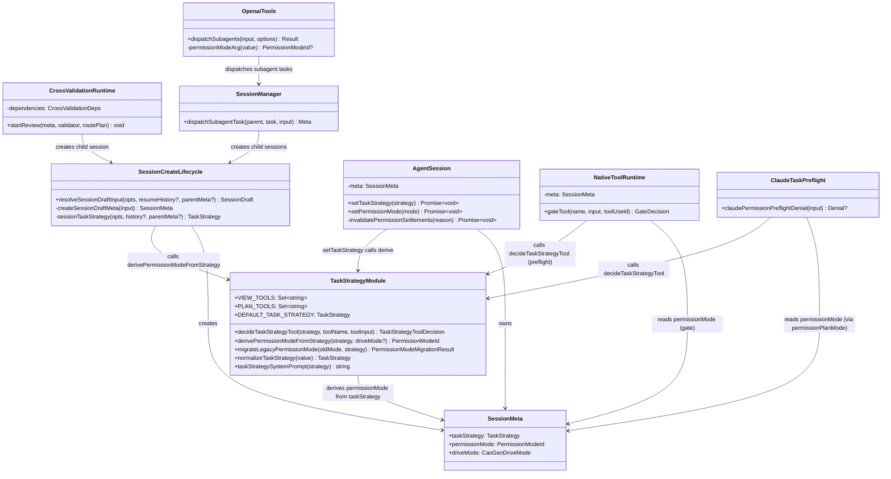
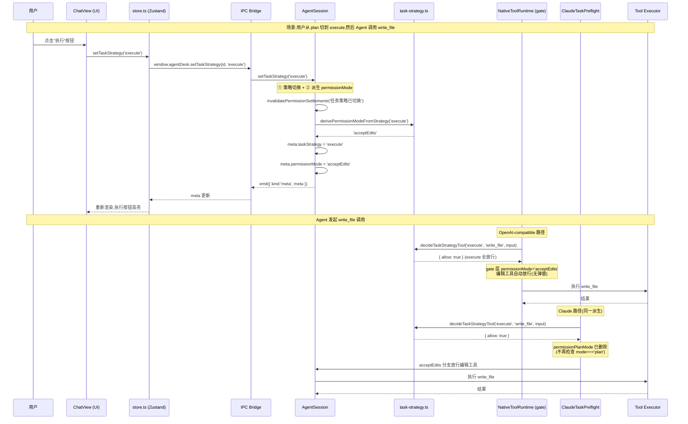
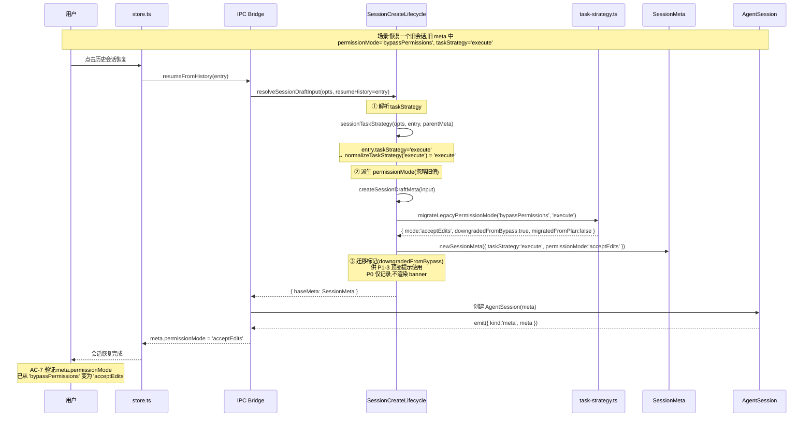
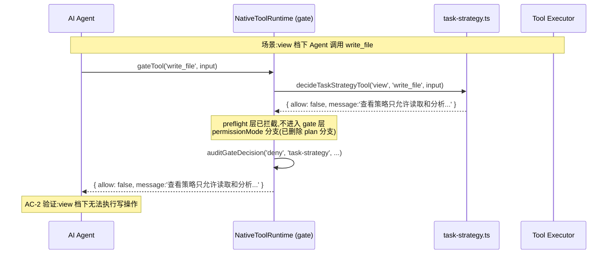
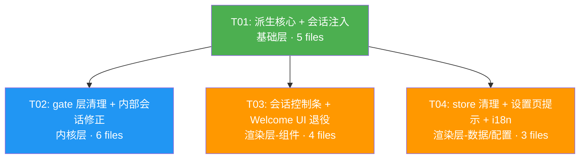

# 架构设计:WB-P0 — TaskStrategy 任务策略收编

> 文档版本:v1.0
> 编写日期:2026-07-28
> 关联 PRD:`docs/PRD-WB-P0-task-strategy.md`(v1.0,权威)
> 架构师:Bob
> 范围:P0-1 ~ P0-6 仅限,不含 P1/P2

---

## 1. 实现方案与框架选型

### 1.1 技术栈

沿用现有技术栈,**无新增框架或第三方依赖**:

- Electron 40 + React 18 + TypeScript(桌面壳 + 渲染层)
- Zustand(渲染层状态管理)
- Node.js main 进程(会话生命周期、工具 gate、权限策略引擎)

### 1.2 核心技术挑战

| 挑战 | 说明 | 方案 |
|------|------|------|
| **派生函数单一来源** | OpenAI-compatible 与 Claude 两条引擎路径必须使用同一份派生逻辑,否则行为分叉 | 派生函数放在 `task-strategy.ts`(已被两路径共同 import),不复制到引擎层 |
| **SessionMeta.permissionMode 语义迁移** | 从"用户可设"变为"派生只读",但字段保留(向后兼容已持久化会话) | 在会话创建/恢复入口统一派生,用户/模型写入入口全部关闭或忽略 |
| **老会话迁移无感** | 旧 `permissionMode: 'bypassPermissions'` / `'plan'` 的会话恢复后需安全降级 | 恢复时按 TaskStrategy 重新派生覆盖;bypassPermissions → acceptEdits(若 strategy=execute);检测标记供 P1-3 提示 |
| **内部只读会话回归** | `cross-validation-runtime.ts` 用 `permissionMode: 'plan'` 强制只读,删 gate 分支后失效 | 改为 `taskStrategy: 'plan'`,由 preflight 层 `decideTaskStrategyTool` 兜底只读 |
| **DAG 子会话权限入口** | `openaiTools.ts` 工具 schema 暴露 `permissionMode` 参数供模型设置子会话权限 | P0 忽略该参数(子会话 permissionMode 由 taskStrategy 派生);schema 清理放 P1 |

### 1.3 派生函数放置层级

```
┌─────────────────────────────────────────────────────┐
│  Renderer (React + Zustand)                         │
│  ┌──────────────┐  ┌──────────────┐                │
│  │ ChatView     │  │ WelcomeView  │  ← 移除         │
│  │ (移除下拉框) │  │ (移除选择器) │    PermissionMode │
│  └──────┬───────┘  └──────┬───────┘    用户入口      │
│         │ setTaskStrategy  │                        │
│         ▼                  ▼                        │
│  ┌─────────────────────────────┐                    │
│  │ store.ts (Zustand)          │  ← 移除             │
│  │ setTaskStrategy() → IPC     │    setPermissionMode│
│  └─────────────┬───────────────┘    IPC 调用         │
└────────────────┼────────────────────────────────────┘
                 │ IPC
┌────────────────┼────────────────────────────────────┐
│  Main Process  ▼                                    │
│  ┌─────────────────────────────┐                    │
│  │ agentSession.ts             │                    │
│  │ setTaskStrategy() {         │                    │
│  │   meta.taskStrategy = ...   │                    │
│  │   meta.permissionMode =     │  ← 新增:同步派生   │
│  │     derivePermissionMode... │                    │
│  │ }                           │                    │
│  └─────────────┬───────────────┘                    │
│                │                                    │
│  ┌─────────────▼───────────────┐                    │
│  │ task-strategy.ts            │  ← 新增派生函数     │
│  │ derivePermissionModeFrom... │    (单一来源)      │
│  │ decideTaskStrategyTool()    │                    │
│  └──────┬──────────┬───────────┘                    │
│         │          │                                │
│  ┌──────▼──┐  ┌────▼──────────────┐                 │
│  │ OpenAI  │  │ Claude            │  ← 两路径共用   │
│  │ gate    │  │ preflight         │    同一派生     │
│  └─────────┘  └───────────────────┘                 │
└─────────────────────────────────────────────────────┘
```

**关键决策**:派生函数 `derivePermissionModeFromStrategy()` 放在 `src/main/task/task-strategy.ts` 内,与 `decideTaskStrategyTool()` 同文件。理由:
1. 该文件已被 OpenAI 路径(`native-tool-runtime.ts:218`)和 Claude 路径(`claude-task-preflight.ts:28`)共同 import,天然是两路径的共享层。
2. 派生逻辑与策略拦截逻辑强相关(都依赖 `TaskStrategy` 类型),放一起便于维护。
3. 不在引擎层(openaiEngine/anthropicEngine)复制派生,避免分叉。

### 1.4 SessionMeta.permissionMode 语义变更

| 维度 | 收编前 | 收编后 |
|------|--------|--------|
| **写入者** | 用户(下拉框)、模型(工具参数)、DriveMode(defaultPermissionMode) | 仅 `derivePermissionModeFromStrategy()` 派生写入 |
| **字段保留** | — | 保留(向后兼容已持久化会话快照/历史) |
| **类型** | `'default' \| 'acceptEdits' \| 'plan' \| 'bypassPermissions'` | 不变(`'plan'` 值保留但不再被派生) |
| **用户可设** | 是 | 否 |
| **模型可设** | 是(工具参数) | 否(参数忽略) |
| **老会话恢复** | 保留旧值 | 按 TaskStrategy 重新派生覆盖 |

### 1.5 UI 退役最小改动点

| 改动点 | 文件 | 改动类型 |
|--------|------|---------|
| 会话控制条 PermissionMode 下拉框 | `ChatView.tsx:222-234` | 删除 `<select>` 块 |
| WelcomeView permissionMode 状态 | `WelcomeView.tsx:106-108` | 删除 `useState` |
| WelcomeView draft.permissionMode | `WelcomeView.tsx:254` | 删除字段 |
| WelcomeRoutingControls 选择器 | `WelcomeRoutingControls.tsx:81-83` | 删除 `<select>` |
| WelcomeRoutingControls props | `WelcomeRoutingControls.tsx:15,22,36` | 删除 `permissionMode` / `onPermissionChange` |
| WelcomeSessionDraft.permissionMode | `welcome-session-projection.ts:21` | 删除字段 |
| welcomeSessionOptions 传参 | `welcome-session-projection.ts:69,79` | 删除 `permissionMode` 传参(后端派生) |
| store.setPermissionMode | `store.ts:1718-1721` | 删除方法体(IPC 调用) |
| PERMISSION_OPTIONS 用户引用 | `store.ts:3855-3859` | 保留常量,仅注释标注"仅供 RoutineEditor" |
| DriveMode 正交提示 | `SettingsModal.tsx:414` | 新增提示文案 `<p>` |

---

## 2. 文件列表

### 2.1 主进程(Main Process)

| # | 文件路径 | 改动类型 | 职责(一句话) |
|---|---------|---------|--------------|
| F01 | `src/main/task/task-strategy.ts` | **新增函数** | 新增 `derivePermissionModeFromStrategy()` 和 `migrateLegacyPermissionMode()`,作为 TaskStrategy → PermissionMode 派生的单一来源 |
| F02 | `src/main/session-create-lifecycle.ts` | **修改** | `createSessionDraftMeta` 中 `permissionMode` 改为派生调用;恢复时检测旧 bypassPermissions 供迁移标记 |
| F03 | `src/main/session-meta.ts` | **修改(注释)** | `newSessionMeta` 的 `permissionMode` 参数标注为"派生只读,调用方应使用 derivePermissionModeFromStrategy" |
| F04 | `src/main/agentSession.ts` | **修改** | `setTaskStrategy()` 同步派生 `meta.permissionMode`;`setPermissionMode()` 标注内部仅用(Routine);删除 `permissionPlanMode` 传参(line 1746) |
| F05 | `src/main/native-tool-runtime.ts` | **删除分支** | 删除 `mode === 'plan' && !readOnlyCall` 分支(line 252-265),该逻辑已被 preflight 覆盖 |
| F06 | `src/main/permission/claude-task-preflight.ts` | **删除分支+类型清理** | 删除 `permissionPlanMode` 分支(line 36-38);清理 `ClaudePermissionPreflightInput.permissionPlanMode` 字段 |
| F07 | `src/main/model/cross-validation-runtime.ts` | **修改** | `permissionMode: 'plan'` → `taskStrategy: 'plan'`(line 119, 169),由 preflight 兜底只读 |
| F08 | `src/main/openaiTools.ts` | **修改** | 忽略 DAG 工具 `permissionMode` 参数(line 682-683 不再写入 input);schema 参数保留但标注 deprecated |
| F09 | `src/main/sessionManager.ts` | **修改** | 子会话创建 `permissionMode` 字段改为派生或删除(line 501, 584, 643) |
| F10 | `src/main/ide/ide-bridge.ts` | **修改(注释)** | `optionalPermissionMode` 标注为"兼容旧 IDE 调用,值将被忽略,permissionMode 由 taskStrategy 派生" |

### 2.2 共享类型(Shared Types)

| # | 文件路径 | 改动类型 | 职责 |
|---|---------|---------|------|
| F11 | `src/shared/types.ts` | **修改(注释)** | `SessionMeta.permissionMode` 标注"派生只读";`CreateSessionOptions.permissionMode` 标注"已废弃,后端忽略";`CaoGenDrivePolicyView.defaultPermissionMode` 标注"风险偏好描述,不再设置会话权限";`DispatchSubagentTaskInput` 新增可选 `taskStrategy?` 字段 |

### 2.3 渲染层(Renderer)

| # | 文件路径 | 改动类型 | 职责 |
|---|---------|---------|------|
| F12 | `src/renderer/src/components/ChatView.tsx` | **删除** | 移除 PermissionMode `<select>` 下拉框(line 222-234) |
| F13 | `src/renderer/src/components/WelcomeView.tsx` | **删除** | 移除 `permissionMode` state、draft 字段、WelcomeRoutingControls 传参 |
| F14 | `src/renderer/src/components/experience/WelcomeRoutingControls.tsx` | **删除** | 移除 `permissionMode` prop 和 `<select>` 选择器 |
| F15 | `src/renderer/src/components/experience/welcome-session-projection.ts` | **删除** | 移除 `WelcomeSessionDraft.permissionMode` 字段;`welcomeSessionOptions` 不再传 `permissionMode` |
| F16 | `src/renderer/src/store.ts` | **修改** | 删除 `setPermissionMode` 方法体;`PERMISSION_OPTIONS` 注释标注"仅供 RoutineEditor";`defaultPermissionMode` 注释标注语义变更 |
| F17 | `src/renderer/src/components/SettingsModal.tsx` | **新增** | DriveMode 选择器下方新增正交提示文案 |
| F18 | `src/renderer/src/i18n.ts` | **新增** | 新增 `driveModeOrthogonalHint` 等 i18n key |
| F19 | `src/renderer/src/components/RoutineEditor.tsx` | **验证(不改)** | 确认 `PERMISSION_OPTIONS` 引用不受影响,Routine 权限选择器保持四档不变 |

### 2.4 不改但需验证不受影响的文件

| 文件 | 理由 |
|------|------|
| `src/main/routineStore.ts` | Routine 权限模式独立类型 `RoutinePermissionMode`,不收编 |
| `src/main/routines/routine-executor.ts` | Routine 执行器使用 `setPermissionMode`,保留为内部 API |
| `src/main/openaiEngine.ts` / `src/main/anthropicEngine.ts` | `setPermissionMode` 镜像方法保留,仅供 Routine 和内部调用 |
| `src/main/task/task-snapshot-validation.ts` | 快照校验用 `isString`,兼容任意值 |
| `src/main/session-active-registry.ts` / `src/main/session-creation-journal.ts` | 仅校验 `typeof === 'string'`,兼容 |
| `src/main/task/operation-effect-gateway.ts` | 硬编码 `permissionMode: 'default'`,不受影响 |
| `src/main/agent/dag-scheduler.ts` | 传递 `dispatchOptions.permissionMode`,由上游 sessionManager 派生后传入,不需改 |

---

## 3. 数据结构与接口

### 3.1 派生函数

```typescript
// src/main/task/task-strategy.ts

/**
 * TaskStrategy → PermissionMode 派生函数(单一来源)。
 *
 * 收编后 SessionMeta.permissionMode 不再接受用户/模型直接设置,
 * 统一由此函数从 TaskStrategy 派生。
 *
 * @param strategy 当前任务策略
 * @param driveMode 可选,DriveMode 执行档位。P0 不参与派生(Q-6 决议),
 *                  保留参数签名供 P2 评估"execute 是否受 DriveMode 调节"时使用。
 * @returns 派生的 PermissionModeId
 *
 * 映射表(P0-2):
 *   view    → default    (preflight 已拦截所有非只读工具,default 对只读放行)
 *   plan    → default    (preflight 已拦截写操作,default 对只读+dry_run 放行)
 *   execute → acceptEdits(编辑类自动放行,高危逐次询问)
 */
export function derivePermissionModeFromStrategy(
  strategy: TaskStrategy,
  driveMode?: CaoGenDriveMode
): PermissionModeId {
  // P0:driveMode 不参与派生(Q-6 决议:execute 统一 acceptEdits,
  // DriveMode 风险控制走 permissionDenylistRules,不改 permissionMode)
  void driveMode // 显式标注 P0 不使用,避免 lint 警告

  if (strategy === 'execute') return 'acceptEdits'
  // view 和 plan 均派生为 default
  return 'default'
}
```

### 3.2 老会话迁移函数

```typescript
// src/main/task/task-strategy.ts

export interface PermissionModeMigrationResult {
  /** 派生后的 permissionMode(总是由 taskStrategy 计算) */
  mode: PermissionModeId
  /** 旧值是否为用户手设的 bypassPermissions(被降级为 acceptEdits) */
  downgradedFromBypass: boolean
  /** 旧值是否为已废弃的 'plan'(被重新派生覆盖) */
  migratedFromPlan: boolean
}

/**
 * 老会话恢复时,根据旧 permissionMode 和当前 taskStrategy 计算迁移结果。
 *
 * 迁移规则(Q-5 决议):
 *   - 始终按 taskStrategy 重新派生,旧值不保留
 *   - bypassPermissions → 派生值(若 strategy=execute 则 acceptEdits),标记 downgradedFromBypass
 *   - 'plan' → 派生值,标记 migratedFromPlan
 *   - 其他值(default/acceptEdits) → 派生值(可能与旧值相同),不标记
 *
 * downgradedFromBypass 标记供 P1-3 顶部一次性提示使用。
 */
export function migrateLegacyPermissionMode(
  oldMode: PermissionModeId | undefined,
  strategy: TaskStrategy
): PermissionModeMigrationResult {
  const mode = derivePermissionModeFromStrategy(strategy)
  return {
    mode,
    downgradedFromBypass: oldMode === 'bypassPermissions',
    migratedFromPlan: oldMode === 'plan'
  }
}
```

### 3.3 SessionMeta 语义变更说明

```typescript
// src/shared/types.ts (仅注释变更,字段不变)

export interface SessionMeta {
  // ... 其他字段不变 ...

  /** 任务策略:view(只读) / plan(规划) / execute(执行)。用户唯一策略入口。 */
  taskStrategy: TaskStrategy

  /**
   * 权限模式(派生只读)。
   *
   * 收编后此字段由 derivePermissionModeFromStrategy(taskStrategy) 派生,
   * 不再接受用户或模型直接设置。旧值仅用于老会话迁移检测。
   *
   * 值域不变:'default' | 'acceptEdits' | 'plan' | 'bypassPermissions'
   *   - 'plan':保留用于向后兼容,不再被派生给任何 TaskStrategy
   *   - 'bypassPermissions':仅 Routine 可用,会话内不出现
   */
  permissionMode: PermissionModeId
}
```

### 3.4 CreateSessionOptions 语义变更

```typescript
// src/shared/types.ts

export interface CreateSessionOptions {
  // ... 其他字段不变 ...

  taskStrategy?: TaskStrategy

  /**
   * @deprecated 收编后此字段被后端忽略。
   * permissionMode 由 taskStrategy 派生,不接受外部设置。
   * 保留字段仅为向后兼容旧调用方(IDE bridge、resumeFromHistory 等)。
   */
  permissionMode?: PermissionModeId
}
```

### 3.5 DispatchSubagentTaskInput 扩展

```typescript
// src/shared/types.ts

export interface DispatchSubagentTaskInput {
  id?: string
  title?: string
  role?: string
  prompt: string
  cwd?: string
  isolated?: boolean
  driveMode?: CaoGenDriveMode
  model?: string
  providerId?: string
  engine?: EngineKind

  /**
   * @deprecated 收编后子会话 permissionMode 由 taskStrategy 派生,此字段被忽略。
   */
  permissionMode?: PermissionModeId

  /** 新增:子任务策略。未指定时继承父会话 taskStrategy。 */
  taskStrategy?: TaskStrategy
}
```

### 3.6 类关系图



---

## 4. 程序调用流程

### 4.1 用户切换策略 → 派生 → preflight → gate → 执行



### 4.2 老会话恢复 → 派生覆盖 → 迁移标记



### 4.3 view 档下 Agent 尝试写入(被 preflight 拦截)



---

## 5. 任务列表(按实现顺序)

### T01: 派生核心 + 会话注入(基础层)

| 属性 | 值 |
|------|-----|
| **优先级** | P0 |
| **依赖** | 无 |
| **文件** | `src/main/task/task-strategy.ts`、`src/main/session-create-lifecycle.ts`、`src/main/session-meta.ts`、`src/main/agentSession.ts`、`src/shared/types.ts` |

**改动要点**:

1. **task-strategy.ts**:新增 `derivePermissionModeFromStrategy(strategy, driveMode?)` 和 `migrateLegacyPermissionMode(oldMode, strategy)`。映射:view→default、plan→default、execute→acceptEdits。driveMode 参数 P0 不使用(void 标注)。

2. **session-create-lifecycle.ts**:`createSessionDraftMeta` 中 line 112 的 `permissionMode: opts.permissionMode ?? resumeHistory?.permissionMode ?? input.defaultPermissionMode` 改为:
   - 新会话:`derivePermissionModeFromStrategy(input.taskStrategy)`
   - 恢复会话:`migrateLegacyPermissionMode(resumeHistory?.permissionMode, input.taskStrategy).mode`
   - 迁移标记(`downgradedFromBypass`)记录到 SessionDraft 返回值或 transient 字段,供 P1-3 使用

3. **session-meta.ts**:`newSessionMeta` 的 `permissionMode` 参数添加注释"派生只读,调用方应使用 derivePermissionModeFromStrategy"。

4. **agentSession.ts**:
   - `setTaskStrategy()`(line 1188-1191):在 `updateTaskStrategyMeta` 之后,同步设置 `meta.permissionMode = derivePermissionModeFromStrategy(strategy)`。
   - `setPermissionMode()`(line 1182-1186):添加注释"内部 API,仅供 Routine executor 调用;会话内 permissionMode 由 taskStrategy 派生"。
   - line 1746:`permissionPlanMode: this.meta.permissionMode === 'plan'` — 删除此传参(对应 T02 中 preflight 删除该分支)。

5. **types.ts**:`SessionMeta.permissionMode` 添加派生只读注释;`CreateSessionOptions.permissionMode` 标注 @deprecated;`CaoGenDrivePolicyView.defaultPermissionMode` 标注"风险偏好描述,不再设置会话权限";`DispatchSubagentTaskInput` 新增可选 `taskStrategy?` 字段。

**验收对应**:AC-7(老会话恢复派生覆盖)、AC-2/AC-3/AC-4 的派生基础(view→default 使 preflight 生效、execute→acceptEdits 使编辑放行)。

---

### T02: gate 层清理 + 内部会话修正(内核层)

| 属性 | 值 |
|------|-----|
| **优先级** | P0 |
| **依赖** | T01 |
| **文件** | `src/main/native-tool-runtime.ts`、`src/main/permission/claude-task-preflight.ts`、`src/main/model/cross-validation-runtime.ts`、`src/main/openaiTools.ts`、`src/main/sessionManager.ts`、`src/main/ide/ide-bridge.ts` |

**改动要点**:

1. **native-tool-runtime.ts**:删除 line 252-265 的 `if (mode === 'plan' && !readOnlyCall)` 分支。该逻辑已被 line 218 的 `decideTaskStrategyTool` preflight 覆盖(plan 策略下写工具在 preflight 即被拒)。保留 line 146 的 `bypassPermissions` 分支(Routine 仍需)和 `acceptEdits` 分支(execute 派生值)。

2. **claude-task-preflight.ts**:删除 line 36-38 的 `if (input.permissionPlanMode && !input.readOnlyTool)` 分支;从 `ClaudePermissionPreflightInput` 接口中删除 `permissionPlanMode: boolean` 字段。对应 T01 中 agentSession.ts line 1746 的传参删除。

3. **cross-validation-runtime.ts**:line 119 和 line 169 的 `permissionMode: 'plan'` 改为 `taskStrategy: 'plan'`(或同时保留 permissionMode 但值改为不传,由后端派生)。这样 `decideTaskStrategyTool('plan', ...)` 在 preflight 层兜底只读,替代被删除的 gate 层 plan 分支。**⚠️ 这是防止回归的关键修正**:不删 gate plan 分支前需先确保此文件已改,否则 cross-validation 会话会丢失只读保护。

4. **openaiTools.ts**:
   - line 682-683:`permissionModeArg(args.permissionMode)` 的结果不再写入 `input.permissionMode`(忽略模型传入的 permissionMode)。
   - line 352, 378:schema 中 `permissionMode` 参数保留(避免破坏已有模型 prompt 兼容),但添加 `deprecated: true` 描述。
   - 新增:若 `args.taskStrategy` 存在且合法,写入 `input.taskStrategy`(利用 T01 中新增的 `DispatchSubagentTaskInput.taskStrategy` 字段)。

5. **sessionManager.ts**:line 501, 584, 643 的 `permissionMode: task.permissionMode ?? input.permissionMode ?? parent.meta.permissionMode` — 删除 `permissionMode` 赋值(后端 `createSessionDraftMeta` 会从 taskStrategy 派生);若 `task.taskStrategy` 存在则传入(利用 T01 新增字段),否则继承父会话 taskStrategy。

6. **ide-bridge.ts**:line 538 的 `permissionMode: optionalPermissionMode(value.permissionMode)` 和 line 613 的 `optionalPermissionMode` 函数 — 标注 @deprecated 注释,值将被后端忽略。

**验收对应**:AC-5(gate plan 分支已删除)、AC-2(view 拦截不受影响)、AC-3(plan 拦截不受影响)。

---

### T03: 会话控制条 + Welcome UI 退役(渲染层-组件)

| 属性 | 值 |
|------|-----|
| **优先级** | P0 |
| **依赖** | T01(派生函数就绪后,UI 移除才安全) |
| **文件** | `src/renderer/src/components/ChatView.tsx`、`src/renderer/src/components/WelcomeView.tsx`、`src/renderer/src/components/experience/WelcomeRoutingControls.tsx`、`src/renderer/src/components/experience/welcome-session-projection.ts` |

**改动要点**:

1. **ChatView.tsx**:删除 line 222-234 的 PermissionMode `<select>` 块。保留 `ChatTaskStrategyControl`(line 213)和 `SessionModelSelect`(line 214-221)。删除 `setPermissionMode` import(若仅此处使用)。删除 `PERMISSION_OPTIONS` import。

2. **WelcomeView.tsx**:
   - 删除 line 106-108 的 `const [permissionMode, setPermissionMode] = useState(...)`。
   - 删除 line 254 draft 中的 `permissionMode` 字段。
   - 删除 line 399 `permissionMode={permissionMode}` 和 line 406 `onPermissionChange={setPermissionMode}` 传参。
   - 确认 `taskStrategy` state(line 109)和 draft 传参(line 255)不受影响。

3. **WelcomeRoutingControls.tsx**:
   - 删除 props 中的 `permissionMode: PermissionModeId`(line 15)和 `onPermissionChange` (line 22)。
   - 删除函数参数解构中的 `permissionMode`(line 36)和 `onPermissionChange`(line 33)。
   - 删除 line 81-83 的 `<select>` 块。
   - 删除 `PERMISSION_OPTIONS` import(line 6)。

4. **welcome-session-projection.ts**:
   - 删除 `WelcomeSessionDraft` 接口中的 `permissionMode: PermissionModeId`(line 21)。
   - `welcomeSessionOptions()`:删除 line 69 的 `permissionMode: caogenDrivePolicyView('core').defaultPermissionMode` 和 line 79 的 `permissionMode: draft.permissionMode`。后端将自动从 taskStrategy 派生。

**验收对应**:AC-1(会话控制条只有 TaskStrategy 三按钮)、AC-6(DriveMode 不影响 TaskStrategy)、AC-8(RoutineEditor 不受影响)。

---

### T04: store 清理 + 设置页正交提示 + i18n(渲染层-数据/配置)

| 属性 | 值 |
|------|-----|
| **优先级** | P0 |
| **依赖** | T01 |
| **文件** | `src/renderer/src/store.ts`、`src/renderer/src/components/SettingsModal.tsx`、`src/renderer/src/i18n.ts` |

**改动要点**:

1. **store.ts**:
   - 删除 `setPermissionMode` 方法体(line 1718-1721)或改为空操作 + console.warn(向后兼容,避免外部调用报错)。
   - `PERMISSION_OPTIONS` 常量(line 3855-3859):保留(RoutineEditor 仍 import),添加注释"仅供 RoutineEditor 使用,会话控制面不再引用"。
   - `settings.defaultPermissionMode`(line 970):添加注释"DriveMode 风险偏好描述,不再作为会话 permissionMode 默认值;会话 permissionMode 由 taskStrategy 派生"。
   - `resumeFromHistory`(line 1500):删除 `permissionMode: entry.permissionMode` 传参(后端忽略,改为派生)。

2. **SettingsModal.tsx**:在 DriveMode 选择器的 `<p className="settings-hint">` (line 414-416)之后,新增一行提示文案:
   ```tsx
   <p className="settings-hint">{t('driveModeOrthogonalHint')}</p>
   ```
   文案内容:"驱动档位控制模型、预算和验证深度;任务策略(查看/规划/执行)在会话中单独选择。"

3. **i18n.ts**:新增 i18n key:
   - `driveModeOrthogonalHint`: `{ zh: '驱动档位控制模型、预算和验证深度;任务策略(查看/规划/执行)在会话中单独选择。', en: 'Drive mode controls model, budget and validation depth; task strategy (view/plan/execute) is selected separately in the session.' }`

**验收对应**:AC-6(DriveMode 选择器保留且有正交提示)、AC-1(无 PermissionMode 入口)。

---

### 任务依赖图



**实现顺序建议**:
1. **先 T01**(派生核心):所有后续任务的基础。
2. **再 T02**(gate 清理):⚠️ T02.3(cross-validation 修正)必须在 T02.1/T02.2(删除 gate 分支)之前完成或同时完成,否则 cross-validation 会话会丢失只读保护。
3. **T03 和 T04 可并行**(均仅依赖 T01,互不依赖)。

---

## 6. 依赖包列表

**无新增第三方依赖**。沿用现有技术栈:
- electron@^40.0.0
- react@^18.2.0
- typescript@^5.4.0
- zustand@^4.5.0

---

## 7. 共享知识(跨文件约定)

### 7.1 派生函数单一来源(Single Source of Truth)

- `derivePermissionModeFromStrategy()` 是 TaskStrategy → PermissionMode 映射的**唯一实现**,位于 `src/main/task/task-strategy.ts`。
- **禁止**在引擎层(openaiEngine/anthropicEngine)、gate 层(native-tool-runtime)、UI 层(store/ChatView)复制派生逻辑。
- OpenAI-compatible 路径和 Claude 路径**必须**通过各自的 preflight/gate 间接使用同一份 `decideTaskStrategyTool()`,permissionMode 的值由会话创建时一次派生、策略切换时同步更新。

### 7.2 permissionMode 永不为用户直接写入

- 收编后,`SessionMeta.permissionMode` 的写入路径仅剩两条:
  1. **会话创建/恢复**:`createSessionDraftMeta()` 调用 `derivePermissionModeFromStrategy()` 或 `migrateLegacyPermissionMode()`。
  2. **策略切换**:`agentSession.setTaskStrategy()` 同步调用 `derivePermissionModeFromStrategy()`。
- `agentSession.setPermissionMode()` 保留为**内部 API**,仅供 `routine-executor.ts` 调用(Routine 需要独立配置 bypassPermissions)。
- 渲染层 `store.setPermissionMode()` 的 IPC 调用被移除,方法体改为空操作或删除。

### 7.3 bypassPermissions 仅 Routine 可用

- `bypassPermissions` 不出现在会话控制条、WelcomeView、DAG 工具 schema 的有效参数中。
- 仅 `RoutineEditor.tsx` 的权限选择器(`PERMISSION_OPTIONS`)保留四档(含 bypassPermissions),`routineStore.ts` 的 `RoutinePermissionMode` 类型不变。
- Routine 执行器(`routine-executor.ts`)通过 `setPermissionMode()` 设置 Routine 的执行权限,此路径不受收编影响。

### 7.4 OpenAI/Claude 两路径必须一致

- `native-tool-runtime.ts`(OpenAI-compatible 路径 gate)和 `claude-task-preflight.ts`(Claude 路径 preflight)都调用 `decideTaskStrategyTool()`。
- 收编后两路径都不再有 `mode === 'plan'` 分支。plan 策略的只读保护统一由 `decideTaskStrategyTool('plan', ...)` 在 preflight 层提供。
- `agentSession.ts` 中 Claude 路径的 `permissionPlanMode` 传参(line 1746)和 `claude-task-preflight.ts` 中的对应分支同时删除。

### 7.5 cross-validation 会话只读保护

- `cross-validation-runtime.ts` 创建的模型复核会话需要只读保护。
- 收编前:靠 `permissionMode: 'plan'` 在 gate 层拦截。
- 收编后:改用 `taskStrategy: 'plan'`,由 `decideTaskStrategyTool('plan', ...)` 在 preflight 层拦截。
- **必须在删除 gate plan 分支之前或同时完成此修改**,否则会产生安全回归。

### 7.6 老会话迁移行为

- 恢复历史会话时,**始终**按 `taskStrategy` 重新派生 `permissionMode`,旧值不保留。
- 旧 `bypassPermissions` → 派生值(若 taskStrategy=execute 则 acceptEdits)。
- 旧 `plan` → 派生值(若 taskStrategy=plan 则 default)。
- 迁移标记(`downgradedFromBypass`)在 P0 记录但不渲染 banner;banner 为 P1-3 范围。

### 7.7 DriveMode 与 TaskStrategy 正交

- DriveMode 控制模型路由、预算、验证深度、sandbox、GUI 自动化、工具风险策略(`permissionDenylistRules`)。
- TaskStrategy 控制"做什么/做到哪一步"(view 只看 → plan 出计划 → execute 执行)。
- DriveMode 的 `defaultPermissionMode` 字段**不再设置会话 permissionMode**(P0 不重命名,仅改语义说明;重命名放 P1-4)。
- execute 派生 `acceptEdits` **不受 DriveMode 调节**(Q-6 决议);DriveMode 的风险控制走 `permissionDenylistRules`(如 spark 阻止 `risk>=high`),不改 permissionMode。

---

## 8. 待明确事项

### 8.1 派生函数 driveMode 参数的 P2 预留

**问题**:派生函数签名 `derivePermissionModeFromStrategy(strategy, driveMode?)` 包含 `driveMode` 参数,P0 不使用(void 标注)。是否需要在 P0 就预留这个参数,还是等 P2 再加?

**建议**:P0 预留。理由:(1) 加参数是向后兼容的(可选参数);(2) 避免 P2 改签名时需要修改所有调用点;(3) 主理人 Q-6 决议已明确"Drive 风险控制走 permissionDenylistRules",但 P2 可能评估"execute 是否受 DriveMode 调节",预留参数降低未来改动成本。

**需主理人确认**:是否同意预留 driveMode 参数(当前建议:同意)。

### 8.2 老会话迁移提示的 i18n key 命名

**问题**:P1-3 的"旧会话迁移提示"banner 需要 i18n key。P0 虽然不渲染 banner,但迁移标记(`downgradedFromBypass`)已记录。是否需要在 P0 就定义 i18n key?

**建议**:P0 不定义 banner 的 i18n key(避免死代码)。仅在 `i18n.ts` 中新增 P0 实际使用的 `driveModeOrthogonalHint` key。迁移提示的 i18n key 放 P1-3 定义。

**需主理人确认**:是否同意 P0 不预定义迁移提示 i18n key(当前建议:同意)。

### 8.3 迁移标记的存储位置

**问题**:`migrateLegacyPermissionMode()` 返回的 `downgradedFromBypass` 标记需要传递到渲染层供 P1-3 使用。P0 中应存在哪里?

**选项**:
- (A) 存入 `SessionMeta` 的 transient 字段(如 `meta._migrationFlags`),会随 meta emit 传到渲染层。但会污染 SessionMeta 类型。
- (B) 存入 `AgentSession` 实例的 transient 属性,通过单独的 IPC 事件通知渲染层。
- (C) P0 不存储,仅在 `createSessionDraftMeta` 时 console.warn;P1-3 再实现存储和传递。

**建议**:(C) P0 不存储。理由:P0 验收标准(AC-7)只检查 `meta.permissionMode` 值正确,不检查 banner。P0 仅 console.warn 记录迁移事件,P1-3 再实现完整的存储+传递+渲染链路。

**需主理人确认**:是否同意 P0 采用方案(C)(当前建议:同意)。

### 8.4 openaiTools DAG 工具的 taskStrategy 参数

**问题**:T02 中建议在 `openaiTools.ts` DAG 工具 schema 新增 `taskStrategy` 参数(利用 T01 新增的 `DispatchSubagentTaskInput.taskStrategy` 字段),让模型可以指定子任务的策略。但这会改变工具 schema,可能影响已有模型 prompt。

**选项**:
- (A) P0 新增 `taskStrategy` 参数到 schema,模型可选择传入。
- (B) P0 不新增,子会话 taskStrategy 继承父会话;P1 再评估是否需要模型控制。

**建议**:(B) P0 不新增 schema 参数。理由:(1) 最小改动原则;(2) 子会话继承父会话 taskStrategy 已满足当前需求;(3) 模型控制子任务策略是增强功能,放 P1 评估。

**需主理人确认**:是否同意 P0 不新增 DAG 工具的 taskStrategy schema 参数(当前建议:同意)。

### 8.5 store.setPermissionMode 的处理方式

**问题**:渲染层 `store.setPermissionMode()`(line 1718-1721)收编后不再被 UI 调用。应删除方法还是保留为空操作?

**选项**:
- (A) 删除方法 + 删除 IPC 类型声明。
- (B) 保留方法但改为空操作 + `console.warn('[deprecated] setPermissionMode is no-op, use setTaskStrategy instead')`。

**建议**:(B) 保留为空操作。理由:(1) 避免外部插件/扩展调用时报错;(2) console.warn 帮助调试;(3) P1 可彻底清理。

**需主理人确认**:是否同意方案(B)(当前建议:同意)。

---

## 附录:验收标准与任务映射

| AC | 描述 | 主要负责任务 |
|----|------|------------|
| AC-1 | 会话控制条只有 TaskStrategy 三按钮,无 PermissionMode 下拉框 | T03 |
| AC-2 | view 档下无法执行写操作或命令 | T01(派生 default)+ 现有 preflight 不变 |
| AC-3 | plan 档可生成 TaskPlan 但无法执行写操作;批准后仍无法在 plan 档执行 | T01(派生 default)+ T02(gate 清理不影 preflight) |
| AC-4 | execute 档编辑类自动放行,命令类弹出确认 | T01(派生 acceptEdits) |
| AC-5 | native-tool-runtime.ts 中 mode === 'plan' 分支已删除,gateTool 正常 | T02 |
| AC-6 | DriveMode 选择器仍在设置页,切换不影响 TaskStrategy | T03(不触及 SettingsModal DriveMode)+ T04(正交提示) |
| AC-7 | 老会话恢复后 permissionMode 被派生值覆盖 | T01(migrateLegacyPermissionMode) |
| AC-8 | Routine 编辑器 PermissionMode 选择器仍可用 | T03(不触及 RoutineEditor)+ T04(PERMISSION_OPTIONS 保留) |
