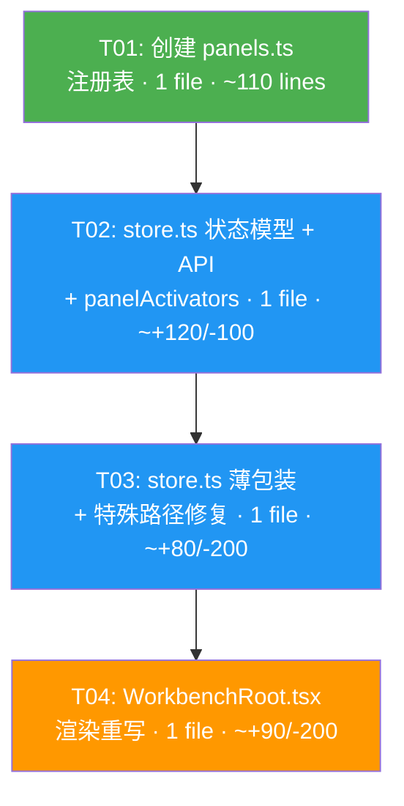

# 架构设计:WB-P1 — UI/结果工作台收编

> 文档版本:v1.0
> 编写日期:2026-07-30
> 关联 PRD:`docs/PRD-WB-P1-ui-consolidation.md`(v1.0,权威)
> 架构师:高见远
> 范围:P0-1 ~ P0-7 仅限,不含 P1/P2

---

## 1. 实现方案与框架选型

### 1.1 技术栈

沿用现有技术栈,**无新增框架或第三方依赖**:

- Electron 40 + React 18 + TypeScript(桌面壳 + 渲染层)
- Zustand(渲染层状态管理)
- React.lazy + Suspense(面板组件懒加载,首次打开才加载代码)

### 1.2 核心技术挑战

| 挑战 | 说明 | 方案 |
|------|------|------|
| **互斥逻辑统一** | 10 个 `*Open` 布尔 + 1 个 `resultOpen` 本地 state + useEffect 手动同步,互斥靠每个 open 方法内联 10 行赋值 | `activePanelId: PanelId \| null` 单值替代,互斥由单值语义天然保证 |
| **keep-alive 不卸载** | 条件渲染(`resultOpen ? <A> : terminalOpen ? <B> : ...`)导致切换即卸载,终端会话/浏览器页面/文件草稿丢失 | 注册表遍历 + `display: none/flex` 控制,`mountedPanels: Set<PanelId>` 跟踪已挂载面板 |
| **薄包装向前兼容** | 30+ 处调用方(ChatView/Composer/CommandPalette/ToolCallCard/StudioResultPanel/commands.ts/各面板关闭按钮)直接调用 `openDiffPanel()` 等 | 旧方法保留为薄包装,内部转发 `openPanel(id)` / `closePanel()`,调用方零改动 |
| **open 方法副作用差异** | 每个 open 方法有不同的激活副作用(refreshDiffPanel/startTerminal/openBrowser/refreshFilesPanel 等) | `panelActivators: Record<PanelId, (ctx?) => void>` 映射表,`openPanel` 统一调用 |
| **close 方法副作用差异** | `closeBrowserPanel` 关闭原生 BrowserView,`closePreviewPanel` 递增 seq 取消请求,`closeMemoryPanel` 清空表单 | 薄包装中 `closePanel()` + 面板特定清理;keep-alive 下面板组件保持挂载,副作用仅清理 store 状态 |
| **原生 BrowserView 平台约束** | `closeNativeBrowserView` 在每个 open 方法中调用,关闭原生 BrowserView 覆盖层;无"隐藏"API | `openPanel`/`closePanel` 统一调用 `closeNativeBrowserView`;浏览器面板 keep-alive 限于 React 组件状态,原生视图切换时重建(需 P1+ 添加 hide API) |
| **openBrowserPanel/openPreviewPanel 参数传递** | `openBrowserPanel(url?)` 和 `openPreviewPanel(path?)` 需要传递 URL/路径给激活回调 | `openPanel(id, context?)` 接受可选 `PanelOpenContext`,`panelActivators` 回调接收 context |

### 1.3 状态模型设计

```
┌─────────────────────────────────────────────────────────────────┐
│  WorkbenchState (Zustand)                                       │
│                                                                 │
│  收编前:                                收编后:                   │
│  ┌──────────────────────┐              ┌──────────────────────┐ │
│  │ diffOpen: boolean    │              │ activePanelId:        │ │
│  │ worktreeOpen: boolean│              │   PanelId | null      │ │
│  │ terminalOpen: boolean│   ───────►   │ mountedPanels:        │ │
│  │ filesOpen: boolean   │              │   Set<PanelId>        │ │
│  │ browserOpen: boolean │              │                      │ │
│  │ previewOpen: boolean │              │ (10 个 *Open 删除)    │ │
│  │ pluginRegistryOpen   │              │                      │ │
│  │ subagentOpen: boolean│              │ (数据字段不变:        │ │
│  │ routineOpen: boolean │              │  diff/terminal/       │ │
│  │ memoryOpen: boolean  │              │  browserState/等)    │ │
│  └──────────────────────┘              └──────────────────────┘ │
│                                                                 │
│  + WorkbenchRoot.tsx 本地:               + 删除本地 state:       │
│    resultOpen: boolean (useState)         resultOpen (移入 store) │
└─────────────────────────────────────────────────────────────────┘
```

**关键决策**:

1. **`activePanelId` 单值互斥**:同一时刻只有 0 或 1 个活动面板。`openPanel('diff')` 自动使前一个面板失活——无需手动将其余 9 个布尔置 false。
2. **`mountedPanels` keep-alive 集合**:面板首次激活时加入集合,`closePanel` 不移除(Q-1 决议:全部 keep-alive)。面板组件持续挂载,仅 `display` 切换。`unmountPanel(id)` 供"重置终端"等场景主动销毁。
3. **10 个 `*Open` 字段删除**:不再保留为兼容字段。经核实,`*Open` 仅被 `WorkbenchRoot.tsx`(渲染+sideOpen 计算)和 `store.ts`(open/close 方法内部)读取,无外部组件直接读取。WorkbenchRoot 重写后改用 `activePanelId`,store 内部改用 `activePanelId` + `mountedPanels`。

### 1.4 注册表结构

```
┌─────────────────────────────────────────────────────────────────┐
│  panels.ts (新建)                                               │
│                                                                 │
│  PanelId = 'result' | 'diff' | 'terminal' | 'browser' | 'files'│
│          | 'preview' | 'worktree' | 'pluginRegistry'            │
│          | 'subagent' | 'routine' | 'memory'                    │
│                                                                 │
│  PanelDefinition {                                              │
│    id: PanelId                                                  │
│    titleKey: string          // i18n key                        │
│    icon: HeaderIconName                                         │
│    component: React.LazyExoticComponent<...>                    │
│    keepAlive: boolean        // 全部 true (Q-1 决议)            │
│  }                                                              │
│                                                                 │
│  PANEL_REGISTRY: PanelDefinition[]  // 11 个面板注册            │
│                                                                 │
│  PanelOpenContext {                                             │
│    url?: string    // browser 面板                              │
│    path?: string   // preview 面板                              │
│  }                                                              │
└─────────────────────────────────────────────────────────────────┘

┌─────────────────────────────────────────────────────────────────┐
│  store.ts — panelActivators (非导出,模块内部)                   │
│                                                                 │
│  Record<PanelId, (ctx?) => void>                                │
│                                                                 │
│  diff:          () => { refreshDiffPanel(); refreshGitStatus() }│
│  terminal:      () => { startTerminal() }                       │
│  browser:       (ctx) => { openBrowser(ctx?.url) }              │
│  files:         () => { refreshFilesPanel() }                   │
│  preview:       (ctx) => { resolve path; refreshPreviewPanel() }│
│  worktree:      () => { reset worktree state; refreshWorktree() }│
│  pluginRegistry:() => { refreshPluginRegistryPanel() }          │
│  subagent:      () => { clear subagentError/Message }           │
│  routine:       () => { refreshRoutinePanel() }                 │
│  memory:        () => { clear memoryInitialForm }               │
│  result:        () => { /* 无副作用,数据由 useStudioResult 拉取 */ }│
└─────────────────────────────────────────────────────────────────┘
```

**为什么 `panelActivators` 在 store.ts 而非 panels.ts**:`panels.ts` 定义类型和注册表(纯数据,无副作用),`panelActivators` 需要调用 store 方法(`get().refreshDiffPanel()` 等),放在 store.ts 避免循环依赖(`panels.ts` → `store.ts` → `panels.ts`)。

### 1.5 keep-alive 渲染策略

```
┌──────────────────────────────────────────────────────────────┐
│  WorkbenchRoot.tsx 渲染 (收编后)                              │
│                                                              │
│  sideOpen = activePanelId !== null                           │
│                                                              │
│  {sideOpen && (                                              │
│    <>                                                        │
│      <div className="workbench-side-gutter" ...>             │
│        <button onClick={closePanel}>›</button>               │
│      </div>                                                  │
│      <section className="workbench-side">                    │
│        <Suspense fallback={<PanelLoading />}>                │
│          {PANEL_REGISTRY.map(def => {                        │
│            const isActive = activePanelId === def.id         │
│            const isMounted = mountedPanels.has(def.id)       │
│            if (!isActive && !isMounted) return null          │
│            return (                                          │
│              <div                                            │
│                key={def.id}                                  │
│                className="workbench-panel"                   │
│                style={{ display: isActive ? 'flex' : 'none' }}│
│                aria-hidden={!isActive}                       │
│              >                                               │
│                {renderPanelContent(def.id)}                  │
│              </div>                                          │
│            )                                                 │
│          })}                                                 │
│        </Suspense>                                           │
│      </section>                                              │
│    </>                                                       │
│  )}                                                          │
│                                                              │
│  renderPanelContent(id):                                     │
│    'result'   → <StudioResultPanel sessionId={activeId} />   │
│    'diff'     → <DiffPanel />           // 自行 useStore     │
│    'terminal' → <TerminalPanel />       // 自行 useStore     │
│    'browser'  → <BrowserPanel />        // 自行 useStore     │
│    'files'    → <FilePanel />           // 自行 useStore     │
│    'preview'  → <PreviewPanel />        // 自行 useStore     │
│    'worktree' → <WorktreePanel />       // 自行 useStore     │
│    'pluginRegistry' → <PluginRegistryPanel {...props} />     │
│    'subagent' → <SubagentPanel {...props} />                 │
│    'routine'  → <RoutinePanel {...props} />                  │
│    'memory'   → <MemoryPanel sessionId={activeId}            │
│                   initialForm={memoryInitialForm}             │
│                   onClose={closePanel} />                     │
└──────────────────────────────────────────────────────────────┘
```

**P0-7 props 传递策略(混合模式)**:

- **已自选面板**(Diff/Terminal/Browser/File/Preview/Worktree):组件内部 `useStore` 选取状态,WorkbenchRoot 零 props 传递。
- **需 props 面板**(PluginRegistry/Subagent/Routine/Memory/Result):WorkbenchRoot 通过 `renderPanelContent(id)` 函数组装 props。这些面板的 props 来源仍是 WorkbenchRoot 的 `useStore` selector——P0 不重构面板内部的数据获取(P1-1 再搬移)。
- **StudioResultPanel standalone 路径**:`AppListView.tsx:134` 的 `<StudioResultPanel standalone />` 不走注册表,不受影响(Q-6 决议)。

---

## 2. 文件列表

### 2.1 新建文件

| # | 文件路径 | 改动类型 | 职责(一句话) |
|---|---------|---------|--------------|
| F01 | `src/renderer/src/components/workbench/panels.ts` | **新建** | `PanelId` 联合类型、`PanelDefinition` 接口、`PanelOpenContext` 接口、`PANEL_REGISTRY` 数组(11 个面板定义,component 用 `React.lazy`) |

### 2.2 修改文件

| # | 文件路径 | 改动类型 | 职责(一句话) |
|---|---------|---------|--------------|
| F02 | `src/renderer/src/store.ts` | **修改** | 删除 10 个 `*Open` 字段;新增 `activePanelId` + `mountedPanels`;新增 `openPanel`/`closePanel`/`togglePanel`/`unmountPanel`;新增 `panelActivators` 映射;旧 open*/close* 方法改为薄包装;修复 `acceptMemorySuggestion`/`refreshDiffPanel` 等特殊路径;浏览器 closed 事件改用 `activePanelId` |
| F03 | `src/renderer/src/components/workbench/WorkbenchRoot.tsx` | **修改** | 删除 `resultOpen` 本地 state + `useEffect` 同步 + `closeActiveSidePanel` 10 元组 + 75 行 if/else 链;改用 `activePanelId`/`mountedPanels` + 注册表遍历 + `display:none/flex`;`DeskControlRail` 映射更新;`renderPanelContent` 函数 |

### 2.3 不改但需验证不受影响的文件

| 文件 | 理由 |
|------|------|
| `src/renderer/src/components/ChatView.tsx` | 调用 `openDiffPanel()`/`openBrowserPanel()` 等薄包装,签名不变,零改动 |
| `src/renderer/src/components/Composer.tsx` | 调用 `openDiffPanel()`/`openBrowserPanel()` 等薄包装,签名不变 |
| `src/renderer/src/components/CommandPalette.tsx` | 调用 `openDiffPanel()` 等薄包装,签名不变 |
| `src/renderer/src/components/ToolCallCard.tsx` | 调用 `openDiffPanel()` 薄包装,签名不变 |
| `src/renderer/src/components/workbench/StudioResultPanel.tsx` | 调用 `openDiffPanel()`/`openFilesPanel()` 等薄包装;standalone 路径不走注册表(Q-6 决议) |
| `src/renderer/src/components/workbench/DiffPanel.tsx` | 内部 `useStore` 选取,关闭按钮调 `closeDiffPanel()` 薄包装,零改动 |
| `src/renderer/src/components/workbench/TerminalPanel.tsx` | 内部 `useStore` 选取,关闭按钮调 `closeTerminalPanel()` 薄包装 |
| `src/renderer/src/components/workbench/BrowserPanel.tsx` | 内部 `useStore` 选取,关闭按钮调 `closeBrowserPanel()` 薄包装 |
| `src/renderer/src/components/workbench/FilePanel.tsx` | 内部 `useStore` 选取 |
| `src/renderer/src/components/workbench/PreviewPanel.tsx` | 内部 `useStore` 选取 |
| `src/renderer/src/components/workbench/WorktreePanel.tsx` | 内部 `useStore` 选取 |
| `src/renderer/src/components/workbench/PluginRegistryPanel.tsx` | 接收 props,关闭按钮调 `closePluginRegistryPanel()` 薄包装 |
| `src/renderer/src/components/workbench/SubagentPanel.tsx` | 接收 props,关闭按钮调 `closeSubagentPanel()` 薄包装 |
| `src/renderer/src/components/workbench/RoutinePanel.tsx` | 接收 props,关闭按钮调 `closeRoutinePanel()` 薄包装 |
| `src/renderer/src/components/MemoryPanel.tsx` | 接收 props,关闭按钮调 `closeMemoryPanel()` 薄包装 |
| `src/renderer/src/components/AppListView.tsx` | `<StudioResultPanel standalone />` 不走注册表 |
| `src/renderer/src/commands.ts` | 调用 `openDiffPanel()` 等薄包装,签名不变 |
| `src/shared/types.ts` | 无新增 IPC API,无 `AgentDeskApi` 变更(AC-13) |
| `preload/` 目录 | 无变更(AC-13) |
| `src/main/` 目录 | 无变更(AC-13) |

---

## 3. 数据结构与接口

### 3.1 PanelId 联合类型

```typescript
// src/renderer/src/components/workbench/panels.ts

/**
 * 工作台面板标识符。
 *
 * 11 个面板 = 原 10 个独立面板 + StudioResultPanel(归一为 'result')。
 * 新增面板只需在此联合类型添加一个字面量 + 在 PANEL_REGISTRY 注册。
 */
export type PanelId =
  | 'result'
  | 'diff'
  | 'terminal'
  | 'browser'
  | 'files'
  | 'preview'
  | 'worktree'
  | 'pluginRegistry'
  | 'subagent'
  | 'routine'
  | 'memory'
```

### 3.2 PanelDefinition 接口

```typescript
// src/renderer/src/components/workbench/panels.ts

import type * as React from 'react'
import type { HeaderIconName } from '../ChatHeaderIcons'

/**
 * 面板注册表条目。
 *
 * 每个面板在此注册后,WorkbenchRoot 的渲染循环自动遍历挂载,
 * store 的 openPanel/closePanel/togglePanel 自动支持。
 */
export interface PanelDefinition {
  /** 面板唯一标识 */
  id: PanelId
  /** i18n key(用于面板标题/tooltip) */
  titleKey: string
  /** DeskControlRail / 面板头图标 */
  icon: HeaderIconName
  /** 懒加载组件,首次打开才加载代码 */
  component: React.LazyExoticComponent<React.ComponentType<any>>
  /** 是否在切换时保持挂载(keep-alive)。Q-1 决议:全部 true */
  keepAlive: boolean
}
```

### 3.3 PanelOpenContext 接口

```typescript
// src/renderer/src/components/workbench/panels.ts

/**
 * openPanel 的可选上下文参数。
 *
 * 供需要运行时参数的面板使用:
 * - browser: openBrowserPanel(url?) 传递 url
 * - preview: openPreviewPanel(path?) 传递 path
 *
 * 其他面板忽略此参数。
 */
export interface PanelOpenContext {
  url?: string
  path?: string
}
```

### 3.4 PANEL_REGISTRY 注册表

```typescript
// src/renderer/src/components/workbench/panels.ts

import { lazy } from 'react'

export const PANEL_REGISTRY: readonly PanelDefinition[] = [
  {
    id: 'result',
    titleKey: 'toggleDeskSummary',
    icon: 'summary',
    component: lazy(() => import('./StudioResultPanel')),
    keepAlive: true
  },
  {
    id: 'diff',
    titleKey: 'deskReview',
    icon: 'review',
    component: lazy(() => import('./DiffPanel')),
    keepAlive: true
  },
  {
    id: 'terminal',
    titleKey: 'deskTerminal',
    icon: 'terminal',
    component: lazy(() => import('./TerminalPanel')),
    keepAlive: true
  },
  {
    id: 'browser',
    titleKey: 'deskBrowser',
    icon: 'browser',
    component: lazy(() => import('./BrowserPanel')),
    keepAlive: true
  },
  {
    id: 'files',
    titleKey: 'deskFiles',
    icon: 'files',
    component: lazy(() => import('./FilePanel')),
    keepAlive: true
  },
  {
    id: 'preview',
    titleKey: 'deskFiles', // 复用 files 标签(DeskControlRail files 选项卡覆盖 preview)
    icon: 'files',
    component: lazy(() => import('./PreviewPanel')),
    keepAlive: true
  },
  {
    id: 'worktree',
    titleKey: 'deskReview', // 复用 review 标签(DeskControlRail review 选项卡覆盖 worktree)
    icon: 'review',
    component: lazy(() => import('./WorktreePanel')),
    keepAlive: true
  },
  {
    id: 'pluginRegistry',
    titleKey: 'openDeskTools',
    icon: 'plugins',
    component: lazy(() => import('./PluginRegistryPanel')),
    keepAlive: true
  },
  {
    id: 'subagent',
    titleKey: 'deskSideChat',
    icon: 'subagents',
    component: lazy(() => import('./SubagentPanel')),
    keepAlive: true
  },
  {
    id: 'routine',
    titleKey: 'openDeskTools',
    icon: 'routines',
    component: lazy(() => import('./RoutinePanel')),
    keepAlive: true
  },
  {
    id: 'memory',
    titleKey: 'memoryShort',
    icon: 'memory',
    component: lazy(() => import('../MemoryPanel')),
    keepAlive: true
  }
] as const

/** 按 PanelId 快速查找 */
export const PANEL_MAP: Readonly<Record<PanelId, PanelDefinition>> = Object.fromEntries(
  PANEL_REGISTRY.map((def) => [def.id, def])
)
```

### 3.5 WorkbenchState 变更

```typescript
// src/renderer/src/store.ts

export interface WorkbenchState {
  // ═══════════════════════════════════════════════════════════
  // 收编前(删除):
  //   diffOpen, worktreeOpen, terminalOpen, filesOpen,
  //   browserOpen, previewOpen, pluginRegistryOpen,
  //   subagentOpen, routineOpen, memoryOpen
  // ═══════════════════════════════════════════════════════════

  // 收编后(新增):
  /** 当前活动面板 ID,null 表示无面板打开 */
  activePanelId: PanelId | null
  /** 已挂载面板集合(keep-alive)。面板首次激活时加入,closePanel 不移除 */
  mountedPanels: Set<PanelId>

  // ═══════════════════════════════════════════════════════════
  // 以下数据字段全部保留(P0 不搬移,Q-4 决议):
  //   diff, diffLoading, diffError, gitStatus, gitLoading, ...
  //   worktree, worktreeLoading, ...
  //   terminal, terminalBuffer, terminalLoading, ...
  //   fileEntries, currentFileContent, ...
  //   browserState, browserUrlDraft, browserAnnotations, ...
  //   preview, previewPath, previewAnnotations, ...
  //   pluginRegistry, pluginRegistryLoading, ...
  //   routines, routineRuns, routineLoading, ...
  //   memoryInitialForm, memorySuggestion, ...
  // ═══════════════════════════════════════════════════════════
}
```

### 3.6 通用面板 API

```typescript
// src/renderer/src/store.ts (AppStore 接口新增)

interface AppStore {
  // ... 现有方法 ...

  // ═══ 新增:通用面板 API ═══

  /**
   * 打开面板。设 activePanelId = id,加入 mountedPanels,
   * 调用 closeNativeBrowserView 清理原生 BrowserView,
   * 调用 panelActivators[id] 执行面板特定激活逻辑。
   */
  openPanel(id: PanelId, context?: PanelOpenContext): void

  /**
   * 关闭当前活动面板。设 activePanelId = null,
   * 调用 closeNativeBrowserView。
   * keep-alive 面板保持 mounted(display: none)。
   */
  closePanel(): void

  /**
   * 切换面板。activePanelId === id ? closePanel() : openPanel(id, context)
   */
  togglePanel(id: PanelId, context?: PanelOpenContext): void

  /**
   * 主动卸载面板(从 mountedPanels 移除)。
   * 供"重置终端"等场景使用。日常切换不需要调用。
   */
  unmountPanel(id: PanelId): void

  // ═══ 保留:旧方法薄包装(@deprecated,P1-5 标记) ═══
  // openDiffPanel(): Promise<void>     → openPanel('diff')
  // closeDiffPanel(): void             → closePanel()
  // openTerminalPanel(): Promise<void>  → openPanel('terminal')
  // closeTerminalPanel(): void          → closePanel()
  // ... 10 对 open/close ...
}
```

### 3.7 panelActivators 映射

```typescript
// src/renderer/src/store.ts (模块内部,非导出)

type PanelActivator = (context?: PanelOpenContext) => void

const panelActivators: Record<PanelId, PanelActivator> = {
  diff: () => {
    void get().refreshDiffPanel()
    void get().refreshGitStatus()
  },

  terminal: () => {
    void get().startTerminal()
  },

  browser: (ctx) => {
    const id = get().activeId
    if (!id) return
    set((s) => ({
      workbench: {
        ...s.workbench,
        browserLoading: true,
        browserError: undefined,
        browserMessage: undefined
      }
    }))
    void (async () => {
      try {
        const state = await window.agentDesk.openBrowser(id, ctx?.url)
        const annotations = await window.agentDesk
          .listBrowserAnnotations(id)
          .catch(() => [])
        set((s) => ({
          workbench: {
            ...s.workbench,
            browserLoading: state.loading,
            browserState: state,
            browserUrlDraft: state.url,
            browserAnnotations: annotations,
            browserError: undefined
          }
        }))
      } catch (err) {
        set((s) => ({
          workbench: {
            ...s.workbench,
            browserLoading: false,
            browserError: err instanceof Error ? err.message : String(err)
          }
        }))
      }
    })()
  },

  files: () => {
    void get().refreshFilesPanel()
  },

  preview: (ctx) => {
    const nextPath = ctx?.path ?? get().workbench.previewPath ?? get().workbench.currentFilePath
    const pathChanged = Boolean(nextPath && nextPath !== get().workbench.previewPath)
    if (pathChanged) {
      previewRequestSeq += 1
      previewVisualRequestSeq += 1
    }
    set((s) => ({
      workbench: {
        ...s.workbench,
        previewPath: nextPath,
        previewError: undefined,
        ...(pathChanged
          ? {
              preview: undefined,
              previewAnnotations: [],
              previewLoading: false,
              previewVisual: undefined,
              previewVisualLoading: false,
              previewVisualError: undefined
            }
          : {})
      }
    }))
    void get().refreshPreviewPanel()
  },

  worktree: () => {
    set((s) => ({
      workbench: {
        ...s.workbench,
        worktreeMergeSummary: undefined,
        worktreeMergePatch: undefined,
        worktreeApplyCheck: undefined,
        worktreeApplyResult: undefined,
        worktreePrResult: undefined,
        worktreeConflictFiles: undefined,
        worktreeConflictLoading: false,
        worktreeLastReceipt: undefined,
        worktreeMergeInspecting: false,
        worktreeApplying: false,
        worktreeCreatingPr: false
      }
    }))
    void get().refreshWorktreePanel()
  },

  pluginRegistry: () => {
    set((s) => ({
      workbench: {
        ...s.workbench,
        pluginRegistryError: undefined,
        pluginRegistryMessage: undefined
      }
    }))
    void get().refreshPluginRegistryPanel()
  },

  subagent: () => {
    set((s) => ({
      workbench: {
        ...s.workbench,
        subagentError: undefined,
        subagentMessage: undefined
      }
    }))
  },

  routine: () => {
    set((s) => ({
      workbench: {
        ...s.workbench,
        routineError: undefined,
        routineMessage: undefined
      }
    }))
    void get().refreshRoutinePanel()
  },

  memory: () => {
    set((s) => ({
      workbench: { ...s.workbench, memoryInitialForm: undefined }
    }))
  },

  result: () => {
    // StudioResultPanel 内部 useStudioResult 自动拉取数据,无需激活副作用
  }
}
```

### 3.8 openPanel / closePanel / togglePanel 实现

```typescript
// src/renderer/src/store.ts

openPanel(id, context) {
  closeNativeBrowserView(get().activeId)
  set((s) => ({
    activePanelId: id,
    mountedPanels: new Set(s.mountedPanels).add(id)
  }))
  panelActivators[id]?.(context)
},

closePanel() {
  closeNativeBrowserView(get().activeId)
  set({ activePanelId: null })
},

togglePanel(id, context) {
  const current = get().activePanelId
  if (current === id) {
    get().closePanel()
  } else {
    get().openPanel(id, context)
  }
},

unmountPanel(id) {
  set((s) => {
    const next = new Set(s.mountedPanels)
    next.delete(id)
    return {
      mountedPanels: next,
      activePanelId: s.activePanelId === id ? null : s.activePanelId
    }
  })
},
```

### 3.9 旧方法薄包装实现

```typescript
// src/renderer/src/store.ts

// ── Diff ──
/** @deprecated 使用 openPanel('diff') 代替 */
async openDiffPanel() {
  get().openPanel('diff')
},
/** @deprecated 使用 closePanel() 代替 */
closeDiffPanel() {
  get().closePanel()
},

// ── Terminal ──
/** @deprecated 使用 openPanel('terminal') 代替 */
async openTerminalPanel() {
  get().openPanel('terminal')
},
/** @deprecated 使用 closePanel() 代替 */
closeTerminalPanel() {
  get().closePanel()
},

// ── Files ──
/** @deprecated 使用 openPanel('files') 代替 */
async openFilesPanel() {
  get().openPanel('files')
},
/** @deprecated 使用 closePanel() 代替 */
closeFilesPanel() {
  get().closePanel()
},

// ── Browser ──
/** @deprecated 使用 openPanel('browser', { url }) 代替 */
async openBrowserPanel(url) {
  get().openPanel('browser', url ? { url } : undefined)
},
/** @deprecated 使用 closePanel() 代替 */
async closeBrowserPanel() {
  // 保留:清理 browserLoading/browserError(closePanel 不做面板特定清理)
  get().closePanel()
  set((s) => ({
    workbench: {
      ...s.workbench,
      browserLoading: false,
      browserError: undefined
    }
  }))
},

// ── Preview ──
/** @deprecated 使用 openPanel('preview', { path }) 代替 */
async openPreviewPanel(path) {
  get().openPanel('preview', path ? { path } : undefined)
},
/** @deprecated 使用 closePanel() 代替 */
closePreviewPanel() {
  // 保留:递增 seq 取消待处理请求
  previewRequestSeq += 1
  previewVisualRequestSeq += 1
  get().closePanel()
  set((s) => ({
    workbench: {
      ...s.workbench,
      previewLoading: false,
      previewVisualLoading: false
    }
  }))
},

// ── Worktree ──
/** @deprecated 使用 openPanel('worktree') 代替 */
async openWorktreePanel() {
  get().openPanel('worktree')
},
/** @deprecated 使用 closePanel() 代替 */
closeWorktreePanel() {
  get().closePanel()
},

// ── PluginRegistry ──
/** @deprecated 使用 openPanel('pluginRegistry') 代替 */
async openPluginRegistryPanel() {
  get().openPanel('pluginRegistry')
},
/** @deprecated 使用 closePanel() 代替 */
closePluginRegistryPanel() {
  get().closePanel()
},

// ── Subagent ──
/** @deprecated 使用 openPanel('subagent') 代替 */
openSubagentPanel() {
  get().openPanel('subagent')
},
/** @deprecated 使用 closePanel() 代替 */
closeSubagentPanel() {
  get().closePanel()
},

// ── Routine ──
/** @deprecated 使用 openPanel('routine') 代替 */
async openRoutinePanel() {
  get().openPanel('routine')
},
/** @deprecated 使用 closePanel() 代替 */
closeRoutinePanel() {
  get().closePanel()
},

// ── Memory ──
/** @deprecated 使用 openPanel('memory') 代替 */
openMemoryPanel() {
  get().openPanel('memory')
},
/** @deprecated 使用 closePanel() 代替 */
closeMemoryPanel() {
  get().closePanel()
  set((s) => ({
    workbench: { ...s.workbench, memoryInitialForm: undefined }
  }))
},
```

### 3.10 特殊路径修复

```typescript
// src/renderer/src/store.ts

// ── acceptMemorySuggestion:从记忆建议打开 Memory 面板 ──
acceptMemorySuggestion() {
  const suggestion = get().workbench.memorySuggestion
  if (!suggestion) return
  const text = suggestion.text.trim()
  const title = text.length > 28 ? `${text.slice(0, 28)}...` : text || '用户约定'
  closeNativeBrowserView(get().activeId)
  set((s) => ({
    activeId: suggestion.sessionId,
    activePanelId: 'memory',
    mountedPanels: new Set(s.mountedPanels).add('memory'),
    workbench: {
      ...s.workbench,
      memorySuggestion: undefined,
      memoryInitialForm: {
        kind: 'convention',
        title,
        body: text,
        reason: '用户输入包含长期约定关键词'
      }
    }
  }))
},

// ── refreshDiffPanel:不再设 diffOpen: true ──
// 收编前:refreshDiffPanel 内部 set diffOpen: true(line 1854)
// 收编后:删除 diffOpen: true 赋值。refresh 只刷新数据,不改变 activePanelId。
// 调用方(openPanel('diff') 的 onActivate 或 DiffPanel 的刷新按钮)负责面板可见性。

// ── refreshFilesPanel:不再设 filesOpen: true ──
// 收编前:refreshFilesPanel 内部 set filesOpen: true(line 2426)
// 收编后:删除 filesOpen: true 赋值。

// ── refreshPluginRegistryPanel:不再设 pluginRegistryOpen: true ──
// 收编前:refreshPluginRegistryPanel 内部 set pluginRegistryOpen: true(line 2988)
// 收编后:删除 pluginRegistryOpen: true 赋值。

// ── refreshRoutinePanel:不再设 routineOpen: true ──
// 收编前:refreshRoutinePanel 内部 set routineOpen: true(line 3423)
// 收编后:删除 routineOpen: true 赋值。

// ── 浏览器 closed 事件:改用 activePanelId ──
// 收编前(line 1316-1325):
//   if (event.kind === 'closed') {
//     return { workbench: { ...s.workbench, browserOpen: false, browserState: undefined, browserLoading: false } }
//   }
// 收编后:
if (event.kind === 'closed') {
  if (activeId && event.sessionId !== activeId) return s
  return {
    activePanelId: s.activePanelId === 'browser' ? null : s.activePanelId,
    workbench: {
      ...s.workbench,
      browserState: undefined,
      browserLoading: false
    }
  }
}
```

---

## 4. 类关系图

见 `docs/class-diagram-wb-p1.mermaid`。

---

## 5. 程序调用流程

见 `docs/sequence-diagram-wb-p1.mermaid`。

---

## 6. 任务列表(按实现顺序)

### T01: 创建面板注册表 panels.ts

| 属性 | 值 |
|------|-----|
| **优先级** | P0 |
| **依赖** | 无 |
| **文件** | `src/renderer/src/components/workbench/panels.ts`(新建,约 110 行) |

**改动要点**:

1. 定义 `PanelId` 联合类型(11 个字面量)。
2. 定义 `PanelDefinition` 接口(`id`/`titleKey`/`icon`/`component`/`keepAlive`)。
3. 定义 `PanelOpenContext` 接口(`url?`/`path?`)。
4. 定义 `PANEL_REGISTRY` 数组:11 个面板定义,`component` 使用 `React.lazy(() => import('./XxxPanel'))` 懒加载,`keepAlive` 全部 `true`。
5. 导出 `PANEL_MAP` 便捷查找表。

**验收对应**:AC-2(注册表 11 个面板,字段完整)。

---

### T02: store.ts 状态模型 + 通用 API + panelActivators

| 属性 | 值 |
|------|-----|
| **优先级** | P0 |
| **依赖** | T01(需要 `PanelId`/`PanelOpenContext` 类型) |
| **文件** | `src/renderer/src/store.ts`(修改,约 +120 / -100 行) |

**改动要点**:

1. **import**:从 `./components/workbench/panels` 导入 `PanelId`、`PanelOpenContext`。
2. **WorkbenchState**:删除 10 个 `*Open: boolean` 字段;新增 `activePanelId: PanelId | null` 和 `mountedPanels: Set<PanelId>`。
3. **AppStore 接口**:新增 `openPanel`/`closePanel`/`togglePanel`/`unmountPanel` 方法签名。
4. **初始状态**:`activePanelId: null`,`mountedPanels: new Set<PanelId>()`。
5. **panelActivators**:定义 11 个面板的激活回调(§3.7)。
6. **openPanel/closePanel/togglePanel/unmountPanel**:实现(§3.8)。

**验收对应**:AC-1(`activePanelId` 字段存在,`openPanel` 方法存在)。

---

### T03: store.ts 旧方法薄包装 + 特殊路径修复

| 属性 | 值 |
|------|-----|
| **优先级** | P0 |
| **依赖** | T02(需要 `openPanel`/`closePanel` 已实现) |
| **文件** | `src/renderer/src/store.ts`(修改,约 +80 / -200 行) |

**改动要点**:

1. **10 对 open/close 薄包装**:每个旧方法改为调用 `openPanel(id)` / `closePanel()`,保留面板特定副作用(§3.9)。加 `@deprecated` JSDoc 注释。
2. **acceptMemorySuggestion**:改为设置 `activePanelId: 'memory'` + `mountedPanels.add('memory')`,删除 10 个 `*Open` 赋值(§3.10)。
3. **refreshDiffPanel / refreshFilesPanel / refreshPluginRegistryPanel / refreshRoutinePanel**:删除内部的 `*Open: true` 赋值(§3.10)。
4. **浏览器 closed 事件**:`browserOpen: false` → `activePanelId === 'browser' ? null : activePanelId`(§3.10)。
5. **closeNativeBrowserView 调用点**:原 10 个 open 方法中的 `closeNativeBrowserView` 调用已由 `openPanel` 统一处理,薄包装中删除重复调用。

**验收对应**:AC-8(旧方法仍可调用,内部转发正确)、AC-13(无 IPC/types 变更)。

---

### T04: WorkbenchRoot.tsx 渲染重写

| 属性 | 值 |
|------|-----|
| **优先级** | P0 |
| **依赖** | T03(需要薄包装 + 新 API 就绪) |
| **文件** | `src/renderer/src/components/workbench/WorkbenchRoot.tsx`(修改,约 +90 / -200 行) |

**改动要点**:

1. **删除 `resultOpen` 本地 state**(L51):`const [resultOpen, setResultOpen] = useState(false)` → 删除。
2. **删除 10 个 `*Open` selector**(L55-64):替换为 `const activePanelId = useStore((s) => s.activePanelId)` + `const mountedPanels = useStore((s) => s.mountedPanels)`。
3. **新增 API selector**:`openPanel`/`closePanel`/`togglePanel`/`unmountPanel`。
4. **删除 `closeActiveSidePanel` 函数**(L40-46)和调用点(L152-158):`collapseSidePanel` 改为 `() => closePanel()`。
5. **删除 `useEffect` 同步**(L239-243):`activePanelId` 单值保证互斥,无需手动同步 `resultOpen`。
6. **`toggleSummaryPanel`**(L167-174):改为 `togglePanel('result')`。
7. **`sideOpen` 推导**(L189-190):`const sideOpen = activePanelId !== null`。
8. **`deskTools` 映射**(L191-237):
   - review: `active: activePanelId === 'diff' || activePanelId === 'worktree'`, `onSelect: () => openPanel('diff')`
   - terminal: `active: activePanelId === 'terminal'`, `onSelect: () => openPanel('terminal')`
   - browser: `active: activePanelId === 'browser'`, `onSelect: () => openPanel('browser')`
   - files: `active: activePanelId === 'files' || activePanelId === 'preview'`, `onSelect: () => openPanel('files')`
   - sideChat: `active: activePanelId === 'subagent'`, `onSelect: () => openPanel('subagent')`
   - memory: `active: activePanelId === 'memory'`, `onSelect: () => openPanel('memory')`
9. **`DeskControlRail` props**:`summaryOpen` 改为 `activePanelId === 'result'`。
10. **渲染区**(L282-357):75 行 if/else 链替换为注册表遍历 + `display: none/flex`(§1.5)。`<Suspense>` 包裹懒加载组件。
11. **`renderPanelContent(id)` 函数**:为 PluginRegistry/Subagent/Routine/Memory/Result 面板组装 props(保持现有 selector 调用,只改渲染入口)。
12. **删除冗余 import**:不再直接 import 面板组件(由 `panels.ts` 懒加载);保留 `StudioResultPanel` import(standalone 路径不走注册表——实际上注册表也 lazy import 了,WorkbenchRoot 不需要再直接 import)。

**验收对应**:AC-3(if/else 链删除,注册表遍历存在)、AC-6(resultOpen 删除)、AC-7(DeskControlRail 映射正确)、AC-12(closePanel 隐藏侧栏)。

---

### 任务依赖图



**实现顺序建议**:

1. **先 T01**(注册表):纯类型和数据定义,无副作用,可独立编译验证。
2. **再 T02**(状态模型 + API):新增 `activePanelId`/`mountedPanels`/`openPanel` 等,此时旧方法未改,两者并存(旧方法仍直接操作 `*Open`,但 `*Open` 已删除——编译会报错,需 T03 同时完成)。
3. **T03 紧跟 T02**(同一文件 `store.ts`):薄包装 + 特殊路径修复。T02 + T03 实际上是一个原子改动(删除 `*Open` + 薄包装必须同时完成,否则编译失败)。
4. **最后 T04**(渲染重写):store 就绪后,重写 WorkbenchRoot 渲染。

> **注意**:T02 和 T03 虽分为两个任务,但属于同一文件的原子改动——`*Open` 字段删除(T02)和薄包装改写(T03)必须同时完成,否则旧方法引用已删除的字段会导致编译失败。建议在同一次提交中完成。

---

## 7. 跨文件约定

### 7.1 PanelId 类型单一来源(Single Source of Truth)

- `PanelId` 联合类型定义在 `src/renderer/src/components/workbench/panels.ts`,是面板标识符的**唯一定义**。
- `store.ts` 从 `panels.ts` import `PanelId` 和 `PanelOpenContext`。
- `WorkbenchRoot.tsx` 从 `panels.ts` import `PANEL_REGISTRY` 和 `PANEL_MAP`。
- **禁止**在 `store.ts` 或其他文件中重新定义面板 ID 字面量。

### 7.2 注册表遍历渲染约定

- `WorkbenchRoot` 的渲染**必须**通过 `PANEL_REGISTRY.map()` 遍历,不允许新增 if/else 分支。
- 新增面板流程:① 在 `PanelId` 添加字面量;② 在 `PANEL_REGISTRY` 添加定义;③ 在 `panelActivators` 添加激活回调(若有副作用);④ 在 `renderPanelContent` 添加 props 组装(若需要 props)。无需改 `openPanel`/`closePanel`/`closeActiveSidePanel`/`if/else` 链。

### 7.3 旧方法 @deprecated 约定

- 所有旧 `open*Panel`/`close*Panel` 方法加 `@deprecated use openPanel('xxx') instead` / `@deprecated use closePanel() instead` JSDoc 注释。
- P0 不修改调用方(ChatView/Composer/CommandPalette/ToolCallCard/StudioResultPanel/commands.ts)。
- P1-5 统一清理调用方,将 `openDiffPanel()` 替换为 `openPanel('diff')` 等,然后删除薄包装。

### 7.4 closeNativeBrowserView 调用约定

- `openPanel(id)` 和 `closePanel()` 统一调用 `closeNativeBrowserView(get().activeId)`。
- 薄包装中**不再**单独调用 `closeNativeBrowserView`(由 `openPanel`/`closePanel` 统一处理)。
- `acceptMemorySuggestion` 保留独立调用 `closeNativeBrowserView`(因为它直接设置 `activePanelId` 而非调用 `openPanel`)。

### 7.5 keep-alive 面板行为约定

- 面板首次激活时加入 `mountedPanels`,此后保持挂载(`display: none` 时仍保留 React 组件树)。
- `closePanel()` 设 `activePanelId = null`,**不从** `mountedPanels` 移除任何面板。
- `unmountPanel(id)` 是唯一从 `mountedPanels` 移除面板的方法,供"重置终端""关闭浏览器"等场景使用。
- 浏览器面板的 keep-alive 限于 React 组件状态(`browserState`/`browserUrlDraft`/`browserAnnotations`);原生 BrowserView 在面板切换时被 `closeNativeBrowserView` 关闭,切回时由 `panelActivators.browser` 重建(平台约束,P1+ 评估 hide API)。

### 7.6 sideOpen 推导约定

- `sideOpen = activePanelId !== null`——不再遍历 10 个布尔值。
- `sideOpen` 为 false 时,`workbench-side` 区域不渲染(DOM 中不存在),但 `mountedPanels` 中的面板组件仍保持挂载(因为它们在 `sideOpen` 为 true 时渲染,React 的 `display: none` 保持组件树存活)。
- **注意**:当 `sideOpen` 从 true → false(关闭侧栏),`{sideOpen && (...)}` 条件渲染会卸载所有面板组件。这与 keep-alive 理念冲突。

  **解决方案**:将 `{sideOpen && (...)}` 改为始终渲染 `<section className="workbench-side">`,通过 CSS `visibility: hidden` / `width: 0` 控制可见性,而非条件渲染。或使用 `hidden` 属性。具体由 T04 实现时确定——推荐用 `style={{ display: sideOpen ? 'flex' : 'none' }}` 包裹整个 `workbench-side` section,保持 DOM 存活。

  > **架构推荐**:WorkbenchRoot 的 `workbench-side` section 始终渲染(不条件渲染),通过 `display: none` 控制可见性。内部面板也通过 `display: none` 控制可见性。这样关闭侧栏时面板组件仍保持挂载,重新打开时状态保留。

### 7.7 StudioResultPanel standalone 路径约定

- `AppListView.tsx:134` 的 `<StudioResultPanel sessionId={activeId} standalone onOpenSessionSurface={onOpenSession} />` 不走面板注册表。
- 注册表中的 `StudioResultPanel` 渲染时传 `standalone={false}`(默认值),不传 `onOpenSessionSurface`(Q-6 决议)。
- `StudioResultPanel` 内部的 `openTool` 调用 `openDiffPanel()`/`openFilesPanel()` 等薄包装,零改动。

---

## 8. 不修改清单

以下文件/模块在 P0 中**明确不受影响**:

| 文件/模块 | 理由 |
|-----------|------|
| `src/main/` 整个目录 | 六环链路铁律:只改 store→UI 环,不动主进程。无新增 IPC 通道(AC-13) |
| `preload/` 整个目录 | 无 preload 暴露变更(AC-13) |
| `src/shared/types.ts` | 无 `AgentDeskApi` 变更,无新增 IPC 类型(AC-13) |
| `src/renderer/src/components/ChatView.tsx` | 调用薄包装,签名不变 |
| `src/renderer/src/components/Composer.tsx` | 调用薄包装,签名不变 |
| `src/renderer/src/components/CommandPalette.tsx` | 调用薄包装,签名不变 |
| `src/renderer/src/components/ToolCallCard.tsx` | 调用薄包装,签名不变 |
| `src/renderer/src/commands.ts` | 调用薄包装,签名不变 |
| `src/renderer/src/components/workbench/DiffPanel.tsx` | 内部 `useStore` 选取,关闭按钮调薄包装 |
| `src/renderer/src/components/workbench/TerminalPanel.tsx` | 同上 |
| `src/renderer/src/components/workbench/BrowserPanel.tsx` | 同上 |
| `src/renderer/src/components/workbench/FilePanel.tsx` | 同上 |
| `src/renderer/src/components/workbench/PreviewPanel.tsx` | 同上 |
| `src/renderer/src/components/workbench/WorktreePanel.tsx` | 同上 |
| `src/renderer/src/components/workbench/PluginRegistryPanel.tsx` | 接收 props 不变,关闭按钮调薄包装 |
| `src/renderer/src/components/workbench/SubagentPanel.tsx` | 同上 |
| `src/renderer/src/components/workbench/RoutinePanel.tsx` | 同上 |
| `src/renderer/src/components/workbench/StudioResultPanel.tsx` | openTool 调薄包装;standalone 路径不走注册表 |
| `src/renderer/src/components/MemoryPanel.tsx` | 接收 props 不变,关闭按钮调薄包装 |
| `src/renderer/src/components/AppListView.tsx` | `<StudioResultPanel standalone />` 不走注册表 |
| `src/renderer/src/components/RoutineEditor.tsx` | Routine 权限选择器不受影响(AC-10) |
| `src/renderer/src/components/SettingsModal.tsx` | 布局设置不受影响 |
| `src/renderer/src/components/experience/` 目录 | Welcome 流程不受影响 |
| WB-P0 TaskStrategy 相关代码 | 策略层不触及(AC-9) |

---

## 9. 待明确事项

### 9.1 workbench-side 条件渲染与 keep-alive 冲突

**问题**:当前 `WorkbenchRoot.tsx:260` 使用 `{sideOpen && (...)}` 条件渲染 `workbench-side` section。当 `sideOpen` 从 true → false(关闭侧栏)时,React 会卸载整个 section 及其所有子组件——这与 keep-alive(面板保持挂载)理念冲突。关闭侧栏后再打开,所有面板状态丢失。

**选项**:
- (A) 将 `{sideOpen && (...)}` 改为始终渲染 `<section>`,通过 `style={{ display: sideOpen ? 'flex' : 'none' }}` 控制可见性。DOM 保持存活,面板组件不卸载。
- (B) 保持 `{sideOpen && (...)}` 条件渲染,接受"关闭侧栏 = 卸载所有面板"的行为(与当前行为一致)。keep-alive 仅在"侧栏保持打开、面板间切换"场景生效。
- (C) 折中:侧栏 section 始终渲染,但 `workbench-side-gutter`(拖拽条)条件渲染。

**建议**:**(A)** 始终渲染 + `display: none`。理由:US-1/US-5 的核心价值是"切换面板不丢状态",但用户也会"关闭侧栏再打开"——如果关闭侧栏丢状态,keep-alive 的价值大打折扣。方案 A 改动量小(仅 `WorkbenchRoot.tsx` 的 `{sideOpen && (...)}` → `style={{ display: ... }}`),且与面板级的 `display: none` 策略一致。

**需主理人确认**:是否同意方案 A(当前建议:同意)。

---

### 9.2 浏览器面板 keep-alive 的平台限制

**问题**:浏览器面板使用 Electron 原生 `BrowserView` 覆盖在渲染窗口上。`closeNativeBrowserView` 调用 `window.agentDesk.closeBrowser(sessionId)` 销毁原生视图。无"隐藏"API。因此,浏览器面板的 keep-alive 仅限于 React 组件状态(`browserState`/`browserUrlDraft`/`browserAnnotations`),原生 BrowserView 在面板切换时被销毁,切回时由 `panelActivators.browser` 重新创建。

**影响**:
- Terminal 面板:keep-alive 完全有效(终端会话由主进程管理,`closeTerminalPanel` 不调用 `closeTerminal`)。✓
- File 面板:keep-alive 完全有效(文件草稿在 store 中)。✓
- Diff/Worktree/PluginRegistry/Subagent/Routine/Memory 面板:keep-alive 完全有效(数据在 store 中)。✓
- Preview 面板:keep-alive 部分有效(预览数据在 store 中,但 `closePreviewPanel` 薄包装递增 seq 取消请求——日常切换不走薄包装,不影响)。✓
- **Browser 面板**:keep-alive 限于 React 状态,原生视图重建。⚠️

**建议**:P0 接受浏览器面板的平台限制。PRD US-1(终端 keep-alive)和 US-2(文件草稿 keep-alive)是核心价值,不受此限制。浏览器面板的完整 keep-alive 需 P1+ 在主进程添加 `hideBrowser`/`showBrowser` API(违反六环链路铁律,需独立评估)。

**需主理人确认**:是否同意 P0 接受浏览器面板的平台限制(当前建议:同意)。

---

### 9.3 panels.ts 中 preview/worktree 的 titleKey 和 icon 复用

**问题**:`preview` 和 `worktree` 面板在 `DeskControlRail` 中没有独立的选项卡——`review` 选项卡覆盖 `diff` + `worktree`,`files` 选项卡覆盖 `files` + `preview`。因此 `PanelDefinition` 的 `titleKey` 和 `icon` 对这两个面板缺少独立的 i18n key 和图标。

**选项**:
- (A) 复用 `deskReview`/`deskFiles` 的 titleKey 和 icon(当前方案)。缺点:面板头标题不精确(Preview 面板显示"文件")。
- (B) 新增 i18n key(`deskPreview`/`deskWorktree`)和图标。缺点:新增 i18n key 和可能的新图标路径,增加 P0 改动面。

**建议**:**(A)** P0 复用。理由:`PanelDefinition.titleKey` 和 `icon` 在 P0 中仅用于注册表元数据,`DeskControlRail` 的 6 个选项卡 UI 不变(不从此字段读取)。P1-2(面板头标准化)再添加独立标题和图标。

**需主理人确认**:是否同意 P0 复用 titleKey/icon(当前建议:同意)。

---

### 9.4 openPanel 的 context 参数扩展

**问题**:PRD §3.2 P0-3 定义的 `openPanel(id: PanelId): void` 不带参数。但 `openBrowserPanel(url?)` 和 `openPreviewPanel(path?)` 需要传递 URL/路径。架构方案扩展签名为 `openPanel(id: PanelId, context?: PanelOpenContext): void`。

**影响**:
- `openPanel` 的公开签名与 PRD 不完全一致(多了可选 `context` 参数)。
- 向后兼容:`context` 是可选参数,不传时行为与 PRD 一致。

**建议**:接受扩展签名。`PanelOpenContext` 是可选参数,不破坏 PRD 的 API 契约。薄包装 `openBrowserPanel(url?)` → `openPanel('browser', { url })` 是主要使用者。

**需主理人确认**:是否同意 `openPanel` 扩展 context 参数(当前建议:同意)。

---

## 附录:验收标准与任务映射

| AC | 描述 | 主要负责任务 |
|----|------|------------|
| AC-1 | `activePanelId: PanelId \| null` 字段存在,`openPanel(id)` 方法存在 | T02 |
| AC-2 | `PANEL_REGISTRY` 11 个面板,字段完整 | T01 |
| AC-3 | if/else 链删除,注册表遍历 + `display: none` 存在 | T04 |
| AC-4 | Terminal 切 Diff 切回:终端会话未断(keep-alive) | T02 + T04 |
| AC-5 | File 切 Browser 切回:草稿保留(keep-alive) | T02 + T04 |
| AC-6 | `resultOpen` 本地 state 删除,`useEffect` 同步删除 | T04 |
| AC-7 | DeskControlRail 6 选项卡映射正确 | T04 |
| AC-8 | 旧方法薄包装可调用,内部转发正确 | T03 |
| AC-9 | WB-P0 TaskStrategy 不受影响 | 不触及(验证) |
| AC-10 | Routine 自动化路径不受影响 | 不触及(验证) |
| AC-11 | 新增面板只需注册 1 行 + 1 组件文件 | T01(注册表设计) |
| AC-12 | `closePanel()` 隐藏侧栏,keep-alive 面板保持 mounted | T02 + T04 |
| AC-13 | 六环链路不破坏:无新增 IPC/types/preload/main 变更 | 全部任务(验证) |
