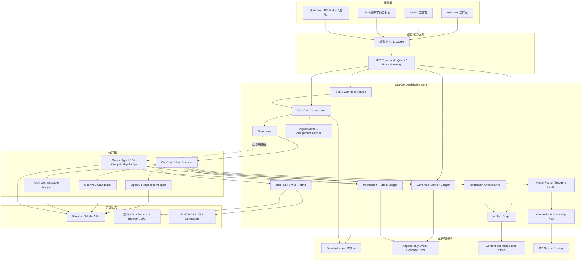
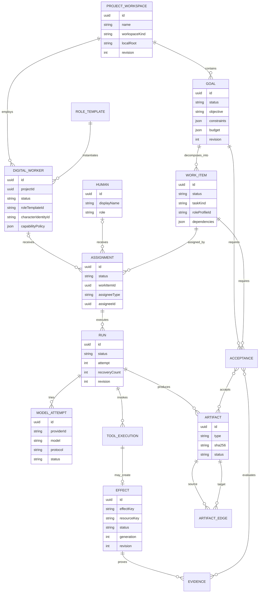
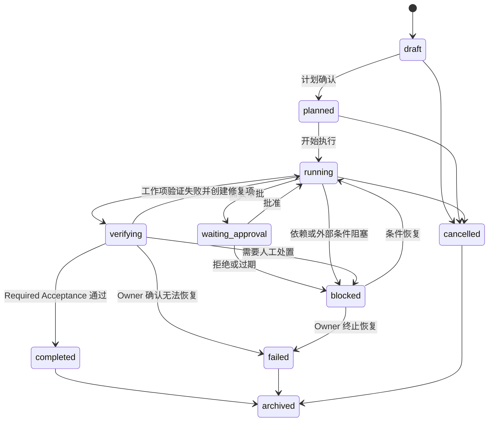
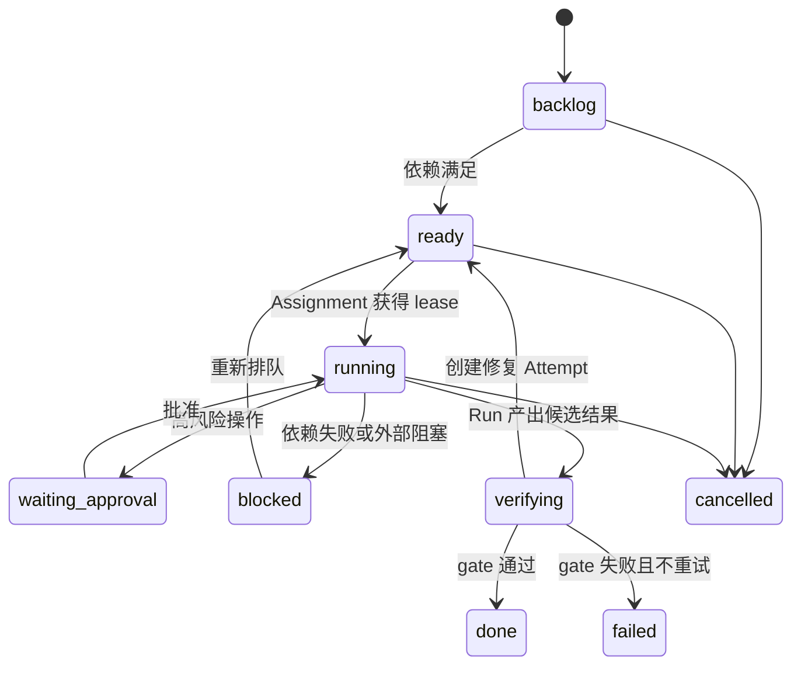
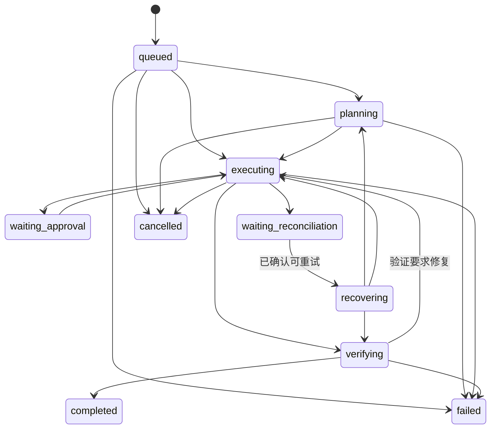
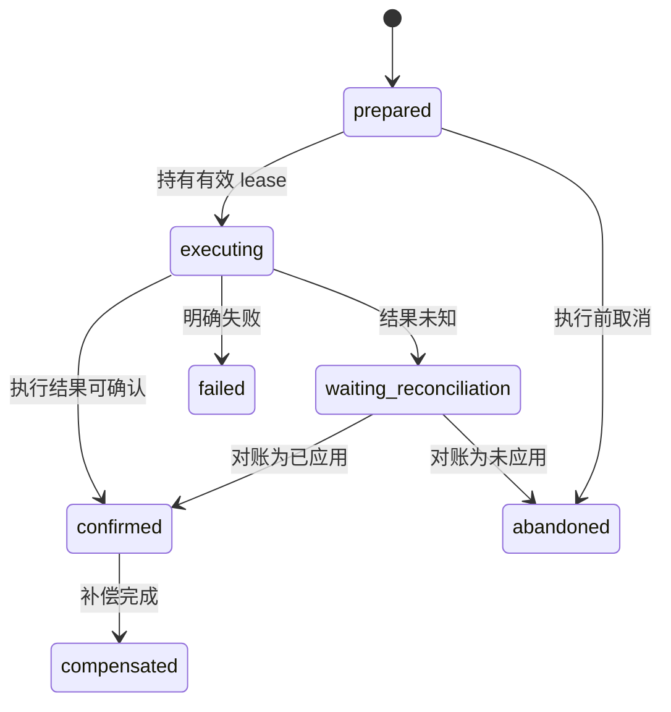
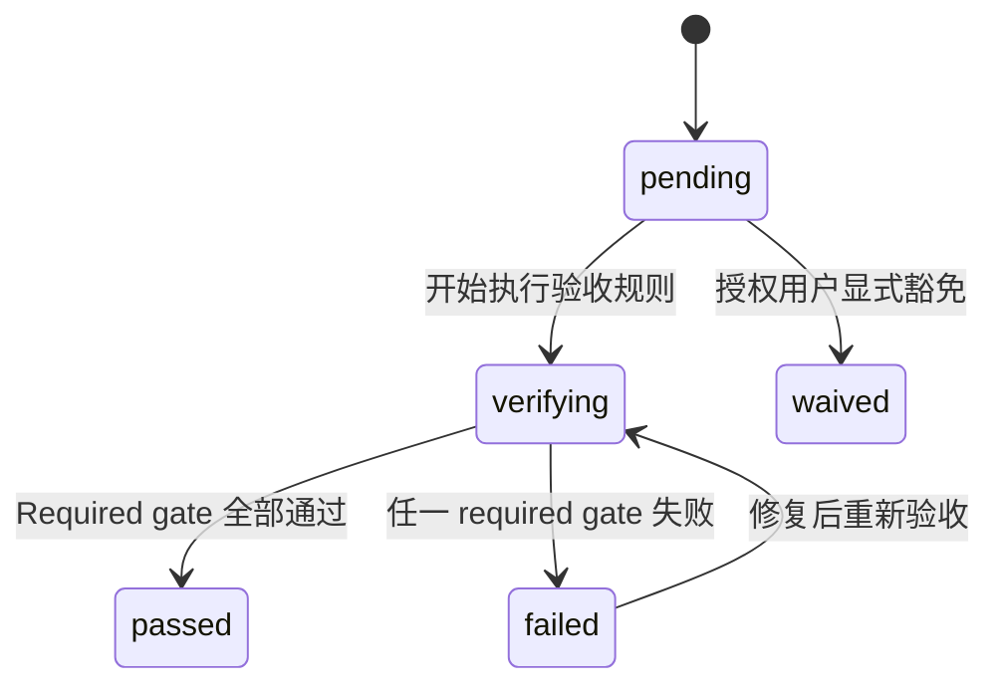
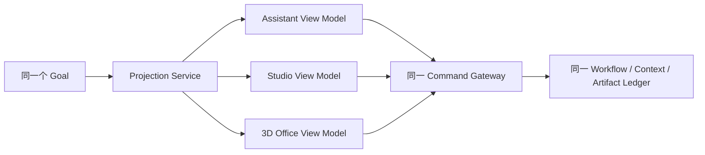
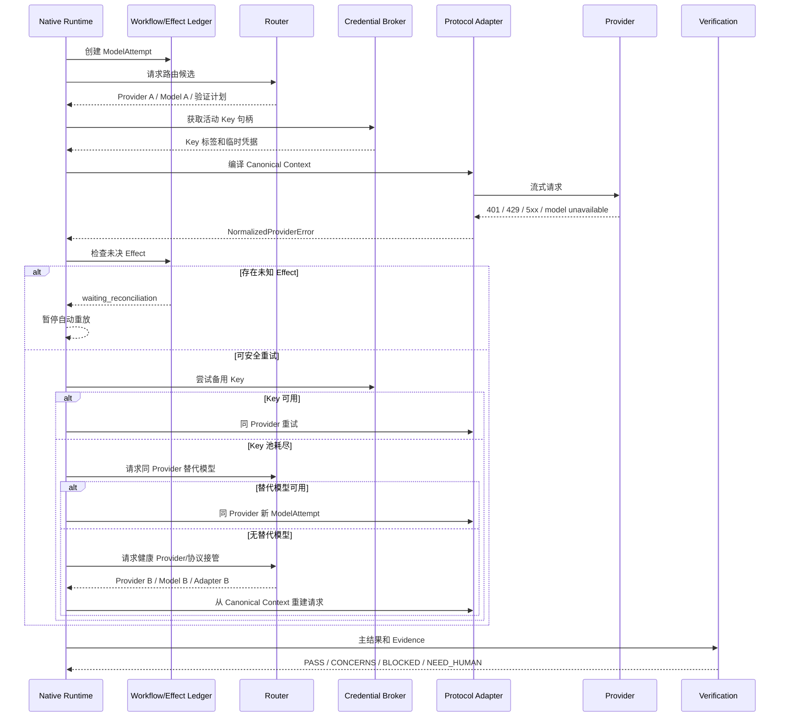

# CaoGen 概要设计

> 文档状态：立项目标架构
>
> 事实基线：`main@21051cab`，以 `STATUS.md` 2026-07-18 实测口径为准
>
> 需求基线：[`PROJECT-CHARTER.md`](./PROJECT-CHARTER.md) · [`PRODUCT-REQUIREMENTS.md`](./PRODUCT-REQUIREMENTS.md) · [`PRODUCT-TECHNICAL-REQUIREMENTS.md`](./PRODUCT-TECHNICAL-REQUIREMENTS.md)
>
> 安全基线：[`SECURITY-AND-RISK.md`](./SECURITY-AND-RISK.md)
>
> 重要边界：Claude Agent SDK 当前仍是可选正式路径；CaoGen Native Runtime + 协议 Adapter 是长期迁移目标，不是当前完成事实

## 1. 设计目标

本设计把 CaoGen 从“多厂商桌面会话 + 两类执行引擎”演进为“一个 CaoGen 原生执行内核 + 多协议算力 Adapter + 持久工作与交付账本”。

目标系统必须做到：

1. 用户只管理 Goal、约束、预算、审批和验收；
2. Assistant 与 Studio 使用同一内核、同一数据和同一任务身份；
3. Provider、模型、Key 和协议切换只产生新的 ModelAttempt；
4. 任何模型都不能绕过 CaoGen 的工具、权限、Effect、Artifact 和 Acceptance；
5. 应用崩溃、Provider 故障和模型切换不制造上下文断层或重复副作用；
6. 数字员工是 CaoGen 的岗位实例，不是外部 Agent CLI；
7. 3D 办公是 Ledger 的只读状态投影，不是新的执行真相来源。

## 2. 状态图例

| 标记 | 含义 |
|---|---|
| 当前已验证 | 当前主分支已有实现和证据 |
| 条件可用 | 已实现但依赖外部条件或存在明确限制 |
| 立项目标 | 本设计要求实现，当前未完整落地 |
| 后续规划 | 不进入首个目标版本 |
| 明确不做 | 不进入 CaoGen 核心边界 |

## 3. 总体架构



## 4. 当前架构与目标架构映射

| 目标组件 | 当前实现基础 | 状态与迁移 |
|---|---|---|
| Desktop Shell | Electron main/preload/React renderer | 当前已验证，继续沿用 |
| Engine Registry | `engine.ts`、`engines.ts` | 当前已验证；迁移后降为 Runtime/Bridge 注册 |
| OpenAI Runtime | `openaiEngine.ts` | 当前已验证；拆出 Native Runtime 和两个 Adapter |
| Claude Runtime | `agentSession.ts` + Claude Agent SDK | 条件可用；迁移期保留 Compatibility Bridge |
| Model Router | `model/*`、`providerHealth.ts`、`providerKeyRouting.ts` | 当前已验证；补同厂商换模型、跨协议和 half-open |
| Session/Task Facade | `sessionManager.ts` | 当前已验证；保留 facade，继续下沉领域服务 |
| Task/Workflow Ledger | `TaskRunRecord`、Task Snapshot SQLite、`workflow-ledger-*` | v8 recovery read-source foundation 已验证；Goal/WorkItem/Run/Artifact/Acceptance/Evidence Link/event chain 可投影和查询，Task Snapshot/TaskRun 恢复读取支持按数据库路径隔离的 `legacy / compare / canonical` 三态，未配置时默认 legacy |
| Effect Ledger | `task/effect-*`、`task-evidence-store.ts` | 当前已验证；v8 store 保留 v6 TaskRun Effect evidence append-only hash-chain foundation，但仍仅部分覆盖，继续扩大到所有外部副作用 |
| Context Ledger | transcript JSONL、history、checkpoint | 立项目标；当前迁移输入仍分散 |
| Artifact Graph | `workflow_artifact_edges` / `workflow_artifact_locations`、`workflow-ledger-artifact-graph-*` 与 `workflowLedger:*` IPC | foundation 已验证：edge/location 有不可变 payload、归属校验、event-chain binding、邻域/分页查询、脱敏 export 与只读 verification；附件、preview、patch、Code Forge、Routine/blob/sourceRef 尚未全部迁入 |
| Supervisor | 进程内 SessionManager、Routine Scheduler、tray | 条件可用；以现有进程内能力建设持久队列和 lease |
| Digital Worker | child session、DAG role、3D session workstation | 立项目标；当前没有一等实体 |
| Acceptance | Code Forge verification、model review、人工 Diff | 立项目标；当前验证入口分散 |
| 3D Ink Office | 当前机器人资产和 Office model | 立项目标；真实状态投影逻辑可复用 |

## 5. 逻辑分层

### 5.1 Experience Layer

负责展示和用户输入，不拥有业务真相。

- Assistant：目标、文件、进度、来源、审批、产物和验收；
- Studio：增加终端、Diff、Git、worktree、DAG、Attempt、预算和策略；
- 3D Office：人物、任务、状态、成本、审批和 failover 的空间投影；
- Quickbar/IDE Bridge：向现有 Goal 或新 Goal 投递上下文；
- Renderer store：只缓存 view model，不成为持久状态源。

### 5.2 Application Layer

负责用例编排：创建 Goal、拆解 WorkItem、分配数字员工、启动 Run、等待审批、组织验证和完成交付。

### 5.3 Runtime Layer

负责模型循环、上下文组装、Adapter 调用、工具执行、取消、重试、故障恢复和流事件。

### 5.4 Trust Layer

负责权限、凭据、Effect、幂等、Reconciler、证据和审计。Trust Layer 必须在 Runtime 与任何外部副作用之间。

### 5.5 Integration Layer

负责 Protocol Adapter、Tool、Skill、MCP、IDE、浏览器、GUI 和未来 Connector。集成组件不得直接决定 Goal 完成。

### 5.6 Data Layer

负责领域记录、事件、Blob、凭据、索引和迁移。所有 renderer 可见状态均从这里或其投影产生。

## 6. CaoGen Native Runtime

### 6.1 Runtime 接口

建议以窄接口替代当前引擎自行持有完整产品语义：

```ts
interface NativeRuntime {
  startRun(runId: string): Promise<void>
  submitInput(runId: string, input: CanonicalInput): Promise<void>
  cancelRun(runId: string, reason: string): Promise<void>
  resumeRun(runId: string): Promise<void>
  resolvePermission(command: PermissionDecision): Promise<void>
  subscribe(runId: string, cursor?: EventCursor): AsyncIterable<RuntimeEvent>
}

interface ProtocolAdapter {
  readonly protocol: ProtocolId
  capabilities(): AdapterCapabilities
  compile(input: AdapterCompileInput): Promise<ProviderRequest>
  stream(request: ProviderRequest, signal: AbortSignal): AsyncIterable<AdapterEvent>
  normalizeError(error: unknown): NormalizedProviderError
}
```

接口只是概要设计，具体 TypeScript 类型应在实现阶段按领域拆分，避免继续扩大 `src/shared/types.ts`。

### 6.2 Runtime 执行循环

```text
读取 Run/Step
-> 构建 Canonical Context Slice
-> 请求 Router 选择 ModelAttempt
-> Adapter 编译并发起流式调用
-> 规范化文本/思考/tool call
-> Permission + Effect preflight
-> Tool Fabric 执行
-> Tool result 写回 Context
-> 继续模型循环
-> 生成 Artifact/Evidence
-> Verification/Acceptance
-> 完成或进入恢复状态
```

### 6.3 Runtime 不变量

1. 一个 Run 同一时刻只有一个持有有效 execution lease 的执行者；
2. 每个外部 Effect 必须先耐久写入再执行；
3. ModelAttempt 可替换，Run、WorkItem、DigitalWorker 不替换；
4. Adapter 的 server conversation id 只作为缓存，不是 Canonical Context；
5. `completed` 前必须没有未收敛 Effect；
6. 用户中断不触发自动 failover；
7. 产品错误不通过 Provider failover 掩盖。

## 7. Protocol Adapter 设计

### 7.1 Adapter 能力

```ts
interface AdapterCapabilities {
  streaming: boolean
  tools: boolean
  vision: boolean
  structuredOutput: boolean
  serverConversation: boolean
  promptCaching: boolean
  maxContextTokens?: number
  maxOutputTokens?: number
}
```

Capability 来自静态已验证表、Provider 声明和可选 probe。来源和时间必须进入证据，不允许把未知能力永久默认为 true。

### 7.2 首批 Adapter

#### OpenAI Responses Adapter

- 复用当前 Responses SSE 和工具循环；
- Provider 切换时从 Canonical Context 重新编译完整可接受历史；
- `previous_response_id` 仅优化同 Provider 连续 Attempt；
- 保存 response id 与 Adapter/Provider 的绑定，禁止跨 Provider 复用。

#### OpenAI Chat Completions Adapter

- 复用当前 chat history、工具调用和压缩；
- 从 Canonical Context 重建文本、图片、tool call/tool result 配对；
- 对不支持工具的 Provider 明确拒绝，不以文本模拟工具成功。

#### Anthropic Messages Adapter

- 直接实现 Messages、content blocks、tool use、usage 和流事件；
- 不依赖 Claude Agent SDK 的隐藏会话状态；
- Hook、subagent、checkpoint 等产品能力由 CaoGen Native Runtime 提供；
- Anthropic 兼容端点必须经过协议合约测试。

#### Claude Agent SDK Compatibility Bridge

- **条件可用**：当前继续保留；
- 把 SDK 事件转换为 RuntimeEvent 和 Ledger 事件；
- 不新增只有 SDK 会话才能使用的核心产品能力；
- 旧 SDK 会话保持可读、可恢复条件明确、可从 CaoGen transcript fork；
- 退出必须由迁移门禁决定，不能按日期硬删。

## 8. 领域模型



### 8.1 ProjectWorkspace

当前 `Project` 主要是路径收藏和项目规则容器。目标 `ProjectWorkspace` 支持：

- code workspace：本地目录、仓库和 worktree；
- knowledge workspace：资料集合，可不绑定 Git；
- unassigned workspace：临时 Goal，但执行本地工具时仍必须有明确 root；
- 后续 remote workspace：仅在远程 runner 立项后启用。

### 8.2 Goal

Goal 是用户管理的顶层工作单元，保存目标、约束、禁止事项、预算、截止时间、验收和当前阻塞。会话不再是用户理解产品的唯一主对象。

### 8.3 WorkItem 与 Workflow

WorkItem 是看板和依赖图的主对象；Session/Run 是执行明细。Workflow 由 WorkItem、依赖、gate 和人工确认点组成，可来自模板、模型拆解或人工编辑。

### 8.4 DigitalWorker

DigitalWorker 是项目内岗位实例：

- 身份：名称、水墨形象、岗位、职责；
- 能力：Skill、MCP、Tool、上下文和领域记忆；
- 策略：权限上限、预算、并发、允许 Provider 区域；
- 生命周期：proposed、active、paused、retired；
- 不包含固定厂商身份。

### 8.5 ModelAttempt

ModelAttempt 是一次可替换算力尝试。Key 只记录 `keyId/keyLabel`，密钥值永不进入领域数据库、事件或 Artifact。

Assignment 是 WorkItem 到责任主体的唯一归属关系，`assigneeType` 支持 `digital_worker | human`。ER 中 DigitalWorker/Human 到 Assignment 均为可选多态关系，每个 Assignment 只能命中其中一种。只有分配给 DigitalWorker 并启动 Run 时才会产生 ModelAttempt；Human Assignment 不被伪装成模型执行。

## 9. 状态机

### 9.1 Goal 状态机



### 9.2 WorkItem 状态机



### 9.3 Run 状态机



### 9.4 Effect 状态机



### 9.5 Acceptance 状态机



`waived` 必须记录授权人、原因和范围；失败后的复验创建新的 Verification 记录并使 Acceptance 重新进入 `verifying`，不得覆盖原失败证据。

## 10. Assistant 与 Studio 同内核



### 10.1 Assistant 投影

显示：

- Goal、阶段和下一步；
- 输入文件、来源和引用；
- 人类语言的审批；
- 产物预览、版本和验收；
- “自动选择算力”的简化状态。

隐藏：

- Provider、模型、Key、Token、协议；
- 终端、Git、DAG、MCP 和低层路由分数；
- 不影响用户决策的内部 Attempt。

### 10.2 Studio 投影

在 Assistant 信息上增加：

- WorkItem/DAG/Assignment；
- Run、Attempt、Provider、模型、协议、预算和 failover；
- 终端、文件、Diff、Git、worktree、测试和 PR；
- Skill、MCP、权限策略、Effect 和 Evidence。

### 10.3 无损切换

切换模式只修改 `viewPreference`。Goal、当前 Run、Context cursor、附件、审批、Artifact、预算和数字员工必须保持原 ID，不创建新会话、不重复上传、不重发模型请求。

## 11. 数字员工执行链

```mermaid
flowchart LR
  User["用户目标"] --> Contract["Goal Contract"]
  Contract --> Planner["Workflow Planner"]
  Planner --> Items["WorkItems + DAG"]
  Items --> Assign["Assignment Service"]
  Assign --> Worker["DigitalWorker 岗位实例"]
  Worker --> Run["Native Runtime Run"]
  Run --> Attempts["ModelAttempts"]
  Attempts --> Tools["Tool / Skill / MCP"]
  Tools --> Effects["Effect Ledger"]
  Tools --> Artifacts["Artifact Graph"]
  Effects --> Evidence["Evidence"]
  Artifacts --> Verify["Verification / Review"]
  Evidence --> Verify
  Verify --> Acceptance["Acceptance"]
  Acceptance --> Delivery["交付或修复 WorkItem"]
```



### 11.1 岗位模板

首批通用 RoleTemplate：

- 主理：目标、边界、分派和汇总；
- 研知：资料、来源和研究；
- 策划：需求、方案和任务设计；
- 造物：代码、文档、表格、演示或其他产物；
- 校阅：完整性、质量、安全和一致性审查；
- 验证：测试、复现、证据和验收；
- 运营：Routine、通知、日常维护和交付跟踪。

岗位可以按项目自定义，但不得以厂商名作为默认岗位。

### 11.2 当前能力映射

当前 child session、DAG role、worktree、结果回灌和 3D 工位可作为实现基础，但尚未形成 DigitalWorker、Assignment 和 Goal 一等实体。Genesis 的 worker lane 计划也不得被视为已执行数字员工链。

## 12. 自动路由与故障恢复

### 12.1 路由组件

- Task Profiler：任务类型、输入模态、上下文、风险和阶段；
- Capability Registry：模型/协议能力和证据；
- Policy Resolver：Goal、项目、用户、Drive、区域和预算；
- Health Service：Provider/模型/Key 健康和 circuit breaker；
- Cost Service：版本化价格、估算和实际 usage；
- Router：硬过滤、评分、候选和验证计划；
- Attempt Manager：启动、取消、重试、failover 和 Attempt 链。

### 12.2 故障恢复序列



### 12.3 Circuit Breaker

Provider、模型和 Key 分别维护健康状态：

- closed：正常候选；
- open：连续失败或明确不可用，暂时排除；
- half-open：冷却后受限探测；
- disabled：用户或策略禁用。

当前 Provider 以连续失败 3 次标记不健康，目标设计增加冷却、half-open、探测和自动恢复。Key 保留现有 5 分钟失败冷却并扩展为统一状态。

### 12.4 Cross-validation

验证模型必须尽量与主模型异质：优先不同 Provider，其次不同模型族。验证会话使用 plan/read-only 权限。

当前文本关键字触发仲裁可作为兼容路径；目标必须解析结构化结论，并将 `BLOCKED` 或 required concern 写入 Acceptance，阻止完成，创建修复 WorkItem 或请求人工处置。

## 13. Canonical Context Ledger 设计

### 13.1 事件与内容分离

- Context Item 元数据和因果关系存入 Domain/Event Store；
- 大文本、图片、文件和文档单元存入 Blob Store；
- Item 通过 digest 和受控引用连接内容；
- Provider request 是 Context Slice 的临时编译结果，不持久化密钥。

### 13.2 Context Item 类型

```text
instruction
project_context
user_message
assistant_message
attachment_reference
tool_call
tool_result
permission
effect_reference
routing_decision
failover
checkpoint
compression_summary
subagent_result
review
arbitration
artifact_reference
acceptance_decision
```

### 13.3 Context Slice Builder

Slice Builder 按 Adapter 能力、Token 预算和任务阶段选择上下文：

1. 永久保留 Goal Contract、用户约束、当前 WorkItem 和未决审批；
2. 保留未收敛 Effect 和最近工具配对；
3. 通过 Artifact/Blob 引用附件，不重复复制；
4. 对旧历史生成可追溯 summary，并保留 summary 来源范围；
5. 不支持视觉的模型不得静默丢图，应改路由或明确降级；
6. server conversation 可复用时绑定 Provider、模型、协议和 Context digest。

### 13.4 Checkpoint 和 Fork

- code checkpoint：文件/Git 状态；
- chat checkpoint：Context cursor；
- workflow checkpoint：Goal/WorkItem/Run 状态；
- both：显式组合，不暗中回退未声明域；
- fork：创建新 Context branch，保留 parent branch 和 fork cursor。

## 14. Workflow Ledger 设计

### 14.1 事件模型

Workflow Ledger 采用“当前状态表 + 不可变事件”的组合：

- 当前表用于快速查询和 UI；
- event log 用于审计、恢复和投影；
- Effect Evidence 使用独立 append-only 记录；
- 每个 event 有 `eventId`、`seq`、`causationId`、`correlationId`、`schemaVersion`。

当前 `task-snapshots.db` v8 同时包含 v6 延续的 `task_evidence` Effect-only hash-chain、Goal/WorkItem/Run/Artifact/Acceptance/Evidence Link 状态表和 workflow event chain，并新增 canonical `workflow_recovery_sessions` 与持久 `workflow_store_identity`。Workflow 层已有 `eventId`/causation/correlation、有限 API/IPC/preload/Control Center 查询、校验、cursor 分页、Artifact Graph edge/location binding、脱敏 export 和只读 diagnose/repair plan。Task Snapshot/TaskRun 恢复读取支持 `legacy`、`compare`、`canonical` 三态：legacy 读取旧 Snapshot/TaskRun 表，compare 同时读取两侧并在差异时 fail-closed，canonical 读取 Workflow Run 与 recovery session；未显式配置时默认 legacy。read mode 和首次 open single-flight 均按解析后的数据库路径隔离，跨 mode 首次 open 共享同一 readiness；运行时 mode flip 在数据库 mutation queue 中强制刷新 readiness，并读取两个恢复面后才发布。legacy JSON/旧 SQLite 到 v8 的升级继续使用内存 candidate、精确备份、SHA-256、durable journal/checkpoint、fsync、原子 rename 和可恢复回滚，future/corrupt source 在 journal 创建前 fail-closed。committed journal 通过 store identity 与 durable high-water continuity 阻止目标删除、截断、版本回退或同版本空库替换。该机制完成的是恢复读源 cutover，不代表所有业务入口已进入 canonical ledger，也没有外部不可变 anchor。

### 14.2 Command 处理

```text
Validate input
-> Load aggregate and revision
-> Authorize command
-> Produce domain events
-> Persist events and state transactionally
-> Publish projection events
-> Start asynchronous side effect only after durability barrier
```

### 14.3 与当前 Task Snapshot 的关系

现有 Task Snapshot SQLite、TaskRun、DAG runtime snapshot 和 transcript 仍是迁移输入。当前每次 Task Store open 都先验证目标字节或完成可逆迁移，普通读取只在目标通过当前 read mode 的 readiness 后继续；写入同时维护 legacy Snapshot/TaskRun 与 Workflow Run/recovery session。legacy mode 读取旧表，compare mode 校验两侧一致后返回 legacy 结果，canonical mode 直接读取 canonical recovery surfaces；canonical-only Run 历史和 recovery rows 在后续双写及进程重启后仍可读。mode flip 只有在 mutation queue 中完成 fresh readiness 和两个恢复面实读后才提交，且不同数据库路径的 mode 不互相污染。未显式配置时仍默认 legacy，因此这不是一次全局强制切换。

当前已完成 Goal/WorkItem/Run 投影、有限 Artifact/Acceptance/Evidence links foundation、canonical recovery sessions、三态恢复读源、可逆 migration 和 committed continuity 门禁；Artifact Graph 的 edge/location 生命周期、event binding、邻域查询和只读 export/diagnose 已接通。v8 canonical 模式只覆盖 Task Snapshot/TaskRun 恢复查询，不能替代跨 Provider 的 Canonical Conversation Ledger。Routine、DigitalWorker/Assignment、完整 Artifact Graph/blob/sourceRef、全部外部 domain events、全入口 canonical command/event path、统一 retention/delete 和生产补偿仍未进入统一主路径。

## 15. Artifact Graph 设计

### 15.1 存储模型

```text
artifacts
  id, type, mediaType, sha256, size, version, status,
  producedByRunId, producedByAttemptId, createdAt, metadata

artifact_edges
  id, fromArtifactId, toArtifactId, relation, metadata

artifact_locations
  artifactId, kind, uri/path, availability, checksum

evidence_links
  evidenceId, artifactId, acceptanceId, relation
```

### 15.2 写入流程

1. 工具或 Adapter 产生候选内容；
2. 写入临时文件并计算 SHA-256；
3. 原子移动到 Blob Store；
4. 数据库事务写 Artifact 和边；
5. 生成 ArtifactCreated 事件；
6. Preview/Assistant/Studio 通过 Artifact query 读取；
7. 验证结果增加 `verified_by` 边，不覆盖原始内容。

### 15.3 当前资产迁移

- attachment：转为 input Artifact；
- preview/annotation：转为 Artifact + locator + annotation edge；
- worktree diff/patch：转为 code Artifact；
- Code Forge report：转为 delivery Artifact 和 Evidence；
- Routine result：关联 Goal/Run/Artifact；
- PR/commit：保存远端引用、SHA 和验证状态，不复制秘密凭据。

## 16. Effect Ledger 与权限

### 16.1 Trust Kernel 顺序

```text
Tool Call
-> Runtime schema validation
-> Capability/permission policy
-> Human approval if required
-> Effect descriptor and idempotency key
-> Durable prepare barrier
-> Execute with lease/fencing
-> Read-only postcondition probe
-> Confirm / fail / wait reconciliation
-> Evidence / compensation
```

### 16.2 Permission Scope

授权对象必须可以约束：

- app/window/action；
- project root/path/file digest；
- command/executable/arguments；
- Git repo/remote/ref/diff；
- MCP server/tool/input class；
- message recipient/calendar/form target；
- 有效时长、次数和后置条件。

### 16.3 凭据 Broker

Credential Broker 运行在 main 或独立受信进程，提供临时句柄：

- 数据库只存 Key id、标签和状态；
- OS Secure Storage 保存密钥值；
- Adapter 在请求时获取短生命周期明文；
- renderer、日志、Context、Artifact 和 3D 不接触明文；
- 系统安全存储不可用时拒绝持久化，移除当前 `b64:` fallback。

## 17. IPC/API 设计

### 17.1 通信形态

| 类型 | 例子 | 约束 |
|---|---|---|
| Command | `goal.create`、`run.cancel`、`permission.resolve` | command id、revision、幂等、权限 |
| Query | `goal.get`、`artifact.list`、`run.timeline` | 分页、投影、脱敏 |
| Event | `run.status.changed`、`effect.reconciled` | seq、event id、版本、可恢复 cursor |

### 17.2 Envelope

```ts
interface ApiEnvelope<T> {
  apiVersion: 1
  requestId: string
  correlationId?: string
  payload: T
}

interface ApiError {
  code: string
  message: string
  retryable: boolean
  details?: Record<string, unknown>
}
```

### 17.3 边界规则

- preload 只转发显式方法，不暴露通用 `ipcRenderer`；
- main 对所有动态输入运行 schema validator；
- 路径必须约束在项目、附件、Blob、插件或 userData 根；
- 长任务返回 operation id，事件流推进进度；
- renderer store 按领域 slice 消费投影，不实现路由、权限或状态机；
- 当前 `ipc.ts` 和 shared types 的热点职责在迁移中按领域拆分。

## 18. 3D 水墨人物分层

### 18.1 当前和目标

- 当前已验证：Unitree/机器人模型、程序化 Low、选中 Full、真实 SessionState 驱动；
- 立项目标：中国水墨人物数字员工；
- 明确不做：厂商品牌人格化、游戏级自由漫游、视觉状态反向修改执行事实。

### 18.2 领域分层

```text
CharacterIdentity
  = DigitalWorker / Role / Name / Ink Character / Long-lived Position

ComputeBadge
  = Provider / Model / Key Label / ModelAttempt / Cost

RuntimeState
  = idle / working / awaiting / error / completed /
    walking / reviewing / failover
```

角色根据岗位区分，不根据 Provider 区分。Provider 切换时角色本体、位置、任务和动作连续性不变；旧印章淡出、新印章落下，并由真实 failover 事件触发。

### 18.3 渲染分层

1. **Ledger Projection**：从 Goal、Assignment、Run、Attempt、Permission、Artifact 和 Git 状态构建纯 view model；
2. **Character Layout**：岗位、工位、协作关系和动线；
3. **Ink Skin**：人物轮廓、服饰、墨色、印章和文房道具；
4. **Animation State**：工作、等待、复核、故障、完成；
5. **LOD/Performance**：Boot → procedural/极简 Low → selected Full；
6. **Interaction**：点击人物打开对应 Goal/Run，不直接执行高风险操作。

### 18.4 性能策略

- 沿用当前 `1 Full + N-1 Low`；12 人物为 `1 Full + 11 Low`；
- 未选中 Low 不加载高精资产；
- 隐藏或失焦窗口停止 render loop；
- Provider/状态更新不能重挂 Canvas、重置相机或角色 ID；
- 水墨粒子、溶墨和纸张效果进入质量档位，不作为必需常驻 pass；
- 所有重要状态保留 DOM/data attribute 投影，便于 E2E 和无障碍替代。

## 19. 数据存储

### 19.1 目标存储布局

```text
userData/
  caogen.db                 # Goal/Workflow/Run/Attempt/Artifact metadata
  events/                   # append-only domain/audit segments
  evidence/                 # append-only Effect/Acceptance evidence
  blobs/sha256/             # content-addressed artifact content
  extensions/               # CaoGen-owned Plugin/Skill/MCP registry and managed store
  transcripts-legacy/       # 迁移期旧转录
  worktrees/                # managed Git worktrees
  backups/                  # migration backup and rollback journal
```

凭据不进入上述普通文件，保存在 OS Secure Storage。

当前实现例外：`task-snapshots.db` v8 内同时包含 `task_evidence`（Effect-only hash-chain foundation）、Workflow Ledger 表、canonical recovery sessions 和 `workflow_store_identity`。Task Store 迁移已在 `backups/workflow-ledger/` 下使用按迁移隔离的精确 backup、candidate 和 `journal.json`，committed journal 会绑定 store identity 与 durable high-water marks；但目标布局中的独立 `caogen.db`、`events/`、`evidence/`、content-addressed blobs、完整 artifact lifecycle 和统一数据库内 migration journal 尚未落地。现有链是本地一致性校验，不是外部不可变审计存储。

### 19.2 SQLite 表组

- workspace/project；
- goal/work_item/dependency；
- role_template/digital_worker/assignment；
- run/step/model_attempt/tool_execution；
- effect/effect_evidence/lease；
- artifact/artifact_edge/artifact_location；
- acceptance/verification/evidence_link；
- context_branch/context_item/context_blob_ref；
- outbox/projection_cursor/migration_journal。

### 19.3 事务边界

领域状态、事件和 outbox 必须同事务提交。外部副作用执行前使用 Effect durability barrier。Blob 采用临时写入、校验、原子发布和数据库引用事务，孤儿 Blob 由安全 GC 清理。

当前 managed child recovery 已对 active registry、task snapshot、history 和 creation journal 建立身份与 ownership gate；managed-worktree create/remove 生命周期以及 DAG autoMerge 的逐 patch Operation Effect，连同 completion/finalizer 的 durable finalizer store、terminal snapshot barrier、summary receipt/attempt barrier，均已有 required smoke/crash 证据。terminal DAG 在 finalizer 或进程崩溃后会从 durable 状态幂等恢复，确认 patch receipt 不重复 apply，summary attempt 在当前 revision 未获授权前不自动重发；因此 managed-worktree lifecycle 和 DAG completion/autoMerge scope 已满足本节对应的 Effect/outbox/receipt 要求。该结论不扩展到尚未拆分接入的 Issue、消息、可查询 MCP、Code Forge patch 或所有外部系统的事务级 exactly-once。

## 20. 部署设计

### 20.1 当前 Desktop

```text
Electron Main
  - Runtime、Session、IPC、File/Git/Browser/GUI、Routine
Electron Preload
  - contextBridge typed API
React Renderer
  - Chat / Workbench / 3D Office views
Local userData
  - settings、projects、sessions、transcripts、snapshots、memory、routines
```

主窗口当前 `contextIsolation=true`、`nodeIntegration=false`、`sandbox=false`。文档和 UI 必须继续说明本地命令运行在宿主机，不是 OS 级沙箱。

### 20.2 目标 Desktop

首个目标版本仍为单机 Electron 应用：

- Application Core 和 Native Runtime 位于 main 的领域模块；
- Renderer 通过统一 Projection Service 提供 Assistant、Studio 和 3D 水墨数字员工视图；
- 长任务由进程内 Supervisor 管理；
- tray 隐藏时继续运行；
- app 退出前完成 snapshot/effect barrier；
- 独立 supervisor process 在后续阶段引入。

### 20.3 后续远程执行

远程 Runner、跨设备续做和云端 Routine 属于后续规划，必须另行设计：设备身份、端到端加密、凭据代理、远程 Effect、网络分区、审计、租户隔离和数据驻留。当前不预埋未经验证的“云端已可用”文案。

## 21. 迁移方案

产品里程碑只使用项目立项书中的 `M0-M7`。本节沿用产品技术要求的 `T0-T6` 技术子阶段。

### 21.1 阶段 T0：Trust 与迁移准备（映射 M1）

- 保持 OpenAI-compatible 默认路径和可选 Claude SDK；
- 删除 `b64:` 凭据 fallback；
- 补 Issue、消息、可查询 MCP 和 Code Forge patch Reconciler；
- v6 Effect evidence、v8 Workflow Ledger、canonical recovery sessions、`legacy / compare / canonical` 恢复读源、可逆 migration 与 committed identity/high-water continuity 已落地；继续把全部入口/外部事件接入 ledger，并补完整 Artifact/blob/sourceRef 生命周期、Canonical Conversation Ledger、scoped permission、保留/导出/修复和生产补偿闭环；
- 盘点 `~/.claude/plugins`、项目级和用户级扩展资产，将其标为兼容导入源而非目标托管根；
- 不改变用户现有会话入口。

### 21.2 阶段 T1：Native Runtime 骨架（映射 M2）

- 新建 Runtime、Adapter、Context、Attempt 接口；
- OpenAI Responses/Chat 先通过 Compatibility Adapter 接入；
- 对现有事件进行双写和 projection 对比；
- `sessionManager` 继续作为 facade。

### 21.3 阶段 T2：Canonical Context（映射 M2）

- 导入 transcript JSONL、attachment 和 checkpoint；
- Responses 改用 Context Slice；
- Chat 恢复补图片和工具历史；
- 跨 Provider 回归验证上下文一致性。

### 21.4 阶段 T3：Anthropic Messages Adapter（映射 M2）

- 实现 Anthropic 协议合约；
- 工具、权限、Effect、usage、错误和恢复与 OpenAI Adapter 对齐；
- Claude SDK 保持可选，进行同任务 parity 和差异记录。

### 21.5 阶段 T4：Workflow、Artifact 与数字员工（映射 M3）

- 将 Project/Session/TaskRun/DAG/Routine 影子映射到 Goal/WorkItem/Run；
- 建 Artifact Graph 和 Acceptance；
- Assistant/Studio 改读统一投影；
- 数字员工从 child session 迁移为 Assignment + Run。
- 将兼容扩展目录的 Plugin/Skill/MCP、启用状态、来源和 digest 迁入 CaoGen 自有 `extensions/` store；旧目录只保留显式导入兼容。

### 21.6 阶段 T5：双模式、Supervisor 和 3D 水墨人物（映射 M3-M4）

- 统一 Routine 和交互任务队列；
- 加 heartbeat、lease、orphan recovery；
- 3D 使用 DigitalWorker/Run 投影；
- 机器人资产只用于开发期迁移对照和旧版本回滚，不得成为 CaoGen 1.0 运行时 fallback；加载或性能降级必须使用水墨 Low、程序化水墨剪影或列表视图。

### 21.7 M5 集成、修复与 Soak Gate

M5 不新增架构子阶段，而是对 T0-T5 进行全链集成、修复、真实用户验收和默认连续 7 天无数据丢失/无重复高风险副作用 soak。精确版本 `1.0.0` 的 release owner 已在 `docs/1.0-SOAK-WAIVER.json` 显式接受跳过 elapsed soak 的残余风险；Doctor 必须显示 `waived` 且仅该版本 non-blocking，不能把它折算为 M5 soak 通过，也不能削弱其他 M5/M6 门禁。

### 21.8 阶段 T6：Claude SDK 退出门禁评估（映射 M6）

只有以下条件全部通过才进入删除评审：

1. Anthropic Adapter 的模型、工具、图片、流、错误、usage 和长上下文 parity；
2. Native Runtime checkpoint、Hook、Skill、MCP、subtask 和恢复语义完整；
3. 旧 SDK 会话可读取、可 fork，迁移失败可回滚；
4. `~/.claude/plugins` 等兼容托管根已迁入 CaoGen 自有 registry/store，设置、启用状态和来源可核对；
5. 真实 Claude 条件验证通过；
6. 打包体积、性能和供应链收益有量化证据；
7. 发布说明明确兼容变化。

T6 只输出 Go/No-Go 结论，不直接删除 SDK。未满足时继续保留 Compatibility Bridge；实际删除属于 Go 之后的独立发布决策，不以架构偏好牺牲用户数据。

## 22. 失败恢复设计

| 故障 | 检测 | 恢复策略 | 禁止行为 |
|---|---|---|---|
| Renderer 崩溃 | BrowserWindow reload/事件 cursor | 重建投影，从 cursor 追赶事件 | 不重启 Run，不重复 Tool |
| Main 进程崩溃 | 启动扫描非终态 Run/lease | 标记 recovering，检查 Effect 和 Adapter 状态 | 未对账前不重放 |
| Provider 网络异常 | Adapter normalized error | 退避、Key、模型、Provider 阶梯 | 不把产品错误当 Provider 错误 |
| Key 失败 | auth/quota/rate error | 冷却失败 Key，选备用 Key | 不在 UI/日志暴露 token |
| 模型不可用 | model error/capability mismatch | 同 Provider 模型，再切 Provider | 不直接淘汰整个 Goal |
| Adapter parser 错误 | schema/stream invariant | 保存脱敏诊断，尝试兼容 parser 或切候选 | 不吞掉部分工具调用 |
| 未知 Effect | 无结果、进程强杀、超时 | waiting_reconciliation，自动 probe 或人工处置 | 不自动重放 |
| 数据库损坏 | open/integrity check | 只读恢复、备份、journal replay、导出诊断 | 不覆盖原文件 |
| transcript 尾行截断 | JSONL parser | 跳过尾部损坏行并保留事件收据 | 不伪造缺失事件 |
| Artifact 写入中断 | temp/sha/database mismatch | 删除孤儿 temp 或重新登记已校验 Blob | 不发布未校验内容 |
| Worktree 冲突 | merge/apply check | 阻止合并，展示三栏和 resolver 工作项 | 不自动覆盖主工作区 |
| 验证失败 | gate exit/error | 返回 executing/ready，创建修复项 | 不标记 completed |
| DAG completion/finalizer 中断 | finalizer error、summary attempt 未完成或进程强杀 | 从 durable finalizer store、terminal snapshot barrier 和 receipt 幂等恢复 merge outcome 与父汇总；未知 Effect 保持 waiting_reconciliation | 不重复 merge/apply；未获当前 revision 授权前不自动重发 summary；不把未完成的外部交付视为完成 |
| 3D 资源失败 | asset load/performance probe | procedural Low 或列表视图 fallback | 不影响任务执行 |

## 23. 可观测性设计

### 23.1 Correlation

所有记录使用统一关联链：

```text
goalId
-> workItemId
-> assignmentId
-> runId
-> attemptId
-> toolExecutionId
-> effectId / artifactId / evidenceId
```

### 23.2 指标

- Goal：完成率、阻塞时间、人工干预、验收失败；
- Run：队列、执行、恢复、取消、未知 Effect；
- Router：候选数、命中规则、预算降级、Provider/模型切换；
- Provider：成功率、延迟 EMA、429/5xx、circuit state；
- Adapter：解析错误、Token、缓存命中和上下文编译大小；
- Tool/Effect：权限等待、执行时间、对账和补偿；
- Artifact：生成、验证、版本和导出；
- UI/3D：首帧、可交互、投影延迟、FPS、内存和 LOD。

### 23.3 日志和隐私

日志使用结构化 code 和脱敏字段。默认不记录完整 prompt、文件内容、密钥、Cookie、Authorization 和个人数据。用户可导出诊断包前必须预览其包含内容。

## 24. 性能与扩展设计

- Router 维持内存 capability/health 索引，持久数据异步刷新；
- Context Slice 使用 Token 估算、摘要缓存和 Blob 引用；
- Event projection 增量消费，不全量重算长会话；
- Artifact 大文件流式处理，缩略图和文本索引异步生成；
- Provider 请求使用全局和 Provider 级并发闸门；
- Supervisor 通过 lease 控制 33 child session 上限下的实际并发；
- 3D Office lazy load、预取、LOD、失焦停帧和 opt-in diagnostics 沿用现有策略；
- Assistant 不加载 Studio 的终端、Diff 和 3D 重资源，除非用户打开。

## 25. 测试与发布设计

### 25.1 测试金字塔

1. 领域状态机和纯函数；
2. Adapter 合约与录制流 fixture；
3. Router/Key/Health/Context/Artifact/Effect smoke；
4. IPC/preload 契约；
5. Electron 用户流程；
6. crash/recovery/effect reconciliation；
7. 真实 Provider 和平台条件验证；
8. packaged app、升级、回滚、签名和公开资产审计。

### 25.2 核心端到端场景

- Assistant：资料输入 → 调研 → 产物 → 来源 → 验收；
- Studio：需求 → worktree → 修改 → 浏览器/终端 → 测试 → Diff → commit/PR；
- 数字员工：Goal → DAG → Assignment → child Run → 汇总 → 验证；
- failover：主 Key 401 → 备用 Key；主 Provider 503 → 新 Provider；
- cross-protocol：Responses → Anthropic Adapter，Context 和 Effect 不丢失；
- crash：工具执行前、执行中、执行后强杀；
- 复核：第二模型 BLOCKED → 阻止交付 → 修复 → 再验收；
- 3D：人物身份、工位、状态、算力印章和 failover 连续性。

### 25.3 发布门禁

- typecheck/build；
- domain/adapter/schema migration tests；
- required smoke/E2E；
- secret scan；
- packaged app launch；
- release notes and public asset audit；
- 精确 commit、干净工作树、SHA-256；
- 外部条件以 pass/skip/blocked/fail 四态记录，required 不得用 skip 通过。
- DAG completion/autoMerge finalization 必须具备 durable outbox/receipt、幂等重放，以及“父汇总不丢、merge 不重复”的 crash/restart required E2E。
- Workflow Ledger migration 必须保持健康 v8 零写入、future/corrupt fail-closed、精确备份与 digest、durable journal/checkpoint、候选完整性校验、原子替换和可恢复回滚；mode flip 必须在数据库 mutation queue 内 fresh revalidate 后才发布，committed target 必须保持 store identity 和历史高水位连续性。该恢复读源 cutover 不得被解释为全入口 canonical workflow、Canonical Conversation Ledger 或整体 1.0 发布就绪。

当前证据快照（2026-07-20）：dirty-worktree Deep 为 `123 total / 120 required pass / 3 optional skip / 0 blocked / 0 fail`（`test-results/caogen-deep/2026-07-20T14-04-52-427Z/deep-test-report.md`），其中 Workflow Ledger migration、read-source/shadow consistency、TaskRun evidence、Artifact Graph、ModelAttempt crash reconciliation、DAG finalization crash e2e 和 Code Forge contract 均有 required 通过。独立 Electron 页面流为 `22/22 pass`（`test-results/caogen-deep/2026-07-20T14-22-20-382Z/page-operation-smoke.json`）；Claude real e2e、China real-network 和 China tool-call parity 仍是 optional skip，不能算 pass。本轮 `npm run secret:scan` 已通过，但 `secret:scan:history` 仍需绑定到精确 release commit。本地 unsigned macOS x64 资产已通过 packaging audit 与真实 packaged-app 启动 smoke，但证据未绑定 clean release commit。Release Doctor 最新结果仍为 `not_ready`（`test-results/workos-release-doctor/2026-07-19T16-29-57-170Z/report.md`），开放域仅为 release identity、clean-commit Deep、packaging 与 release notes；DAG finalization 与 P2 release scope 已为 ready。该 Doctor 不替代专项 E2E，也不能把 dirty-worktree Deep 全绿、部分 ModelAttempt 覆盖或 v8 recovery read-source cutover解释为全入口 canonical workflow、Canonical Conversation Ledger 或 1.0 发布就绪。

## 26. 安全设计审查点

每个阶段必须重新审查：

- renderer/main/preload 信任边界；
- 凭据生命周期和脱敏；
- Adapter 注入、tool schema 和 prompt injection；
- MCP/Skill Capability Manifest、版本和 digest；
- 路径穿越、符号链接、硬链接和 Git ref 竞态；
- Effect lease/fencing、对账和补偿；
- 远程 URL、BrowserView、preview CSP 和下载；
- 自动路由的数据区域、预算和厂商偏置；
- Artifact 访问、导出、删除和保留；
- 更新、签名、公证和供应链。

## 27. 关键架构决策

| 决策 | 选择 | 原因 |
|---|---|---|
| 顶层工作单元 | Goal，而非 Agent/Provider/Session | 用户管理目标，避免厂商切换负担 |
| 执行内核 | CaoGen Native Runtime | 统一上下文、工具、权限、恢复和交付 |
| 模型集成 | Protocol Adapter | 协议可替换，产品语义不外包 |
| Claude SDK | 迁移期 Compatibility Bridge | 保留当前能力和旧数据，满足门禁后再评估退出 |
| 状态保存 | 当前状态 + append-only event/evidence | 查询效率、审计和恢复兼顾 |
| 外部副作用 | Effect Ledger + Reconciler | 防止崩溃和 failover 后重复执行 |
| 产物 | Artifact Graph + content-addressed Blob | 统一来源、版本、验证和交付 |
| 用户模式 | Assistant/Studio 投影 | 同一内核服务两类用户，不分裂数据 |
| 数字员工 | CaoGen 岗位实例 | 不把厂商模型或外部 CLI 当员工 |
| 3D 身份 | Character/Compute/Runtime 三层 | 模型切换不重置岗位和人物身份 |

## 28. 明确边界

本设计不包含：

- 外部 Agent CLI 聚合和进程编排平台；
- 以 Claude、Codex、Gemini 等品牌定义数字员工；
- 自研基础模型；
- 当前阶段的云端 Supervisor、远程 Runner 和移动端；
- Jira/HR/CRM/Office 全套替代；
- Docker 产品运行模式；
- 游戏级 3D 自由漫游；
- 未经验证的自动推送、自动发布或通用 exactly-once 宣称。

## 29. 设计完成判定

本概要设计落地完成的最低条件：

1. Native Runtime 和三类首批 Adapter 使用统一 Context/Tool/Effect 合约；
2. Provider/模型切换只增加 ModelAttempt，不改变 Goal/Worker/Assignment；
3. Workflow Ledger、Artifact Graph 和 Acceptance 成为一等持久对象；
4. Assistant/Studio 可无损切换并通过同一组领域 E2E；
5. 未知 Effect 能在强杀、重启和 failover 后 fail-closed；
6. 复核 BLOCKED 能阻止交付并驱动修复闭环；
7. 3D 水墨人物只消费真实状态，模型切换保持人物身份连续；
8. 旧数据和 Claude SDK 会话有备份、迁移、读取、fork 和回滚路径；
9. required 发布门禁全部通过，外部条件按四态诚实记录；
10. `STATUS.md`、产品技术要求、概要设计和公开文案保持一致。
