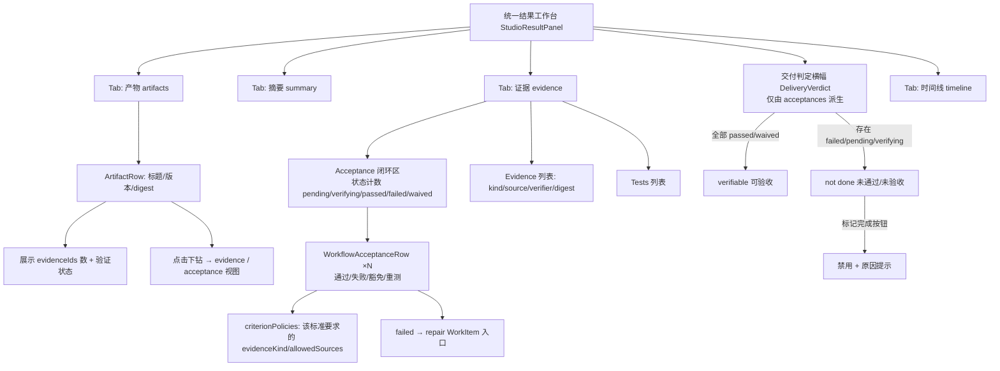

# 增量 PRD：ART-005 — 统一结果工作台的「真·可验证交付闭环」

> 文档版本：v1.0
> 编写日期：2026-07-30
> 前置依赖：
> - WB-P0 TaskStrategy 收编（已 commit）
> - WB-P1 统一结果工作台收编（`src/renderer/src/components/workbench/panels.ts`、`store.ts`、`WorkbenchRoot.tsx`、`StudioResultPanel.tsx`，已 commit）
> - D0 首任务引导集成（门禁已验证，2 个环境/WIP 阻断非 D0 回归）
> 关联 gap 分析项：`docs/COMPETITOR-GAP-ANALYSIS.md` D2「完成可信度」、WB 差距矩阵 WB-P1 的深化
> 关联计划项：`docs/PLAN.md` §8 波次 C（ART-002/ART-005）、§9 W1 退出判据「结果集中可验收」；`docs/PRODUCT-REQUIREMENTS.md` ART-005、AC-15、AC-09
> PRD 类型：简单 PRD（增量）

---

## 1. 产品目标与定位

**一句话目标**：把 WB-P1 已搭好的统一结果工作台从「聚合展示面板」升级为「真·可验证交付闭环」——Artifact 有证据、Evidence 可追溯、Acceptance 通过/拒绝/waiver 显式，做到**「模型自称完成 ≠ 完成」**。

**在「替代竞品」收编主线里的定位**：
- 这是 WB-P1（统一结果工作台容器）的**自然下一棒**，为其补齐「闭环语义」而非再加面板。
- 它是对标 WorkBuddy「不是答案，是完成的活」的核心差异化落点，也是 `docs/PLAN.md` §9 W1 退出判据「结果集中可验收」与直接竞品优先级 D2「完成可信度：失败、未运行测试、缺 Artifact、未知 Effect 或缺 Evidence 时不得显示完成」的同一件事。
- 范围锁定在 **store → UI 环**：消费 `getStudioResultSnapshot` 已返回的 `acceptances / artifacts / evidence / tests` 数据，把"是否真的完成"的判定从模型自报状态解耦为"Acceptance 是否通过/豁免"。**不新建设执行层、不改动 main 完成门禁逻辑**（见第 5 节不破坏清单）。

---

## 2. 用户故事

| # | 角色 | 场景 | 价值 |
|---|------|------|------|
| US-1 | 开发者 | 模型跑完任务、Run 显示 `completed`，但测试其实没过。用户在统一结果工作台一眼看到顶部「交付判定 = 未通过」，并看到哪条 Acceptance 失败、对应 repair WorkItem 已生成；不会被"模型说做完了"误导 | 「自称完成 ≠ 完成」被强制显式，避免假交付 |
| US-2 | 白领/知识工作者 | 在结果工作台一个入口找到本次办公任务生成的纪要/表格/演示稿（Artifact），点击任一产物即可下钻到验证它的 Evidence（来源引用、测试、截图）与它满足的 Acceptance 标准 | 产物、证据、验收集中在同一入口，可复验来源 |
| US-3 | Project Owner | 想验收某 Goal：在 Acceptance 区看到所有标准的通过/失败/豁免状态，对每条标准选择 Evidence 后「通过」或填理由「豁免」；存在未通过项时「标记完成」按钮被禁用并说明原因 | Acceptance 的通过/拒绝/waiver 都是显式用户动作，不可由模型自动决定 |
| US-4 | 开发者 | 一条 Acceptance 标记失败后，结果工作台直接给出对应的 repair WorkItem 入口；Goal 停留在 `verifying`/`failed`，绝不进入 `completed` | 失败不关闭 Goal，返工链路可见可续 |
| US-5 | 审计/导出者 | 导出交付报告时，若仍有未验收项，报告显著标注"未通过/未验收项与缺失 Evidence"，而不是把半成品包装成完整交付 | 对外交付物本身也带可验收边界，不伪造完成 |

---

## 3. 需求池

### P0 — 必须完成（可验收、可测的最小闭环）

**P0-1：交付判定横幅（Delivery Verdict）**
- 在 `StudioResultPanel` 顶部新增一个**派生**的「交付判定」指示，取值仅由 `snapshot.acceptances` 推导：
  - 全部 Acceptance 为 `passed` 或 `waived` → **可验收（verifiable）**；
  - 存在任意 `pending` / `verifying` / `failed` → **未通过 / 未验收（not done）**。
- 该判定**与 `goal.status`、`TaskRun.status` 的模型自报完成解耦**：即使模型 Run 已 `completed`，只要 Acceptance 未通过，verdict 必为 not done。
- 判定在 store 层派生（新增一个纯函数 `deriveDeliveryVerdict(snapshot)`，不写 main、不加 IPC）。

**P0-2：Goal 完成门禁在 UI 层强制**
- 结果工作台中任何"标记 Goal 完成"的入口（包括潜在的新增按钮），在存在 `failed`/`pending`/`verifying` Acceptance 时**禁用或阻断**，并显示原因「仍有未通过/未验收的 Acceptance」。
- 不提供任何可绕过、直接把 Goal 置 `completed` 的 UI 路径。复用 main 已有的 ART-002 done-gate 与 `reviewWorkflowAcceptance` 命令，不新建写入口。

**P0-3：Artifact → Evidence 可追溯**
- `StudioResultArtifact` 已带 `evidenceIds` / `acceptanceIds`；在 Artifact 行（`ArtifactRow`）展示"已挂 Evidence 数 + 验证状态"，并提供下钻：点击跳转到 Evidence / Acceptance 视图（复用现有 `openTool` 跳转契约，不新增 IPC）。
- 用户在统一入口即可回答"这个产物凭什么算完成"。

**P0-4：Acceptance 闭环区（聚合 + 复用现有行）**
- Evidence 视图的 Acceptance 区聚合展示**本 Goal 下所有** Acceptance 的状态计数（pending / verifying / passed / failed / waived）。
- 逐条复用现有 `WorkflowAcceptanceRow`：`passed` / `failed` / `waived` / `retest` 四个动作与"通过/失败前每个 criterion 必选 Evidence""豁免必填理由"的校验**保持不变**，仅扩展展示（如把 `criterionPolicies` 的 `evidenceKind`/`allowedSources` 显式标注为"该标准要求的证据类型/来源"）。
- `failed` 状态行展示对应的 repair WorkItem 入口（来自 `WorkflowAcceptanceReviewResult.repair`）。

**P0-5：失败不关闭 Goal 的不变量显式化**
- 当任一 Acceptance `failed` 时，结果工作台必须：
  1. 顶部 verdict 为 not done；
  2. 显式呈现 repair WorkItem（可跳转 `openSubagentPanel` / 对应 WorkItem 视图）；
  3. Goal 状态不被任何 UI 路径置为 `completed`。

### P1 — 应该完成（增强闭环可信度）

- **P1-1：为 Artifact 直接挂 Evidence**：在结果工作台允许把一条 `workflow`/`human` 来源 Evidence 关联到某个 Artifact（写 `createWorkflowEvidenceLink`，relation=`supports`/`verifies`），使 Artifact↔Evidence 链接在 UI 双向可达，而不只从 Acceptance 侧建立。
- **P1-2：交付包导出门槛提示**：导出交付报告（`saveStudioResultSnapshot`）始终可用，但在 verdict ≠ verifiable 时，报告与 UI 显著标注"未通过/未验收项 + 缺失 Evidence 清单"（对齐 ART-005 现有导出契约，不伪造完成）。
- **P1-3：Acceptance 策略作者在结果工作台可见**：把 `criterionPolicies` 的"每标准要求的 evidenceKind / allowedSources"在 Acceptance 区以只读形式呈现，让用户知道"凭什么算过"。
- **P1-4：跨 Artifact/Evidence/Acceptance 的追溯视图**：在结果工作台新增一个轻量追溯区块（可用 mermaid 或缩进树），展示 `Artifact → 验证它的 Evidence → 它满足的 Acceptance criterion` 的链路，供一次性总览。

### P2 — 可选（锦上添花，不阻塞 1.0）

- **P2-1：Acceptance 的 retest/repair 历史时间线**：每个 Acceptance 展示其历次 `failed → retest → passed/waived` 的 revision 轨迹。
- **P2-2：Verifier 角色建议**：对无法自动验收的 criterion，提示可由人工（Project Owner）作为 Verifier 介入。
- **P2-3：Goal 级 verdict 投影到 Board**：将派生 verdict 投影为 Goal/WorkItem 卡片上的一个状态徽标（若需持久化则涉及 main 只读投影字段，见待确认 Q-5）。

---

## 4. UI 设计稿（贴合现有 StudioResultPanel / WorkflowAcceptanceRow）

以下描述**只改展示与交互，不改数据来源**；数据全部来自 `StudioResultSnapshot`（`getStudioResultSnapshot`）。

### 4.1 结果工作台结构（mermaid）



### 4.2 交付判定横幅（新增，P0-1）

位于 `StudioResultPanel` 头部下方、Tab 之上，单行彩色条（沿用现有 `statusTone` 配色）：

```
[交付判定] ● 未通过（3 项待验收 / 1 项失败）  —— 模型运行已结束，但验收未通过，Goal 未完成
```

- 取值来自 `deriveDeliveryVerdict(snapshot)`：
  - `verifiable`：所有 acceptance ∈ {`passed`, `waived`}；
  - `not_done`：否则。
- **不读取** `goal.status` / `TaskRun.status` 作为判定依据，仅作辅助展示（如标注"模型报告完成于 xx:xx"）。

### 4.3 Artifact 行增强（P0-3）

在现有 `ArtifactRow` 的 `studio-result-location-list` 下追加一行：

```
已挂 Evidence 2 · 验证状态：已覆盖  ✔    [下钻证据]
```

点击「下钻证据」→ `openTool('files' | 'preview')` 或定位到 evidence Tab 并滚动到对应 Evidence（复用现有 `openLocation`/跳转契约，不新增 IPC）。

### 4.4 Acceptance 闭环区（P0-4，复用 WorkflowAcceptanceRow）

Evidence Tab 的 Acceptance 区顶部新增聚合条：

```
本 Goal 验收：pending 0 · verifying 1 · passed 2 · failed 1 · waived 0
```

其下逐条渲染现有 `WorkflowAcceptanceRow`（已有 `passed`/`failed`/`waived`/`retest` 按钮与 Evidence 必填/豁免必填理由校验）。扩展点：
- 在 `AcceptancePolicyList` 旁显式标注「该标准要求的证据类型：test_result / 来源：runtime,human」。
- `failed` 行在 `FailedAcceptanceReview` 旁展示 repair WorkItem 链接（来自 `WorkflowAcceptanceReviewResult.repair.workItemId`），点击 `openSubagentPanel` 或跳转对应 WorkItem。

### 4.5 失败不关闭 Goal（P0-5）

当 `deriveDeliveryVerdict` 为 `not_done` 且存在 `failed`：
- 顶部横幅为「未通过」；
- 不渲染任何"标记 Goal 完成"正向 CTA；若未来新增该 CTA，则其 `disabled` 且 `title="仍有未通过/未验收的 Acceptance"`。
- repair 入口常驻可见。

---

## 5. 不破坏清单（明确哪些不能动）

本次只改 **store → UI 环**，以下契约/能力/门禁保持不变：

| 现有能力 / 契约 | 保持不变原因 |
|---|---|
| **WB-P1 面板注册表 + keep-alive**（`panels.ts`、`WorkbenchRoot.tsx`） | 本 PRD 只在 `StudioResultPanel` 内部增加展示与派生逻辑，不新增/重排面板，不动 `activePanelId`/`mountedPanels` 模型 |
| **WB-P0 TaskStrategy 控制**（view/plan/execute） | 与交付闭环无关，不触及策略 preflight / PermissionMode 派生 |
| **WorkflowAcceptanceRow 现有动作与校验** | `passed`/`failed`/`waived`/`retest` 四个动作、`requiresEvidence` 校验、豁免必填理由均保留；仅扩展展示，不修改 `reviewWorkflowAcceptance` 调用契约 |
| **`getStudioResultSnapshot` / `StudioResultSnapshot` 形状** | 优先在 store 层**派生** verdict，不强制改 main 返回；若确需新字段，须为 **additive 且向后兼容**（见待确认 Q-1/Q-5） |
| **`createWorkflowEvidence` / `createWorkflowEvidenceLink` / `reviewWorkflowAcceptance`** | 写入口复用现有 IPC，不新增写命令；Evidence 来源 `human`/`runtime` 已支持手动添加 |
| **main 进程完成门禁逻辑**（`workflow-acceptance-*`、`ART-002` done-gate） | UI 只消费与呈现；不修改 main 的 Acceptance/repair 状态机，避免回归执行层 |
| **六环链路铁律** | 改动限于 store → UI（第 5–6 环）；不新增 IPC 通道、不改 `shared/types.ts`（除非 additive）、不动 `preload/`、`src/main/` 完成门禁 |
| **脱敏 / 审计边界** | 结果工作台与导出不展示 Provider/模型响应原文、不展示原始 Run 错误（沿用 `taskRunDigest`/`errorDigest` 绑定） |

**唯一允许触碰 main 的前提**：仅当待确认 Q-5 决议需要把 verdict 持久投影到 Goal 记录供 Board 展示时，才在 main 增加**只读投影字段**，且须单独评审、可回滚。

---

## 6. 待确认问题（≤8）

| # | 问题 | 建议默认 | 影响 |
|---|------|---------|------|
| **Q-1** | Delivery Verdict 是 main 在 `StudioResultSnapshot` 新增字段，还是纯 store 派生？ | **纯 store 派生**（`deriveDeliveryVerdict`），不动 main/IPC；数据已足够。理由：零新增链路、可独立回滚 | P0-1 |
| **Q-2** | 是否引入新 Acceptance 状态（如 `disputed`/`superseded`）？ | **保持现有 5 态**（pending/verifying/passed/failed/waived）；用 repair + revision 表达重测/作废。理由：状态机扩张会牵动 main 状态机与既有 required gate | P0-4、P2-1 |
| **Q-3** | Evidence 来源范围：是否允许在结果工作台为 Artifact 直接挂 human 证据（不止从 Acceptance 侧建链）？ | **允许**（P1-1，复用 `createWorkflowEvidenceLink`）。理由：让 Artifact↔Evidence 在 UI 双向可达，强化"产物凭什么算完成" | P1-1 |
| **Q-4** | 与现有 Workflow Ledger 的写入边界：Goal 完成判定 UI 调用什么？ | **复用现有 Goal 完成命令 + `reviewWorkflowAcceptance`**，不新增写入口。理由：避免重复写路径与权限分叉 | P0-2 |
| **Q-5** | 是否需要动 main 进程（如把 verdict 投影到 Goal 记录供 Board 徽标）？ | **本 PRD 不动 main**；若后续要在 Board 显示 verdict 徽标，再单列 PR 在 main 加只读投影字段。理由：守"只改 store→UI"边界 | P0-1、P2-3 |
| **Q-6** | "模型自称完成"的信号从哪来？是否需 main 区分 `model_reported_done` 与 `accepted`？ | **UI 仅依据 `acceptances` 派生 verdict**，不引入新信号。理由：判定口径统一为"Acceptance 通过/豁免"，避免信号膨胀 | P0-1、P0-2 |
| **Q-7** | 交付包导出门槛：verdict 未通过时是否允许导出？ | **始终允许导出，但显著标注未通过/未验收项与缺失 Evidence**。理由：对齐 ART-005 现有导出契约，不为"可导出"而伪造完成 | P1-2 |
| **Q-8** | 范围是否覆盖 Assistant 模式的结果入口？ | **覆盖**。StudioResultPanel 作为 `'result'` 面板被两模式复用同一合同，verdict/closure 逻辑对两模式一致。理由：W1 退出判据要求"结果集中可验收"统一 | 全局 |

**优先级确认（最高优先下一棒是否成立）**：
- 成立。依据：① WB-P1 容器已就绪，本棒补齐其"闭环语义"是容器的价值所在；② 直接对应 W1 退出判据「结果集中可验收」与直接竞品优先级 D2「完成可信度」；③ ` ART-002` done-gate 与 `WorkflowAcceptanceRow` 的验收动作已在 main/UI 存在，本 PRD 是"收口到统一入口 + 解耦模型自报"，成本可控。
- 与 `docs/PLAN.md` §9 优先级纪律 #2（"W2 先接 canonical Artifact producer，再做漂亮的结果 UI"）的张力：本 PRD 不新建 producer，而是为**已有/后续 producer 的输出**建立"必须通过 Acceptance 才算完成"的闸门。建议排序：**先立闭环闸门（本 PRD），W2 的 Office/code canonical producer 把产物接入同一闸门**——闸门先行可避免"更多 producer 产出更多未验收输出"。若严格按纪律 #2 字面理解为"先 producer 后 UI"，则更优候选为「先接 Word/Excel/PPT/PDF canonical Artifact producer（ART-001/003/004）」；但本 PRD 的闸门是 producer 有意义的前置，故仍推荐本棒为最高优先。

---

## 7. 验收标准（可测、可追溯至 PLAN ART-005 / AC-15）

| # | 验收项 | 验证方法 | 追溯 |
|---|--------|---------|------|
| AC-1 | 结果工作台顶部出现「交付判定」，取值**仅由 `snapshot.acceptances` 派生**（passed/waived=verifiable；存在 pending/verifying/failed=not done），与 `goal.status`/`TaskRun.status` 解耦 | 代码检查：`deriveDeliveryVerdict` 只读取 `snapshot.acceptances`；构造"Run completed 但 Acceptance failed"的快照，断言 verdict=not done | ART-005、D2 |
| AC-2 | 存在 `failed`/`pending`/`verifying` Acceptance 时，结果工作台**不显示**任何"Goal 已完成/可交付"正向状态；模型 Run 完成但 Acceptance 未通过时 verdict 必为 not done | 手动/单测：注入上述快照，断言无正向完成态、横幅为"未通过" | D2、AC-15 |
| AC-3 | 「标记 Goal 完成」类入口在存在未通过/未验收 Acceptance 时**禁用或阻断**并给原因；无绕过路径 | UI 测试：存在 failed Acceptance 时点击完成入口被拒/禁用，提示"仍有未通过/未验收的 Acceptance" | ART-002、GOAL-002 |
| AC-4 | 每个 canonical Artifact 行展示其 `evidenceIds` 与验证状态，点击可下钻到 Evidence/Acceptance 视图（复用现有跳转契约） | UI 测试：点 Artifact「下钻证据」→ 定位到对应 Evidence/Acceptance | ART-005 |
| AC-5 | Acceptance 区聚合展示本 Goal 所有 Acceptance 状态计数，并复用 `WorkflowAcceptanceRow` 的通过/失败/豁免/重测；现有"通过/失败前每 criterion 必选 Evidence""豁免必填理由"校验不变 | UI + 单测：计数正确；尝试无 Evidence 通过被拒；无理由豁免被拒 | ART-002、ART-005 |
| AC-6 | Acceptance `failed` 时，结果工作台显示对应 repair WorkItem 入口，Goal 保持 `verifying`/`failed`，不进入 `completed` | UI 测试：failed 行出现 repair 链接且可跳转；Goal 状态不为 completed | ART-004、WORK-004 |
| AC-7 | Evidence 具可追溯来源（kind/source/verifier/contentDigest）；用户可下钻 Artifact→Evidence→Acceptance criterion；不展示 Provider/模型响应原文 | UI + 导出检查：链路可达；交付报告/结果不含原始 Run 错误与 Provider 响应 | ART-005、NFR-PRIV-003 |
| AC-8 | 六环链路不被破坏：无新增 IPC 通道；`shared/types.ts` 无破坏性变更（仅允许 additive 且向后兼容）；`preload/`、`src/main/` 完成门禁逻辑未改 | 代码检查：`git diff shared/types.ts preload/ src/main/task/workflow-acceptance-*` 无相关改动（除非 Q-5 单独 PR） | 门禁纪律 |
| AC-9 | 真人 30 分钟代码/Office 主链：在统一结果工作台找到产物、Evidence、Acceptance 并验收/返工；格式或来源验收失败时不标记 Goal 完成 | 真人验收脚本（对齐 AC-15 / W2 退出判据）：记录找结果耗时、回退聊天次数、返工与恢复 | AC-15、W2 |
| AC-10 | 导出交付报告在 verdict 未通过时仍可用，但报告显著标注未通过/未验收项与缺失 Evidence | 导出检查：未通过场景下导出成功且报告含"未验收项清单" | ART-005 |

---

## 8. 范围边界小结（给架构师）

- **做什么**：在已存在的统一结果工作台内，增加"交付判定"派生横幅、Artifact→Evidence 下钻、Acceptance 闭环聚合与 repair 入口、Goal 完成门禁；全部消费 `StudioResultSnapshot` 既有字段。
- **不做什么**：不新建执行层、不新建 Artifact producer、不改 main 完成门禁/状态机、不新增 IPC；不引入新的 Acceptance 状态（除非 Q-2 改决议）。
- **交付判定的唯一真相源**：`snapshot.acceptances` 的状态集合，而非模型自报完成。这是"模型自称完成 ≠ 完成"在 UI 层的硬落地。
- **退出判据对齐**：W1「结果集中可验收」+ ART-005 + AC-15（格式/来源验收失败不标记 Goal 完成）。
