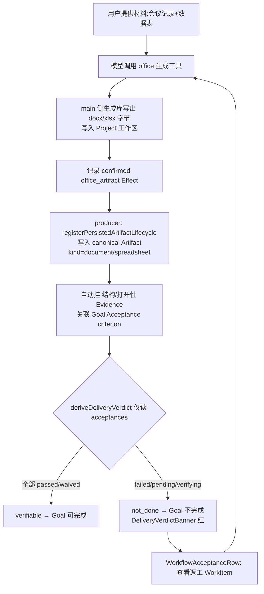

# 增量 PRD：W2 — 把 canonical Artifact producer 接入 ART-005 验收闸门

> 文档版本：v1.0
> 编写日期：2026-07-30
> 所属主线：「替代竞品」收编主线 · 第四棒 W2（PLAN §9 竞品转化计划 · 波次 C「交付链与审计」）
> 上游依赖：
> - ART-005 已建闸门（`src/renderer/src/store/delivery-verdict.ts` 的 `deriveDeliveryVerdict`、DeliveryVerdictBanner、WorkflowAcceptanceRow 的 repair 入口、TraceabilityView，已 commit `6691b2a5`/`16093e66`/`e419f81c`）
> - ART-001 lifecycle contract 已存在（16 kind、digest/provenance/version/creating Run、supersession、blob/sourceRef、retention），生产 Code Forge patch 已接入 `registerConfirmedRunArtifactLifecycles`
> 关联文档：`docs/PLAN.md` §8 波次 C / §9 W2 行；`docs/PRODUCT-REQUIREMENTS.md` §2.3 / §5.6 / §7.10~7.12 / §8.7（ART-001~005）/ AC-15；`docs/COMPETITOR-GAP-ANALYSIS.md` 的 WorkBuddy「成品体验」对标
> PRD 类型：简单 PRD（收敛为最小可验收增量）

---

## 1. 产品目标与定位

**一句话目标**：把 canonical Artifact producer（至少 `document` 决策纪要 + `spreadsheet` 可计算表格）接入 ART-005 已建好的验收闸门——模型生成 docx/xlsx **不是完成**，产物必须进入 canonical Artifact、可被预览/追溯/返工/导出，且「文件生成但验收未过」时 `deriveDeliveryVerdict` 返回 `not_done`，Goal 不标记完成。

**在「替代竞品」主线里的定位**：
- W2 是 PLAN §9 竞品转化计划的第四棒，对标 **WorkBuddy 的「成品体验」**（竞品差距矩阵中 CaoGen「明显落后」项：Office 成品生成 + 结果聚合验收）。本棒是 WorkBuddy 黄金路径「不是答案，是完成的活」在办公成品上的落点。
- 严守 PLAN §9 纪律 #2「W2 先接 canonical Artifact producer，再做漂亮的结果 UI」：**本棒只接 producer + 复用 ART-005 闸门，不新建结果 UI**（UI 已在 ART-005 收口，本棒只让新 Artifact 自然流入既有面板）。
- 范围锁定在 **producer（main）→ canonical Artifact → ART-005 闸门（store/UI）** 这一小段，不做漂亮 UI、不新生成库全家桶、不碰 IPC。

---

## 2. 用户故事

| # | 角色 | 场景 | 价值 |
|---|------|------|------|
| US-1 | 白领/知识工作者 | 给模型一份会议材料 + 数据表，要求生成"带来源的决策纪要(docx)"和"可计算表格(xlsx)"。生成的文件**进入统一结果工作台的 Artifacts**，而不是只在聊天里丢一个 `/tmp/xxx.docx` 路径 | 产物是 first-class、可审计、可复验的 Artifact，不是聊天噪声 |
| US-2 | 同一用户 | 在结果工作台点开 docx/xlsx，系统预览（或内容提取预览）展示文档结构 / 表格计算值；点"下钻证据"跳到验证它的 Evidence 与 Acceptance | 一眼能答"这文件凭什么算完成、来源在哪" |
| US-3 | Project Owner | 验收时发现 xlsx 公式结果是错的 / docx 打不开。标记对应 Acceptance 失败 → 顶部「交付判定」立即变 `not done`，Goal 不被标记完成，并出现 repair WorkItem 入口 | 模型"说生成了"≠完成；坏文件不会骗过交付闸门 |
| US-4 | 同一用户 | 点 repair 入口回到 WorkItem 返工，修正后重新生成 → 新版本 Artifact 以 `supersedes` 进入同一 lifecycle，原 Acceptance 重测通过 | 失败可闭环返工，版本可追溯，不丢旧版本 |
| US-5 | 审计/导出者 | 导出交付报告，包内含这两个 office Artifact 的 manifest/digest；verdict 未过时报告显著标注未验收项 | 对外交付物自带可验收边界，不伪造完成 |

---

## 3. 需求池

> 范围收敛原则：本棒只接 **2 个最高频 producer**（`document` + `spreadsheet`），其余（PPT/PDF/design）列为 P2 / 后续 PRD。理由见第 6 节待确认 Q-1 与「推荐 producer 收敛」段。

### P0 — 必须完成（最小可验收闭环）

**P0-1：canonical Artifact producer 接入（document + spreadsheet）**
- 新增 producer，与既有的 `registerCodeForgePatchLifecycle` **并列**于 `src/main/task/artifact-lifecycle-producer.ts` 的 `registerConfirmedRunArtifactLifecycles` 中，对"已确认"的 office 生成 Effect 调用既有的 `registerPersistedArtifactLifecycle` 写入 `kind: 'document' | 'spreadsheet'` 的 canonical Artifact。
- 严格复用 ART-001 合同：`digest` / `provenance` / `version` / `creating Run` / `supersession` / `blob|sourceRef` / `retention` 全部由既有 store 处理，**不新写 lifecycle**。
- **不允许**只在聊天里返回文件路径；任何经 producer 生成的 docx/xlsx 都必须落到 canonical Artifact（对齐 PRODUCT-REQUIREMENTS §5.6 第 3 条）。

**P0-2：复用 ART-005 闸门（核心约束 #2）**
- 新 Artifact 自动进入 `getStudioResultSnapshot().artifacts`，并由 Goal 的 Acceptance 通过 `acceptanceIds`/`artifactRefs` 关联。
- `deriveDeliveryVerdict`（只读 `snapshot.acceptances`）对"文件已生成但对应 Acceptance 未通过"必须返回 `not_done`；Goal 完成门禁（复用 ART-005 既有守卫）在存在 failed/pending/verifying 时禁用。**不新增任何写入口或绕过路径。**

**P0-3：黄金路径可打开 / 可预览**
- 结果工作台 `artifacts` Tab 的 `ArtifactRow` 复用既有"打开"动作：经 `openTool('preview', location.path)` 走既有 office 视觉预览（`PreviewRenderer.tsx` / `office-visual-preview`）。
- 对 `spreadsheet` 要求**内容提取预览**（展示计算后的值，而非原始 XML），对齐 PRODUCT-REQUIREMENTS §3"Office 高保真 条件可用：结构提取和系统预览"。
- 预览失败（文件损坏/打不开）应作为 P0-6 自动验收失败的信号，而非静默显示空白。

**P0-4：可追溯（Artifact → Evidence → Acceptance）**
- 复用既有 `ArtifactRow` 的"下钻证据"与 `TraceabilityView`：新 office Artifact 展示 `evidenceIds`/`acceptanceIds` 计数与验证状态，点击下钻到 Evidence/Acceptance 视图（**不新增 IPC**）。

**P0-5：失败可返工（repair）**
- 当 office 成品的 Acceptance `failed` 时，复用 `WorkflowAcceptanceRow` 既有 `failed → 查看返工 WorkItem` 入口（ART-004 已建 repair 链路）；本棒**不修改**该行的动作与校验，只让新 Artifact 的 Acceptance 自然进入同一路径。

**P0-6：producer 自动挂结构/打开性 Evidence + 关联 Acceptance criterion**
- 每个经 producer 生成的 office Artifact 必须附带一条**自动 Evidence**（`kind: build_result | tool_result`，来源 `runtime`），内容为该产物的结构/打开性校验结果：文件可被解析、声明 `kind`/`mediaType` 与实际字节一致、`digest` 一致、来源引用（sourceRef / 输入材料）可追溯。
- 黄金路径的 Goal Acceptance 必须包含针对 office 成品的 criterion（如"docx/xlsx 可被目标应用打开""来源可回溯""结构校验通过"）；producer 生成的 Artifact 通过 `artifactRefs` 关联到该 Acceptance。
- 自动校验失败 → 该 Evidence 记为失败并驱动 Acceptance `failed`/`pending-with-failure` → `not_done` → Goal 不完成（对齐 W2 退出判据"失败不完成 Goal"）。

**P0-7：可导出（脱敏 canonical JSON + SHA-256）**
- 复用既有 `saveStudioResultSnapshot`：新 office Artifact 自动出现在导出包内，格式为脱敏 canonical JSON + `exportDigest`，**不含 Provider / 模型响应 / 原始 Run 错误**（ART-005 既有契约，本棒零改动）。verdict 未过时导出报告显著标注未验收项（ART-005 既有行为）。

### P1 — 应该完成（增强，不阻塞 1.0）

- **P1-1：PPT/PDF producer 接入**（presentation / pdf kind）——在 document+spreadsheet 闭环验证后横向扩展，复用同一 producer 分支与闸门。
- **P1-2：可计算表格的公式真实性校验 Evidence**：除"能打开"外，额外 Evidence 校验关键公式单元格计算结果非空且与被引用源一致。
- **P1-3：版本 supersession 可视化**：在 `TraceabilityView` 中展示 office Artifact 的 `supersedes` 版本链（草稿 → 返工 → 通过）。

### P2 — 可选（锦上添花，后续 PRD）

- **P2-1：design 类 Artifact producer 接入**（对齐 ARdot/设计连接器，W5 范畴）。
- **P2-2：office 原生应用像素级预览 / 在线协同批注**（PRODUCT-REQUIREMENTS §15"明确不做：1.0 多人实时文档/Office 套件"）。
- **P2-3：producer 失败重试策略**（格式生成异常时的自动 fallback/重试）。

---

## 4. UI 设计稿（贴合既有 StudioResultPanel / ArtifactRow / DeliveryVerdictBanner / TraceabilityView）

> 本棒**不新建面板**，只让新 office Artifact 自然流入 ART-005 已建的结果工作台。下列仅描述既有组件如何呈现新产物。

### 4.1 黄金路径闭环（mermaid）



### 4.2 结果工作台中的 office Artifact 呈现（复用既有结构）

```mermaid
flowchart TD
  S[StudioResultPanel] --> B[DeliveryVerdictBanner<br/>仅由 acceptances 派生]
  S --> T[Tab: artifacts]
  T --> AR[ArtifactRow: 标题 / document·v1 / digest]
  AR --> L[location: available → 打开(走 office 视觉预览)]
  AR --> EV[已挂 Evidence N · 验证状态: 已覆盖<br/>下钻证据 / 关联 Evidence]
  S --> EV2[Tab: evidence → TraceabilityView<br/>Artifact → Evidence → Acceptance criterion]
  S --> F[Tab: evidence → WorkflowAcceptanceRow<br/>failed 时显示 查看返工 WorkItem]
```

- **ArtifactRow（复用，零改动）**：`kind: 'document'|'spreadsheet'` 与既有一致渲染标题/`kind`/版本/`digest`；`locations` 可用时"打开"按钮经 `openTool('preview', path)` 走既有预览。
- **DeliveryVerdictBanner（复用，零改动）**：office 成品验收未过时显示 `not done`，并带提示"模型运行已结束，但验收未通过，Goal 未完成"。
- **TraceabilityView（复用，零改动）**：自动展示 `office Artifact → 自动 Evidence → 它满足的 Acceptance criterion` 链路。
- **WorkflowAcceptanceRow（复用，零改动）**：`failed` 行自带"查看返工 WorkItem"入口；本棒只保证 office 成品的 Acceptance 进入此路径。

### 4.3 预览/下钻/返工触发（文字说明）

- **可打开/预览**：`ArtifactRow` 的"打开"→ `openLocation()` → `openTool('preview', location.path)`，复用既有 `office-visual-preview` 能力；`spreadsheet` 预览需呈现**计算后的值**（内容提取）。
- **下钻 Evidence**：`ArtifactRow` 的"下钻证据"→ 切到 evidence Tab 并高亮对应 `evidenceId`/`acceptanceId`（既有 `handleDrillEvidence`，零改动）。
- **触发 repair**：evidence Tab 中 `failed` 的 `WorkflowAcceptanceRow` → "查看返工 WorkItem"→ `openTool('tasks')`（既有 `handleOpenRepair`，零改动）。

---

## 5. 不破坏清单（明确哪些不能动）

本次只扩展 **producer（main 内既有通道）→ canonical Artifact → ART-005 闸门（store/UI）**，以下契约/能力/门禁保持不变：

| 现有能力 / 契约 | 保持不变原因 |
|---|---|
| **ART-005 闸门语义**（`deriveDeliveryVerdict` 只读 `snapshot.acceptances`） | 本棒让新 Artifact 进入 `acceptances` 覆盖域，不修改判定函数；"文件生成但验收未过 → not_done"由现有语义自然成立 |
| **WorkflowAcceptanceRow 现有动作与校验**（`passed`/`failed`/`waived`/`retest`、每 criterion 必选 Evidence、豁免必填理由） | office 成品只作为新的 Acceptance 主体进入既有行，不修改其动作/校验 |
| **Artifact lifecycle contract（ART-001）** | 复用 `registerPersistedArtifactLifecycle` 与既有 16-kind 合同；**不新写 lifecycle、不新写 blob 落库** |
| **DeliveryVerdictBanner / TraceabilityView / ArtifactRow 现有结构** | 新 office Artifact 自动流入既有组件，不新建面板、不改展示契约 |
| **导出契约**（`saveStudioResultSnapshot` 脱敏 + SHA-256 + 不含 Provider/模型响应） | 新 Artifact 自动出现在导出包；本棒零改动导出逻辑 |
| **六环链路纪律** | 见第 6 节 Q-5：**本棒需动 main，但【不动 IPC / 不新增 IPC 通道】**；renderer 经既有 `getStudioResultSnapshot` 消费，producer 经既有 confirmed-effect → artifact 通道写入 |

**唯一允许触碰 main 的最小改动点**（已用红色标出）：
1. `src/main/task/artifact-lifecycle-producer.ts` 新增一个 producer 分支（与 `registerCodeForgePatchLifecycle` 并列）。
2. 一个 main 侧 office 生成工具（内部用 docx/exceljs 生成字节、写工作区、记录 `office_artifact` Effect）。
3. `shared/types.ts` 的 `EffectTarget` 联合类型追加 `{ kind: 'office_artifact'; ... }`（additive）。

---

## 6. 待确认问题（≤8）

| # | 问题 | 建议默认 | 影响 |
|---|------|---------|------|
| **Q-1** | 本棒收敛到哪几个 producer？ | **`document`（决策纪要/文档）+ `spreadsheet`（可计算表格）**；PPT/PDF/design 列 P2。理由：AC-15 三件套中这俩最高频、生成质量最可控；"可计算"要求真实公式（exceljs 原生支持）；先验证端到端闭环再横扩 | P0 范围 |
| **Q-2** | 文件生成落点：renderer 内生成 vs main 侧库？ | **main 侧库**。工具运行时在 main，字节经既有 Effect → producer 入 canonical store；若在 renderer 生成再传字节反而需新 IPC，违背六环纪律 | 架构落点 |
| **Q-3** | 预览方式：系统预览 vs 内容提取？ | **两者结合**，复用既有 `office-visual-preview`：document 走系统/视觉预览，spreadsheet 额外做内容提取（计算值预览） | P0-3 |
| **Q-4** | 是否引入新依赖 docx/exceljs/pptxgenjs 及许可？ | **docx（MIT）+ exceljs（MIT）** 覆盖 P0；pptxgenjs 留 P1。须评估体积与 AGPL 兼容性（CaoGen 自身 AGPL，MIT 依赖无冲突） | 依赖/许可 |
| **Q-5** | 是否需动 main / 新增 IPC？ | **<span style="color:red">需动 main，但不动 IPC、不新增 IPC 通道</span>**。最小改动 = producer 分支 + 一个工具 + 一个 effect kind；复用既有 confirmed-effect→artifact 通道与 artifact store，renderer 经既有 `getStudioResultSnapshot` 消费 | 影响面（见第 5 节红色项） |
| **Q-6** | producer 是否自动创建 Evidence / 关联 Acceptance criterion？ | **是**。producer 自动挂"结构/打开性校验"Evidence，并使 Goal Acceptance 含针对 office 成品的 criterion（P0-6）；校验失败即驱动 Acceptance failed | P0-2/P0-6 |
| **Q-7** | 与 ART-001 lifecycle contract 的对接边界？ | **仅调用 `registerPersistedArtifactLifecycle`**，传入完整 `ArtifactLifecycleRegistrationInput`（复用既有的 id/projectId/goalId/runId/kind/version/provenance/retention/content/metadata）；不新写 lifecycle、不新写 blob 落库 | 不重复造 lifecycle |
| **Q-8** | 导出是否需要改？ | **无需改**。新 Artifact 自动进入 `snapshot.artifacts`，`saveStudioResultSnapshot` 既有逻辑已覆盖脱敏 + SHA-256 + 不含 Provider/模型响应 | P0-7 |

**推荐 producer 收敛结论**：本棒只接 **`document` + `spreadsheet`** 两个 producer。收敛理由：① 对齐 AC-15 黄金路径的"决策纪要 + 可计算表格"高频双件套；② 先以最小集合验证"producer → canonical Artifact → ART-005 闸门 → 失败 not_done"端到端，再把模式横扩到 PPT/PDF（P1），避免大需求一次铺开；③ 符合本棒"简单 PRD / 最小可验收增量"定位与 PLAN §9 纪律 #2。

**是否需动 main/IPC 结论**：<span style="color:red">**需动 main，但【不动 IPC】**</span>。最小影响点 = `artifact-lifecycle-producer.ts` 新增 producer 分支 + 一个 main 侧 office 生成工具 + `EffectTarget` 联合类型追加 `office_artifact`（additive）。无新 IPC 通道、无新 lifecycle、无新 blob 落库。

---

## 7. 验收标准（可测、可追溯至 PLAN W2 退出判据 / ART-001 / AC-15）

| # | 验收项 | 验证方法 | 追溯 |
|---|--------|---------|------|
| AC-1 | 经 producer 生成的 docx/xlsx **进入 canonical Artifact**（`kind=document`/`spreadsheet`），带 `digest`/`provenance`/`version`/`creating Run`/`supersession`/`retention`；不在聊天里只返回文件路径 | 代码检查：生成工具触发 `registerPersistedArtifactLifecycle`；构造生成快照，断言 `snapshot.artifacts` 含对应 kind 且字段完整 | ART-001、PRODUCT §5.6(3) |
| AC-2 | 复用 ART-005 闸门：`deriveDeliveryVerdict` 对"文件已生成但对应 Acceptance 未通过"返回 `not_done`；Goal 完成门禁禁用 | 单测：注入"office Artifact 生成成功 + 其 Acceptance failed"快照，断言 verdict=`not_done`、完成入口禁用 | ART-005、W2 退出判据 |
| AC-3 | 结果工作台 `artifacts` Tab 可查看/预览 office Artifact；"打开"走既有 office 预览，"下钻证据"跳到 Evidence/Acceptance | UI 测试：点开 docx/xlsx → 预览可达；点"下钻证据"→ evidence Tab 高亮 | ART-005、WB-P1 |
| AC-4 | **格式/来源验收失败不得标记 Goal 完成**：文件损坏/打不开/无来源时 Acceptance=failed → not_done → Goal 不完成 | 注入"文件生成但结构校验失败"场景，断言 verdict=`not_done` 且 Goal 状态非 completed（对齐 W2 退出判据与 AC-15） | W2 退出判据、AC-15 |
| AC-5 | 失败可返工：office 成品 Acceptance `failed` 时，`WorkflowAcceptanceRow` 显示 repair WorkItem 入口，Goal 保持 failed/verifying | UI 测试：failed 行出现"查看返工 WorkItem"且可跳转；Goal 未进入 completed | ART-004、WORK-004 |
| AC-6 | 可导出：脱敏 canonical JSON + SHA-256，包含新 office Artifact，不含 Provider/模型响应/原始 Run 错误 | 导出检查：verdict 未过时导出成功且报告标注未验收项；包内含 office Artifact manifest/digest | ART-005、AC-15、NFR-PRIV-003 |
| AC-7 | 不破坏清单验证：`git diff` 不改 ART-005 闸门语义、`WorkflowAcceptanceRow` 动作校验、Artifact lifecycle contract；仅 producer 分支 + 工具 + `office_artifact` effect kind 改动 main，**无新 IPC** | 代码检查：`git diff shared/types.ts preload/ src/main/task/artifact-lifecycle-*` 与 `src/renderer/.../delivery-verdict.ts`/`WorkflowAcceptanceRow.tsx`；确认无新增 IPC handler | 六环纪律、门禁纪律 |
| AC-8 | 黄金路径 E2E：用户提供材料 → 生成 document+spreadsheet → 进入 canonical Artifact → 预览/追溯/返工/导出 → 格式失败不关闭 Goal | 真人/自动化脚本（对齐 AC-15）：记录找结果耗时、回退聊天次数、返工与恢复 | AC-15、W2 |

---

## 8. 范围边界小结（给架构师）

- **做什么**：在既有 `registerConfirmedRunArtifactLifecycles` 里加一个 producer 分支，把经 main 侧 office 生成工具写出的 docx/xlsx 接入 canonical Artifact（document/spreadsheet），自动挂结构校验 Evidence 并关联 Goal Acceptance；复用 ART-005 闸门让"文件生成但验收未过 → not_done → Goal 不完成"。
- **不做什么**：不新建结果 UI 面板（ART-005 已收口）；不新写 Artifact lifecycle / blob 落库（复用 ART-001）；不引入 PPT/PDF/design producer（列 P1/P2）；不新增 IPC 通道。
- **最小 main 改动**（红色标出）：producer 分支 + 一个 office 生成工具 + `EffectTarget` 追加 `office_artifact`（additive）。
- **退出判据对齐**：PLAN §9 W2「Word/Excel/PPT/PDF 黄金路径可打开、可预览、可追溯、可返工、可导出，失败不完成 Goal」——本棒先以 Word/Excel 两件套达成可验收最小闭环，PPT/PDF 在 P1 沿用同一模式补齐。
