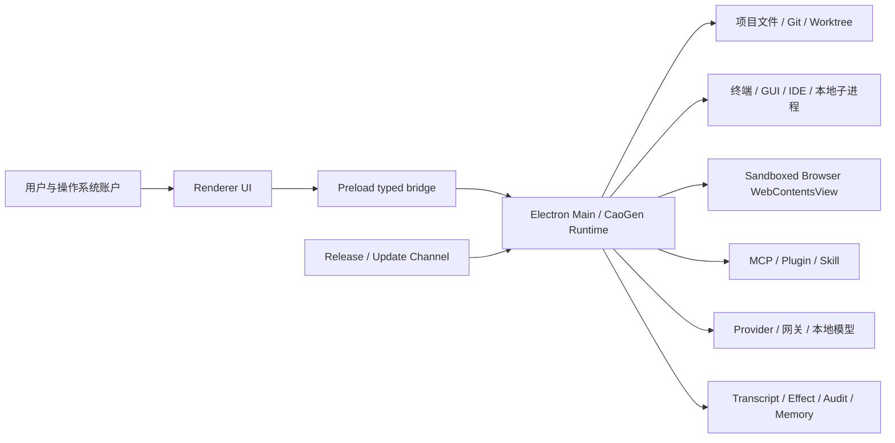

# CaoGen 网络安全与风险说明书

> 文档状态：立项与发布安全基线
>
> 事实基线：`main@21051cab`，以 `STATUS.md`、当前源码和仓库内可复验门禁为准
>
> 更新日期：2026-07-18
>
> 配套文档：[`PROJECT-CHARTER.md`](./PROJECT-CHARTER.md) · [`PRODUCT-REQUIREMENTS.md`](./PRODUCT-REQUIREMENTS.md) · [`PRODUCT-TECHNICAL-REQUIREMENTS.md`](./PRODUCT-TECHNICAL-REQUIREMENTS.md) · [`HIGH-LEVEL-DESIGN.md`](./HIGH-LEVEL-DESIGN.md)
>
> 适用产品：CaoGen Desktop、Native Runtime、项目/会话/任务系统、自动模型路由、工具与 GUI 执行、MCP/插件、3D 办公可视化，以及拟引入的数字员工和通用项目管理能力

本文档是 CaoGen 的正式安全边界、风险登记和发布门禁说明。它不是营销材料，也不把规划中的能力描述为已经实现。若本文与当前源码、`STATUS.md` 或最新 required 测试证据冲突，以可复验的当前实现和测试证据为准，并应及时修订本文。

## 1. 状态口径

本文统一使用以下五种状态，任何安全声明都必须带有其中一种：

| 状态 | 含义 | 可否用于发布声明 |
|---|---|---|
| **当前已验证** | 当前代码已实现，并存在本机测试、Electron E2E、打包审计或源码契约证据 | 可以，但必须保留环境和边界 |
| **条件可用** | 当前代码存在，但依赖操作系统、外部账号、真实 Provider、用户配置或特定平台 | 可以，但必须写明成立条件 |
| **立项目标** | 已确定为目标产品的一部分，尚未形成完整实现与 required 证据 | 不得表述为现有能力 |
| **后续规划** | 有价值但不属于当前立项闭环或没有承诺时间 | 不得表述为承诺交付 |
| **明确不做** | 不属于产品边界，或与 CaoGen 的安全定位冲突 | 不得通过隐含方式重新引入 |

“已编译”“有 UI”“存在接口”不等于“当前已验证”。外部网络、签名、公证、真实账户和真实 GUI 环境的结论不得由本地 mock 代替。

## 2. 目的与范围

### 2.1 目的

本说明书用于：

1. 定义 CaoGen 接触的数据、资产和外部系统。
2. 明确信任边界、网络出口、权限边界和高风险副作用。
3. 记录当前控制措施、P0 缺口、残余风险和用户责任。
4. 为数字员工、通用项目管理、自动模型路由和 3D 水墨人物迁移建立安全前置条件。
5. 为开发、测试、发布、事件响应和商业部署提供统一验收标准。

### 2.2 范围内组件

- Electron 主进程、preload 桥、React renderer 和 IPC。
- 默认 OpenAI-compatible 运行时与可选 Claude Agent SDK 运行时。
- Provider、API Key、模型目录、健康状态、预算、自动路由和故障切换。
- 项目规则、会话、子会话、DAG、worktree、Git、终端、文件工具和 Effect Ledger。
- Browser WebContentsView、GUI/Desktop Control、IDE Bridge、Quickbar、附件和文档预览。
- MCP、Skill、Plugin、Agent 定义、本地安装与运行态探测。
- 项目记忆、会话转录、事件回执、历史、Routine、任务快照和审计日志。
- 3D Office 当前机器人资产及拟迁移的原创水墨动漫人物资产。
- 打包、Release、更新检查、签名、公证、依赖与第三方资产。

### 2.3 范围外或明确不做

- **明确不做**：把 CaoGen 描述为零风险的自主系统，或保证任意外部系统事务级 exactly-once。
- **明确不做**：在当前阶段托管用户源码、Provider Key 或组织数据的 CaoGen 自有云。
- **明确不做**：绕过操作系统权限、网站登录、验证码、风控或企业安全策略。
- **明确不做**：将 Provider、模型厂商或第三方 Agent 人格化为固定数字员工。
- **明确不做**：未经过许可的动漫 IP、游戏角色、在世艺术家风格复刻或厂商商标角色化。
- **明确不做**：静默下载和静默安装更新。
- **明确不做**：在未完成签名、公证和更新链验证前宣称安装包已具备完整供应链信任。

## 3. 产品能力与安全状态矩阵

| 能力 | 当前状态 | 安全边界 |
|---|---|---|
| 本地优先 Desktop | **当前已验证** | 项目数据主要保存在本机，但发送给模型、网关、MCP、网页或外部工具的内容会离开本机 |
| 多 Provider、多 Key | **当前已验证（Provider Broker 基础）** | 安全 `safeStorage` 后端写入 `enc:`；不可用、`basic_text` 或加密失败时新 Key 仅当前进程可用且不落盘；旧 `b64:` 仅只读兼容并等待迁移 |
| 自动模型路由 | **当前已验证** | 路由依据包含策略、任务、风险、健康和预算；自动跨 Provider 会改变数据接收方 |
| Provider/Key 故障切换 | **当前已验证** | 同 Provider 备用 Key 和跨 Provider failover 已有测试；不等于所有协议和真实网络均已验证 |
| 项目规则与项目隔离 | **当前已验证** | 项目提示词和模型策略有隔离测试；不等于操作系统级强隔离 |
| 文件、Git、终端工具 | **当前已验证** | 具有真实副作用；权限、路径、Effect 与用户仓库状态共同决定风险 |
| Effect / Workflow Ledger | **当前已验证（v8 recovery read-source foundation）** | `task-snapshots.db` v8 保留 TaskRun Effect evidence append-only hash-chain，并包含 Goal/WorkItem/Run/Artifact/Acceptance/Evidence Link、workflow event chain、canonical recovery sessions、持久 `workflow_store_identity`、有限 API/IPC/UI 和 cursor 查询；`legacy / compare / canonical` 三态按数据库路径隔离，mode flip 强制重新验证，committed journal 校验 store identity 与历史高水位。Artifact Graph edge/location、fail-closed verification、脱敏 export 与只读 diagnose/repair plan 已有 smoke；未配置时仍默认 legacy，且仍缺全入口接入、完整 Artifact 生命周期、统一 retention/delete 和生产补偿闭环 |
| GUI 自动化 | **条件可用** | 默认关闭，启用后属于高风险；临时授权当前为 5 分钟窗口，尚未绑定完整 app/window/action/path/postcondition |
| Browser WebContentsView | **当前已验证** | 独立 sandboxed WebContentsView 和会话分区；网页内容、Cookies 和页面脚本仍不可信 |
| MCP 运行态探测 | **当前已验证** | stdio 探测会启动本地命令，HTTP 探测会访问配置 URL；能力声明目前未经运行时强制验证 |
| 本地插件安装/卸载 | **当前已验证** | 仅本地目录复制，路径牢笼和 200MB 上限；没有插件市场、签名、digest 固定或恶意 fixture 隔离 |
| 项目、会话、子会话、DAG | **当前已验证（含 R-25 当前范围）** | 具备任务执行、恢复和 autoMerge patch Effect；completion/finalizer 使用 durable finalizer store、terminal snapshot barrier、summary receipt/attempt barrier，并有 crash/restart required E2E。该范围不等于所有外部系统 exactly-once |
| 数字员工岗位与委派治理 | **立项目标** | 必须建立岗位权限、凭据作用域、审批责任、任务归属和可撤销委派后才能启用 |
| 轻量通用项目管理 | **立项目标** | 当前只有项目/会话/任务底座，尚无完整项目角色策略、数据保留/删除和连接器安全策略；多人组织治理属于后续规划 |
| 3D 机器人状态投影 | **当前已验证** | 展示真实会话和任务信号，但不是完整交付驾驶舱或安全审计系统 |
| 3D 水墨动漫人物 | **立项目标** | 当前资产仍是机器人；原创、许可、性能和自动模型切换的身份分层尚待实现 |
| macOS 签名与公证 | **立项目标** | 当前公开 macOS x64 beta 包仍未签名、未公证；CaoGen 1.0 stable 的 macOS 正式包必须完成 |
| 更新检查骨架 | **当前已验证** | `electron-updater` 和 GitHub publish 配置已存在，打包版会初始化并检查 feed，且关闭自动下载和退出时安装 |
| 用户更新流程 | **立项目标** | 当前没有用户可见通知、确认下载和安装的完整 IPC/preload/renderer 链路 |

## 4. 安全目标与原则

### 4.1 核心目标

- **机密性**：Provider Key、项目源码、提示词、浏览器会话、企业资料和私有产物不被未授权主体读取。
- **完整性**：文件、Git、任务、模型路由、插件、更新包和 3D 资产不被静默篡改。
- **可用性**：模型、网络、插件或桌面工具失败时能够明确降级，不通过无限重试放大损失。
- **可追溯性**：关键权限、路由、工具、副作用和人工处置具有可关联证据。
- **最小权限**：每次任务、数字员工、插件、MCP 和 Provider 仅获得完成目标所需的最小访问。
- **诚实恢复**：无法证明副作用是否发生时进入未知结果和人工对账，不伪称成功，也不自动重放。

### 4.2 设计原则

1. 默认本地，外发显式可见。
2. Renderer 不持有明文凭据。
3. 远程 Provider、网关、网页、MCP、插件和项目内容都视为不可信输入。
4. 模型输出是建议或执行意图，不是授权本身。
5. 高风险动作必须可取消、可审计、可对账；无法对账时 fail closed。
6. 自动路由不得绕过项目允许的 Provider、数据区域、预算和风险策略。
7. 数字员工是 CaoGen 内部任务身份，不是第三方厂商 Agent 的包装。
8. 3D 视觉只投影真实状态，不创造虚假的执行、验证或安全状态。

## 5. 资产与数据分类

### 5.1 分类标准

| 等级 | 名称 | 典型数据 | 基本要求 |
|---|---|---|---|
| S0 | 公开 | 开源源码、公开文档、公开 Release、公开模型名称 | 可公开，但仍需许可证和完整性校验 |
| S1 | 内部 | UI 设置、性能指标、匿名故障分类、非敏感项目元数据 | 本地保存；外发前最小化 |
| S2 | 机密 | 私有源码、文件片段、提示词、转录、附件、网页摘录、项目规则、记忆 | 默认本地；外发前显示目标 Provider/工具 |
| S3 | 高敏感 | API Key、访问令牌、Cookies、SSH/签名材料、Webhook、企业凭据 | 不进入 Renderer、日志、提示词、仓库和 Release；必须加密和作用域化 |
| S4 | 控制与证据 | 权限决定、Effect Ledger、审计日志、任务快照、发布 SHA256、事件回执 | 防篡改、可关联、限制删除；不得包含明文 S3 |

### 5.2 当前主要数据位置

| 数据 | 当前位置/流向 | 当前状态与风险 |
|---|---|---|
| Provider 配置与 Key | Electron `userData/providers.json` + 主进程内存 Broker | 新 Key 仅为 `enc:` 或 session-only 内存；旧 `b64:` 记录可能在迁移/重新输入前暂存于历史文件 |
| 会话转录 | `userData/transcripts/*.jsonl` | 持久化耐久事件；未声明统一保留期限 |
| 事件回执 | `userData/event-receipts/*.jsonl` | 用于恢复和关联；不是独立不可篡改审计仓 |
| 历史记录 | `userData` 下历史 JSON | 支持归档、固定、重命名和删除元数据 |
| 项目规则 | 项目内 `caogen.md`、`.caogen.md` 或相关配置 | 属于项目仓库内容，可能被提交或发送给 Provider |
| 项目记忆 | 项目/用户记忆目录 | 支持提议、接受和删除；内容可能被后续提示词检索 |
| Routine | `userData/routines` | 可长期自动触发任务，权限和外发风险随配置累积 |
| 任务快照与 Effect | 本地任务快照/SQLite barrier/运行时记录 | 支持恢复和部分对账；不是完整外部事务日志 |
| 工具审计 | 项目 `.caogen/audit.log` 等 | 有脱敏逻辑；仍需防止命令输出和自由文本泄密 |
| 文件备份 | 项目 `.caogen/tmp/backup` 等 | 用于恢复；可能保留已删除敏感内容 |
| Browser 数据 | `persist:caogen-browser-<session>` 分区 | 可能包含 Cookies、LocalStorage 和登录态；当前没有统一清除策略声明 |
| 附件和截图 | `userData/attachments/<session>` 及测试/缓存目录 | 可能包含屏幕、文档和隐私信息 |
| 插件 | 当前托管根为 `~/.claude/plugins` | 本地复制；卸载进入 `.trash`，不会立即物理删除 |
| Provider/模型请求 | 用户配置的官方端点、网关、中转站或本地服务 | 接收提示词、选中文件、图片和工具结果；受对方政策控制 |
| 3D 资产 | 仓库/安装包内 GLB、贴图、SVG、WASM 解码器 | 需要来源、许可证、商标和解析器安全审计 |

## 6. 信任边界



| 边界 | 信任判断 | 主要风险 |
|---|---|---|
| 用户/OS → CaoGen | 条件信任 | 本机被攻陷、多用户共用账号、恶意输入或误授权 |
| Renderer → Main | Renderer 按低信任处理 | XSS、状态污染、伪造 IPC 参数、过宽 preload 能力 |
| Main → 项目 | 项目内容不可信 | Prompt injection、恶意脚本、Git hooks、符号链接、敏感文件 |
| Main → 子进程 | 子进程不可信或半可信 | 环境变量泄露、命令执行、继承权限、僵尸进程 |
| Main → Provider/网关 | 外部不可信 | 数据留存、日志、训练使用、网关窃取 Key、响应注入 |
| Main → Browser | 网页不可信 | 恶意脚本、登录态滥用、下载、钓鱼、跨站内容注入 |
| Main → MCP/Plugin | 第三方代码和指令不可信 | 任意命令、依赖投毒、环境变量读取、工具结果注入 |
| Main → 本地持久化 | 依赖 OS 账户安全 | 文件权限、备份泄露、篡改、磁盘故障、残留删除 |
| Release → 安装包 | 当前不具备完整信任链 | 未签名、未公证、镜像篡改、更新元数据劫持 |

## 7. 关键数据流

### 7.1 标准模型执行流

1. 用户在 Renderer 输入目标、文件引用、附件、项目规则和权限选择。
2. Preload 通过显式 IPC API 将结构化输入交给主进程。
3. 主进程根据项目规则、用户策略、预算、健康和任务类型选择 Provider/模型。
4. 主进程把本轮所需上下文发送给选中的 Provider、网关或本地模型服务。
5. 模型返回文本或工具调用意图。
6. CaoGen 对工具进行风险分类、权限判断、审批和 Effect 准备。
7. 工具执行结果、路由、失败切换和耐久事件写入本地转录/任务状态并投影到 UI 与 3D Office。

安全要求：自动路由和故障切换不得让用户误以为数据仍只发送给原 Provider。跨 Provider 切换必须可见、可审计，并受项目允许列表约束。

### 7.2 文件与 Git 副作用流

```text
模型工具意图
  -> 权限与风险判断
  -> 冻结输入、目标、摘要和资源身份
  -> Effect lease / fencing
  -> 执行
  -> 只读查询后置条件
  -> confirmed / not_applied / waiting_reconciliation
  -> 人工处置或受控重试
```

当前该流程只对注册了描述符和查询器的工具形成较强保证。未注册查询器的工具按 opaque 处理，失败或中断后必须保守进入人工对账，不能自动重放。

### 7.3 Browser 与 GUI 流

- Browser WebContentsView 使用独立持久分区，可加载外部网页并执行点击、输入、截图和页面文本读取。
- GUI 工具操作真实桌面窗口、坐标、键盘和剪贴板，可能影响 CaoGen 之外的应用。
- 网页内容、屏幕内容和窗口标题都可包含 Prompt injection，不得直接升级为授权。

### 7.4 MCP 与插件流

- Registry 扫描项目、用户和兼容目录中的 Plugin、Skill、Agent 和 MCP 声明。
- 本地插件安装会复制目录到托管根；MCP stdio 探测会真实启动配置命令并发送 `initialize`。
- 当前权限字段主要是声明信息，并不等于运行时强制 Capability Manifest。
- 当前 stdio/probe 已改用最小环境，模型入口拒绝 `env/headers/configPath`，配置导入结果会脱敏；但声明环境、网络、文件和凭据仍未由 digest-bound Capability Manifest 与 scoped broker 统一约束。

### 7.5 数字员工与项目管理流

**立项目标**中的数字员工必须是 CaoGen 内部的角色、任务和责任实体：

```text
ProjectWorkspace
  -> Goal
  -> WorkItem
  -> Assignment (DigitalWorker | Human)
  -> Run
  -> ModelAttempt
  -> ToolExecution / Effect
  -> Artifact / Evidence
  -> Acceptance
```

不同厂商模型只是可替换算力，不得因为 Provider 切换改变数字员工身份、任务责任或审批归属。

### 7.6 3D 水墨人物流

当前 3D Office 使用机器人资产。水墨人物迁移必须分离：

- `CharacterIdentity`：DigitalWorker、岗位、姓名、水墨形象和持续身份。
- `ComputeBadge`：当前 Provider、模型、Key 和模型尝试。
- `RuntimeState`：工作、等待、错误、完成、审查、行走和故障切换。

自动切换模型时只更新算力印章和路由信号，不得把人物替换成另一个厂商角色，也不得用动画伪造任务完成或安全验证。

## 8. 威胁模型

### 8.1 潜在攻击者

- 获取本机普通用户权限的恶意软件或同账号使用者。
- 恶意或被攻陷的 Provider、网关、中转站和本地模型服务。
- 包含 Prompt injection、恶意脚本、Git hooks 或特制文件的项目仓库。
- 恶意网页、下载、浏览器扩展或已登录站点内容。
- 恶意 MCP server、Plugin、Skill、Agent 定义和依赖包。
- 被篡改的安装包、更新元数据、镜像、Release 资产或第三方 3D 资源。
- 通过社会工程诱导用户启用 bypass、GUI 或高风险工具的内容。

### 8.2 关键攻击场景

| 类别 | 场景 | 影响 |
|---|---|---|
| 凭据泄露 | `b64:` 文件被读取、日志含 token、插件继承环境变量 | Provider 账户、仓库或企业系统被接管 |
| Prompt injection | README、网页、文档、MCP 输出诱导 Agent 外发或执行命令 | 数据泄露、代码篡改、越权操作 |
| 权限绕过 | bypass 模式、规则误配、临时 GUI 授权范围过宽 | 高风险动作无需逐次确认 |
| 副作用重放 | 崩溃后不知道 push、消息、PR 是否已发生又自动重试 | 重复提交、重复发布、重复通知或数据破坏 |
| 路径/TOCTOU | 审批后文件、符号链接、Git ref 或窗口状态改变 | 操作落在错误目标 |
| 路由外发 | 自动 failover 把敏感上下文发送给未批准 Provider | 数据驻留和合规违规 |
| MCP/插件投毒 | 本地插件或 stdio server 执行任意代码 | 本机权限范围内完全失陷 |
| Browser/GUI 错位 | 坐标变化、焦点变化、弹窗覆盖或网页欺骗 | 在错误窗口输入敏感数据或执行不可逆操作 |
| Electron 攻击 | Renderer XSS 利用 preload/IPC 面扩大权限 | 本地文件、命令和凭据受影响 |
| 更新供应链 | 未签名安装包或更新源被替换 | 安装恶意应用 |
| 数据残留 | 转录、缓存、备份、Browser partition、插件回收站未清理 | 删除后仍可恢复敏感内容 |
| 成本拒绝服务 | 恶意任务、循环路由、并发子任务或昂贵模型 | 费用、配额和机器资源耗尽 |
| 美术/IP | 水墨人物模仿现有 IP、商标角色化或来源不明资产 | 下架、索赔、品牌与许可证风险 |

## 9. 凭据与密钥安全

### 9.1 当前已验证

- Provider Key 由主进程 Broker 保存和解析；Renderer 只接收 `hasToken`、Key 数量、标签、活动 Key、存储状态和失败分类，不接收明文 token。新 Key 在安全存储不可用时只保留于当前进程，Provider 写入路径已接入原子替换和 POSIX `0600`。
- 只有 `safeStorage.isEncryptionAvailable()` 为真、所选后端不是 `basic_text` 且加密调用成功时，才以 `enc:` 标识持久化。
- 多 Key 轮换、冷却、防打转和活动 Key 持久化已有专项测试。
- 仓库和 Release 有工作树/历史 secret scan 与公开资产审计门禁。
- Git helper 禁止交互式凭据提示，降低后台任务意外弹出或使用未预期凭据的风险。

### 9.2 P0 已知缺口

E1 已移除新 Provider Key 的 `safeStorage` 不可用 → `b64:` 写入路径。安全存储不可用、后端为 `basic_text` 或加密失败时，新 Key 只存在于当前主进程内存，重启后不可恢复。历史 `b64:` 仍作为迁移输入只读兼容：安全存储可用时自动转换为 `enc:`，否则 UI 标记待迁移并建议重新输入。自定义请求头已收窄到标准/路由元数据 allowlist，未知头、畸形行和已知凭据格式的值会被阻断；Base URL 禁止 userinfo、所有查询参数和片段，避免凭据夹带及端点拼接歧义；非标准鉴权只允许明确支持的头名，值由 Broker 使用当前活动 Key 注入。启发式检测不能识别所有不透明秘密，因此秘密不得放入自定义 Header 或 URL，必须使用受管鉴权头。C1 又将 MCP 模型入口的 `env/headers/configPath` 移除，导入结果脱敏，并将 stdio/probe 收敛到最小环境。完整的 provider/project/session/operation/expiry 作用域、digest-bound Capability Manifest、受管隔离 Runner、迁移 crash fault injection 和全出口 secret canary 尚未完成，因此不得把本次基础实现描述为完整 Credential Trust 闭环。

MCP 最小环境 containment 已完成，但这不等于插件/MCP 获得了完整运行时隔离。未经信任的命令仍可能滥用被明确声明的环境、文件或网络能力，且当前缺少内容 digest 绑定、能力变化重审批和受管 Runner。

### 9.3 立项目标控制

1. `safeStorage` 不可用时 fail closed：只允许内存临时 Key，或要求用户显式选择不持久化。
2. 启动迁移扫描所有 `b64:` 记录，提示用户重新输入、轮换并删除可逆副本。
3. 引入 scoped credential broker，以 `provider + project + session + operation + expiry` 绑定凭据。
4. 保持已落地的 MCP stdio/probe 最小环境，并扩展到所有插件/Runner；不得继承无关 token、SSH、云凭据、代理认证和签名材料。
5. MCP/插件只按 Capability Manifest 绑定命名凭据，不获得原始全局环境。
6. 导出、日志、诊断包、截图和 3D 状态禁止包含明文 Key。
7. 凭据文件使用最小 OS 权限；企业版可接系统 Keychain、凭据代理或组织 Secret Manager。

### 9.4 验收标准

- 全仓和迁移 fixture 中不存在可工作的 `b64:` 持久化路径。
- `safeStorage` 不可用时重启后无法从磁盘恢复明文 Key。
- 恶意 MCP fixture 无法读取未授权环境变量。
- Renderer、日志、转录、Effect evidence、崩溃报告和导出包均通过 secret canary 测试。
- 已疑似泄露的真实 Key 必须由凭据持有人在对应平台撤销或轮换，代码修复不能替代轮换。

## 10. 权限、审批与数字员工委派

### 10.1 当前已验证

- 会话权限模式包括 `default`、`acceptEdits`、`plan` 和显式 `bypassPermissions`。
- 工具风险分类覆盖只读、文件写入、Shell、GUI、DAG、Genesis 和 Code Forge 等类别。
- 路径越出当前工作目录时被评为 critical；`.env`、SSH Key、`.npmrc` 等敏感路径提高风险。
- 黑名单优先于临时允许和白名单。
- GUI 自动化默认关闭；启用后仍要求审批，当前临时授权窗口为 5 分钟。
- 权限决定和 GUI gate 有本地审计记录及脱敏逻辑。

### 10.2 当前限制

- `bypassPermissions` 是用户显式选择的高风险模式，不是安全沙箱。
- 当前 GUI 临时授权尚未完整绑定具体 app、window、action、path、diff 和 postcondition。
- 工具名和正则风险分类不能识别所有 Shell 语义、脚本间接调用、编码载荷或运行时变化。
- lexical path 检查不能单独替代真实文件身份、符号链接和审批后漂移检查。
- 数字员工尚无完整 RolePolicy、岗位凭据、停用回收或跨项目委派模型。

### 10.3 立项目标

- 每个数字员工必须拥有独立 `RolePolicy`，包括允许项目、Provider、工具、路径、预算、网络域和审批人。
- 高风险任务采用“提出意图”和“执行授权”分离；1.0 单用户模式下关键发布要求用户二次确认或独立验证证据。
- 临时授权绑定准确对象和预期后置条件，目标变化后自动失效。
- 项目管理中的复制、移动、外发、删除、发布和跨项目汇总必须有独立权限。

### 10.4 后续规划

- 双人审批、多用户组织 RBAC、组织管理员上限和企业级职责分离进入 Team/Enterprise 阶段。
- 组织管理员不得静默读取用户 S2/S3 内容，除非未来部署策略和用户授权明确允许。

## 11. Effect Ledger、副作用重放与恢复

### 11.1 当前已验证

Effect Ledger 已持有独立 intent/effect/resource key、generation/revision、资源级 lease/fencing、状态和 evidence digest。相同资源存在未收敛 Effect 时会阻止第二个执行 lease；等待对账的任务会阻止继续发送。`task-snapshots.db` v8 保留 v6 `task_evidence` 的全局 `seq/prevDigest/recordDigest` hash chain，并包含 Workflow Ledger 状态表、workflow event chain、canonical `workflow_recovery_sessions` 和持久 `workflow_store_identity`；这些结构在归属、链、identity 或 continuity 异常时 fail-closed。Task Snapshot/TaskRun 恢复读取支持 `legacy / compare / canonical`：compare 校验 legacy/canonical parity，canonical 读取 Workflow Run/recovery session；mode 按数据库路径隔离，跨 mode 首次 open 共享同一路径 single-flight，运行时 mode flip 在 mutation queue 中强制 fresh revalidation 和两个恢复面实读后才提交，未配置时默认 legacy。legacy JSON/旧 SQLite 迁移以精确备份、SHA-256、durable journal/checkpoint、内存 candidate 校验、原子替换和可恢复回滚降低升级风险，future/corrupt source 在 journal 前阻断。committed journal 会拒绝目标删除、截断、版本回退、store identity 变化和历史高水位倒退。这是本地 tamper-evident 一致性与 recovery read-source cutover 基础，不是签名、外部不可变账本、全入口 canonical workflow 或 Canonical Conversation Ledger。

当前存在只读 Reconciler 的主要工具：

| 工具/效果 | 当前对账状态 |
|---|---|
| `write_file` | Queryable，冻结文件内容和身份 |
| `search_replace` 非 dry-run | Queryable；dry-run 不创建 Effect |
| OpenAI `edit_file` | Queryable |
| Claude `Edit` | Queryable |
| `git_commit` | Queryable |
| `git_merge` | Queryable，冻结 repo/ref/source SHA 和预期 tree |
| `git_push` | Queryable，但仍受远端可见性和网络语义限制 |
| Agent `git_stage` / `git_stage_all` 与 Renderer Git Index 操作 | Queryable，冻结 exact bytes/entries digest，并通过 HEAD/Index CAS 发布 |
| GitHub/GitLab PR/MR | Queryable，绑定远端回读证据 |
| Claude `MultiEdit` / `NotebookEdit` | Opaque，fail closed |
| Issue、消息、可查询 MCP、Code Forge patch | 尚未全部接入专用 Reconciler |

### 11.2 必须保留的诚实边界

- 强杀证据证明的是 Effect 执行边界可以恢复，不证明所有 writer 内部 crash-atomic。
- 对已有文件的 writer 当前仍可能在 `truncate/write` 中遇到强杀、断电或 ENOSPC，留下空文件或半文件。
- 工具返回成功但后置条件缺失时进入 unresolved，不得自动重试。
- Opaque 工具失败可能已经产生部分副作用，必须人工确认。
- 当前不是任意外部系统的事务级 exactly-once，也没有完整生产补偿执行系统。
- 能写本地数据库的攻击者可以重算未加密的整条 SHA-256 链；当前没有 HMAC、签名、可信时间戳或外部 anchor，因此不能称为 tamper-proof。
- 每次 Task Store open 都会先通过当前 read mode 所需的 readiness，严格扫描 TaskRun、canonical recovery projection 与完整 evidence/workflow 链；普通读取只在目标字节验证通过后继续。mode flip 还会强制 fresh revalidation，因此链规模增长会增加首次打开、切换模式和连续写入成本。Workflow 查询已有 cursor 分页，但独立 `task_evidence` 仍没有分页或统一 retention budget。
- 任一 evidence/TaskRun 损坏会 fail-closed 阻断 snapshot list、恢复和 DAG 只读路径；Workflow Ledger 已提供受限的脱敏 export 与只读 diagnose/repair plan，但没有自动修复、统一 retention/delete 或完整 degraded recovery 通道。

### 11.3 重放规则

1. 未取得新 lease 和 fencing token，不得重放。
2. Effect 处于 `prepared`、`executing` 或 `waiting_reconciliation` 时，同资源禁止并发第二次执行。
3. 只有只读查询确认 `not_applied` 且产生可验证 retry authorization 后才能重试。
4. 无查询器、证据冲突、执行器未确认停止或目标漂移时进入人工处置。
5. 补偿动作自身也必须作为新的 Effect 记录，不能以修改旧日志代替。

### 11.4 当前基础与立项目标

- **当前基础**：`task-snapshots.db` v8 保留 Effect-only append-only hash-chain，并包含 Goal/WorkItem/Run/Artifact/Acceptance/Evidence Link、eventId/causation/correlation、canonical recovery sessions、持久 `workflow_store_identity`、有限 API/IPC/UI、cursor 查询，以及 Artifact Graph edge/location、脱敏 export 和只读 diagnose/repair plan。`legacy / compare / canonical` 三态、数据库路径隔离、mode flip fresh revalidation、可逆 migration 和 committed identity/high-water continuity 已覆盖；最新 required smoke 已覆盖 migration、read-source/shadow consistency、Workflow Ledger、Artifact Graph、security 与 maintenance，但仍绑定 dirty worktree，不能作为 1.0 release-ready 证据。
- **仍是目标**：全部入口和外部事件接入 canonical command/event path、完整 Artifact Graph/blob/sourceRef/metadata 生命周期、跨记录完整性、Canonical Conversation Ledger、统一 retention/delete、用户可查询的完整审计时间线和生产补偿闭环；当前 canonical recovery read mode、edge/location export 与只读 repair plan 不代表全产品已默认 canonical、自动修复或完整审计系统。
- Issue、消息、可查询 MCP 和 Code Forge patch 全部纳入 Reconciler。
- 文件更新采用真正 crash-atomic 的临时文件、fsync、原子替换和目录同步策略。
- 补偿计划、审批、执行和结果证据闭环；当前 `markEffectCompensated` 不是通用补偿执行器。
- 外部 API 使用 idempotency key、资源版本和服务端查询共同降低重复副作用。

## 12. Provider、网关与自动模型路由

### 12.1 当前已验证

- 支持用户配置官方端点、中转站、本地兼容服务、多 Key 和模型列表。
- 自动路由会考虑项目规则、策略、任务类型、风险、能力、历史可靠性、延迟、预算和 Provider 健康。
- 每次路由生成结构化决定，Renderer 和 3D Office 可显示 Provider、模型和选择依据。
- 同 Provider Key 失败后先轮换备用 Key；备用池耗尽后才进入跨 Provider failover。

### 12.2 网络与隐私风险

- 用户配置的网关可以看到 Key、提示词、文件片段、图片和工具结果。
- 远程 HTTP 端点若不是 HTTPS，内容可能被同网段或中间人读取；仅可信 localhost 场景可例外使用 HTTP。
- 当前没有证书固定、组织域名 allowlist、统一网络出口代理或数据驻留强制策略。
- 自动跨 Provider failover 可能把同一敏感上下文发送到另一个司法辖区或供应商。
- Provider 的日志、训练、保留、删除和子处理者政策不受 CaoGen 本地代码控制。
- 本地模型服务也可能由不可信程序监听或记录请求。
- 远程端点和 MCP URL 可能被滥用于访问本机、内网或云元数据地址，企业部署需要 egress/SSRF 策略。

### 12.3 立项目标控制

- 项目级 `AllowedProviders`、`AllowedRegions`、`AllowedEndpointDomains` 和 `NoCrossProviderFailover`。
- S2/S3 数据外发前显示接收方、模型、网关和预计数据类别。
- 企业网络策略支持代理、私有 CA、域名 allowlist、localhost 例外和云元数据地址阻断。
- 路由日志记录决定和分类，不记录明文敏感提示词或 Key。
- Provider 健康只能影响候选排序，不能突破组织安全策略。
- 自动切换模型时，数字员工和 3D 人物身份保持不变，仅更新算力徽记和证据。

## 13. MCP、插件、Skill 与供应链

### 13.1 当前已验证

- Registry 有文件数、深度和读取大小限制，并忽略 `.git` 和 `node_modules` 等目录。
- 本地插件安装只接受形似插件的目录，安装名清洗、目标路径牢笼和单插件 200MB 上限已实现。
- 覆盖安装前先把旧版本移入 `.trash`；卸载也采用可恢复移动，而非直接删除。
- MCP stdio 探测执行真实 `initialize` 握手，HTTP 探测只判断可达性；单项 8 秒超时、并发上限 4。

### 13.2 当前限制

- Manifest/frontmatter 中的 permissions 当前主要是声明，未经完整运行时强制验证。
- 没有固定版本 digest、签名、来源证明、SBOM、隔离安装或恶意 fixture 发布门禁。
- stdio MCP 本质上是本机子进程，可以读取当前 OS 用户可访问的数据。
- HTTP `401/403` 在探测中只表示服务在线，不代表凭据正确或工具安全。
- Skill 和 Agent Markdown 也可能包含 Prompt injection，即使不直接包含可执行代码。
- 当前没有网络插件市场；不得把本地目录安装描述为受信任市场分发。

### 13.3 P0/立项目标

1. Capability Manifest：工具、路径、网络域、环境变量、凭据、子进程和最大资源。
2. 固定版本、内容 digest 和来源 URL；变更后重新审批。
3. 默认最小环境、独立工作目录和资源限制；高风险 MCP 使用 OS 沙箱或隔离 Runner。
4. 安装前静态扫描、secret scan、依赖审计、外部 URI 检查和恶意 fixture 测试。
5. 运行时按 tool 调用做权限和 Effect，不因“插件已安装”获得永久信任。
6. 企业策略可完全禁用项目级插件、未签名插件和网络 MCP。
7. 建立 CaoGen 自有 Plugin/Skill/MCP registry/store；`~/.claude/plugins` 等路径只作为显式兼容导入源，并迁移启用状态、来源和 digest。

## 14. Browser、GUI 与桌面控制

### 14.1 Browser 当前控制

- Browser WebContentsView 设置 `contextIsolation: true`、`nodeIntegration: false`、`sandbox: true`。
- 每个会话使用独立持久 partition。
- 页面打开新窗口时在受控 WebContentsView 或系统浏览器中处理，不直接创建任意 Electron 子窗口。
- 文档完整预览使用内联资源、CSP 和 sandboxed iframe，禁止外部网络加载。

### 14.2 Browser 残余风险

- 持久 partition 可能长期保存 Cookies、LocalStorage 和登录态。
- CaoGen 可执行页面 JavaScript完成点击、输入和文本提取；网页内容不能视为可信指令。
- 页面可能伪造按钮、覆盖元素、诱导输入凭据或在导航后改变目标。
- 当前没有统一下载隔离、站点 allowlist、恶意 URL 检测和 Browser 数据一键清除策略。
- 外部浏览器、系统 Keychain 和站点账号的安全不由 CaoGen 控制。

### 14.3 GUI 当前控制与限制

- GUI 自动化默认关闭，启用和临时授权有明确 gate。
- GUI 操作被评为 high risk，并有专项权限测试。
- 坐标、焦点、窗口层级、分辨率和弹窗可在审批后变化；当前仍不能保证操作对象稳定。

### 14.4 立项目标

- 授权绑定 bundle/app ID、窗口标题/句柄、动作、目标区域、输入摘要和后置条件。
- 执行前重新确认焦点、窗口身份、截图摘要和可见目标。
- 密码框、系统安全提示、支付、删除、发布和组织管理页面默认禁止自动输入或点击。
- GUI 和 Browser 产生的外部效果进入 Effect Ledger 或明确标记为 opaque。

## 15. Electron、IPC 与本地执行面

### 15.1 当前控制

- 主窗口启用 `contextIsolation`，禁用 `nodeIntegration`。
- Renderer 有 CSP：脚本限于自身来源，允许本地 WASM；图片限于自身和 data URL。
- Preload 提供显式 API，而不是向 Renderer 直接暴露 Node.js。
- 主窗口新窗口请求被拒绝，HTTP(S) 链接交给系统浏览器。
- Browser WebContentsView 比主窗口使用更严格的 `sandbox: true`。

### 15.2 当前缺口与残余风险

- 主窗口当前 `sandbox: false`。虽然 `contextIsolation` 和 `nodeIntegration: false` 降低风险，但 Renderer 漏洞仍可能通过 preload/IPC 能力扩大影响。
- IPC 表面较大，不能在未逐项审计前宣称所有 channel 都有统一 schema、sender、路径和权限验证。
- `backgroundThrottling: false`、多会话、终端、索引、3D 和子进程可能增加资源消耗和拒绝服务风险。
- Renderer CSP 允许 `style-src 'unsafe-inline'` 和 `wasm-unsafe-eval`；这是功能需要下的扩大面，不能等同严格 Web CSP。
- 终端和 Agent 子进程拥有当前 OS 用户权限，不是容器或强制沙箱。

### 15.3 立项目标

- 按域拆分 IPC，所有入口使用共享 schema、sender 验证、速率限制和审计策略。
- 评估主窗口 `sandbox: true` 迁移；无法迁移的 Node 能力继续收口到最小 preload API。
- 对文件、Shell、GUI、MCP、更新和凭据使用不同 capability token。
- 加入 Renderer XSS、恶意 IPC payload、原型污染、超大消息和重放测试。

## 16. 更新、签名、公证与发布链

### 16.1 当前事实

- v0.1.6 macOS x64 安装包已发布并经过本地打包资产、SHA256、`app.asar` 内容和真实 renderer 启动审计。
- 当前 macOS `identity` 为 `null`，公开包未签名、未公证。
- v0.1.6 不发布 Windows、macOS arm64 或 Linux 资产；旧版 Windows 资产仍属于 v0.1.5。
- `electron-updater` 已列入运行时依赖，GitHub publish 配置存在，打包环境启动时会初始化并检查更新 feed。
- 更新模块明确设置 `autoDownload=false` 和 `autoInstallOnAppQuit=false`；当前未接通 IPC/preload/renderer 订阅、用户可见通知、确认下载和安装按钮，因此不能宣称用户已可完成自动更新流程。
- GitHub Release 审计检查资产名称、数量、大小、状态、SHA256 和更新元数据文本。

### 16.2 风险

- 未签名安装包无法提供发布者身份和包完整性的操作系统级证明。
- 用户绕过 Gatekeeper 后安装错误来源的同名包，CaoGen 无法补救。
- SHA256 只有在摘要来源本身可信时才能证明完整性。
- 更新 feed、GitHub 账号、Release 权限或 CI 凭据被攻陷会影响分发链。
- 当前没有可验证构建、签名 provenance、透明日志或内置回滚信任策略。

### 16.3 正式发布安全目标

1. macOS Developer ID 签名、Hardened Runtime、公证和 stapling。
2. Windows Authenticode；若重新发布 Windows，重新建立独立 required 门禁。
3. 安装包、更新元数据和 artifact set 均使用签名清单；密钥由账号持有人或受控 CI 管理。
4. 发布 commit、版本、lockfile、构建环境、SBOM、SHA256、签名和 Release 资产一一绑定。
5. 更新必须显式展示版本、来源、Release notes 和签名状态；禁止静默安装。
6. 保留紧急下架、密钥撤销、更新暂停和回滚流程。

## 17. 日志、隐私、保留、导出与删除

### 17.1 当前已验证

- 转录只持久化选定耐久事件，delta/status 等瞬态内容不进入主转录。
- 事件回执保存稳定 event/stream/seq/correlation 身份，支持去重与恢复。
- 启动时会清理不再由历史记录引用的转录和事件回执。
- 历史、项目、Routine 和项目记忆分别存在删除能力。
- 审计日志对 token、password、secret、credential 等字段有脱敏判断。

### 17.2 当前不完整

- 没有统一的数据地图、保留期限、导出格式和“一键删除全部相关数据”流程。
- 删除历史元数据不应被理解为立即清除 Browser partition、附件、截图、项目备份、插件回收站、测试证据和操作系统备份。
- 转录、审计、Effect evidence 和任务快照的完整性与隐私目标存在张力，当前未形成分级保留策略。
- 本地日志、终端输出和模型响应可能通过自由文本包含秘密，字段名脱敏不能覆盖所有情况。
- 当前没有组织级 legal hold、DLP、数据驻留和审计导出策略。

### 17.3 立项目标策略

| 数据 | 默认建议 | 用户控制 |
|---|---|---|
| 会话转录 | 保留至用户删除项目/会话 | 单会话导出、删除、保留期限 |
| 事件回执/Effect | 至相关任务完成后保留安全窗口 | 导出摘要；删除需确认不破坏恢复 |
| Provider 健康与成本 | 仅保留聚合和必要历史 | 按项目清除，不保留提示词 |
| Browser partition | 会话关闭不自动删除；项目删除时提示 | 一键清 Cookie/Storage/Cache |
| 附件/截图/预览缓存 | 限时或随会话删除 | 可查看占用、导出和安全删除 |
| 文件备份 | 限量、限时 | 用户可恢复或清空 |
| 插件回收站 | 限时保留 | 可恢复或永久删除 |
| 记忆 | 仅经用户确认写入长期记忆 | 可查看来源、编辑、删除和禁用检索 |
| 诊断包 | 默认不含 S2/S3 | 生成前预览、二次确认 |

完整删除只能覆盖 CaoGen 管理的本地数据，不能删除已发送到 Provider、网关、Git 远端、网页、MCP、系统备份或第三方服务的数据。

## 18. 备份、恢复与业务连续性

### 18.1 当前能力

- 会话转录、事件回执、任务快照、checkpoint、worktree 和 Effect 对账提供局部恢复基础。
- 部分文件编辑会创建本地备份。
- 应用退出前等待任务快照持久化并释放索引/SQLite 资源。
- 当前没有统一、加密、可校验的全量 CaoGen 备份产品。

### 18.2 风险

- 本机磁盘损坏、用户目录删除或系统迁移可能同时丢失设置、转录、记忆和任务状态。
- 复制旧用户数据目录仍可能带走尚未迁移的历史 `b64:` Key、Cookies 和私有转录；新建 session-only Key 不进入该目录。
- 恢复旧快照后外部 Provider、Git 远端、网页或消息系统状态可能已经变化。
- worktree 不是备份；未提交改动和外部副作用仍可能丢失或冲突。

### 18.3 立项目标

- 可选择的本地加密备份，凭据默认排除或由 OS Keychain 单独恢复。
- 清单、版本、digest 和恢复演练；检测损坏、部分恢复和跨版本迁移。
- 恢复后先对账 Effect 和远端资源，再允许继续执行。
- 企业版可接组织备份，但必须明确管理员可见范围、密钥归属和删除策略。

## 19. SBOM、依赖与第三方资产

### 19.1 当前已验证

- 使用 `package-lock.json` 固定 npm 依赖解析。
- `NOTICE` 保留第三方依赖和资产仍受各自许可证约束的声明。
- 发布门禁检查 `app.asar` 中关键运行时文件，避免打包缺失导致崩溃。
- secret scan 覆盖工作树和 Git 历史；Release 审计阻止凭据、证书、签名材料和本地证据包公开。
- 当前机器人资产记录 Unitree G1 rev1 固定来源和 BSD-3-Clause 许可证；Provider SVG 记录 `@lobehub/icons-static-svg` 版本和 MIT 来源。

### 19.2 当前缺口

- 当前没有正式发布的 CycloneDX/SPDX SBOM、依赖签名 provenance 或强制漏洞 SLA。
- lockfile 固定版本不证明包未被上游或 registry 投毒。
- Electron、Node native modules、WASM、GLTF/Draco 解析器和打包脚本扩大供应链攻击面。
- MIT 图标包的代码/资产许可证不自动授予厂商商标使用权。

### 19.3 立项目标

- 每个 Release 生成 CycloneDX 或 SPDX SBOM，并绑定 commit、artifact set 和签名。
- 对直接/传递依赖执行漏洞、许可证、完整性和弃用审计；Critical/High 漏洞必须有处置决定。
- 第三方二进制、WASM、3D 模型、字体、笔刷和贴图维护来源、版本、digest、许可证和用途清单。
- 禁止 GLTF 外部网络 URI、脚本化扩展和超预算纹理/几何进入安装包。
- 构建环境和依赖缓存应可重建并尽量减少长期凭据。

## 20. 数字员工与通用项目管理风险

数字员工和通用项目管理可以引入，但只能作为 CaoGen 原生控制面的扩展，不能直接把外部 CLI/Agent 当作拥有永久权限的员工。

### 20.1 当前事实

- **当前已验证**：项目、项目规则、会话、子会话、DAG、worktree、预算、路由、任务结果回灌和状态可视化。
- **条件可用**：Routine 和后台任务需要本机应用、权限、Provider 和目标系统可用。
- **立项目标**：员工目录、岗位、团队、任务分配、长期值班、审批链、项目角色策略和通用项目视图。
- **后续规划**：多用户组织 RBAC、组织策略、共享审批、合规留存和 Team/Enterprise 治理。

### 20.2 新增风险

- 长期数字员工累积权限、记忆、凭据和隐式项目知识。
- 一个项目中的恶意内容通过共享员工记忆污染另一个项目。
- 自动任务在无人值守时扩大费用、发布、删除或外发影响。
- 经理型数字员工重派任务时绕过原审批和数据边界。
- 人类责任和模型行为混淆，导致错误结果无人验收。
- 项目状态、任务完成和 3D 动画被误当作真实交付或合规证明。

### 20.3 上线前置条件

1. 每个数字员工有独立角色策略、项目范围、预算、记忆命名空间和凭据作用域。
2. 委派不能提升权限；子任务权限是父任务权限与岗位策略的交集。
3. 无人值守任务默认不能发布、付款、删除、发送外部消息或修改项目/连接器权限。
4. 任务完成必须绑定 Artifact、Evidence 和 Acceptance，不以模型自报成功为准。
5. 员工停用应撤销 lease、临时授权、凭据绑定和后续 Routine。
6. 跨项目汇总必须脱敏并由用户确认。

## 21. 3D 水墨动漫人物资产与许可

### 21.1 当前事实

- 当前 3D Office 使用 Unitree 来源机器人 GLB/LOD、程序化 Low 代理、本地 Draco 解码和 Provider 徽章。
- 当前性能链为 Boot -> procedural Low -> 选中 Agent Full；12 Agent 场景维持 1 Full + 11 Low。
- 3D 展示的路由、Provider/Key failover、预算、审批、工具、任务和 worktree 状态来自真实 SessionState。
- 水墨动漫人物尚未实现，只能标为**立项目标**。

### 21.2 安全与法律要求

- 人物代表 `DigitalWorker/Role/长期身份`，Goal/WorkItem/Run 只表示当前任务状态；Provider/模型只作为可切换 `ComputeBadge`，不得按厂商制造固定人物。
- 建立原创 Style Bible，不使用现有动漫、游戏角色或在世艺术家风格作为生产规格。
- 概念、模型、拓扑、Rig、动画、贴图、字体、笔刷和音效都要有来源、作者、合同和许可证记录。
- AI 生成图只能作为内部探索；生产资产应人工重绘/建模，并保留过程和权利证明。
- Provider 图标仅用于必要识别，不暗示背书；遵守各厂商品牌规范并提供文字 fallback。
- GLB/贴图必须限制大小、节点、骨骼、材质、纹理分辨率和扩展；禁止外部 URI 和未知可执行扩展。
- 解析器、Draco/KTX2 WASM 和资产生成脚本纳入 SBOM 与漏洞修复流程。

### 21.3 性能与完整性验收

- 保持 12 Agent `1 Full + 11 Low`，未选中人物不得加载全部 Full 资产。
- 不降低现有 Office chunk、角色资产、交互时间、draw call 和帧时间 required 门槛。
- 自动 Provider/模型切换时，角色 ID、岗位、位置、任务和动作连续性不变；只更新算力徽记。
- 状态动画只消费真实事件；不得出现无真实任务依据的“完成”“审查通过”或“故障已恢复”。
- 删除机器人资产前，必须完成新资产来源审计、性能门禁、视觉回归和功能等价验证。

## 22. 风险登记表

评级：概率和影响使用低/中/高；等级综合为低/中/高/严重。责任人为职能责任，不代表具体个人。

| ID | 风险 | 概率 | 影响 | 等级 | 当前措施 | 责任 | 关闭/验收条件 |
|---|---|---:|---:|---:|---|---|---|
| R-01 | 历史 `b64:` Provider Key 尚未迁移或轮换 | 低/中 | 高 | **高** | 新写 fallback 已移除；可安全时自动迁移；UI 标记待迁移 | Runtime/Security | 完成真实历史数据迁移演练、轮换提示和全出口 canary |
| R-02 | MCP/插件声明能力缺少 digest 绑定与凭据作用域 | 中 | 高 | **严重** | 模型入口拒绝 `env/headers/configPath`；导入脱敏；stdio/probe 最小环境；探测超时终止 | Plugin/Security | Capability Manifest + scoped broker + managed runner；恶意 MCP 读不到未声明 canary |
| R-03 | 自动跨 Provider 路由造成敏感数据外发 | 中 | 高 | **严重** | 路由日志和可见 failover | Routing/Product | 项目 Provider/区域 allowlist 与 no-failover 策略 required 通过 |
| R-04 | 未签名、未公证安装包被替换 | 中 | 高 | **严重** | SHA256、资产集和打包审计 | Release | Developer ID 签名、公证、staple 和安装验证通过 |
| R-05 | 恶意 Plugin/MCP 获得本机用户权限 | 中 | 高 | **严重** | 本地安装路径牢笼、大小限制、探测超时 | Plugin/Security | Capability Manifest、digest、最小环境、隔离 fixture 通过 |
| R-06 | Prompt injection 诱导外发或执行 | 高 | 高 | **严重** | 工具权限、风险分类、审批 | Runtime/Security | 不可信来源标注、敏感外发 gate、注入 E2E 和拒绝策略通过 |
| R-07 | 崩溃后重复外部副作用 | 中 | 高 | **严重** | Effect lease/fencing、部分 Reconciler | Trust Kernel | 公开副作用入口全覆盖；未知结果禁止自动重放 |
| R-08 | writer 中断留下空/半文件 | 低/中 | 高 | **高** | 摘要、身份检查、部分备份 | Trust Kernel | crash-atomic writer、ENOSPC/强杀 fixture 通过 |
| R-09 | GUI 焦点/窗口漂移操作错误目标 | 中 | 高 | **严重** | 默认关闭、逐次审批、5 分钟临时授权 | Desktop/Security | app/window/action/postcondition 绑定和漂移测试通过 |
| R-10 | Browser Cookies 和登录态残留 | 中 | 中/高 | **高** | 会话独立持久 partition | Browser/Privacy | 查看/清除/项目删除联动和数据清单测试通过 |
| R-11 | Renderer XSS 通过 IPC 扩权 | 低/中 | 高 | **高** | CSP、contextIsolation、nodeIntegration false | Desktop/Security | IPC schema/sender 审计、XSS fixture、主窗口 sandbox 结论完成 |
| R-12 | 项目恶意脚本、Git hooks 或符号链接 | 中 | 高 | **严重** | 路径风险、文件身份、safe Git、Effect | Runtime/Security | 项目不可信模式、hook/attribute/symlink required fixtures 通过 |
| R-13 | 日志、转录、截图或诊断包泄密 | 中 | 高 | **严重** | 字段脱敏、secret scan、Release 过滤 | Privacy/Release | 全数据出口 canary、诊断预览和导出排密钥测试通过 |
| R-14 | 删除不彻底，备份/缓存/回收站仍保留 | 高 | 中 | **高** | 部分删除和 orphan transcript cleanup | Privacy/Product | 统一数据地图、一键删除、残余扫描和说明完成 |
| R-15 | 数字员工长期权限和跨项目记忆污染 | 中 | 高 | **严重** | 当前尚未正式引入 | Product/Security | 角色策略、记忆命名空间、委派不升级权限 E2E 通过 |
| R-16 | 无人值守 Routine 产生费用或外部修改 | 中 | 高 | **严重** | 权限模式、预算、运行历史 | Automation/Security | 无人值守高风险动作默认禁止，预算硬闸和通知闭环 |
| R-17 | 自动路由成本失控或循环重试 | 中 | 中/高 | **高** | 预算、健康、冷却、防打转、并发闸门 | Routing | 全局/项目/会话预算强制，重试总上限和费用 E2E |
| R-18 | 依赖、WASM、native module 供应链投毒 | 中 | 高 | **严重** | lockfile、打包审计、NOTICE | Release/Security | SBOM、漏洞门禁、来源 digest 和构建 provenance |
| R-19 | 3D 水墨人物侵犯 IP 或厂商商标 | 中 | 高 | **高** | 当前未发布水墨人物 | Art/Legal | 原创 Style Bible、权利转让、来源清单、相似性/商标审查 |
| R-20 | 恶意/超大 GLB、贴图或解码器导致 RCE/DoS | 低/中 | 高 | **高** | 本地固定资产、性能门禁 | Art/Security | 资产 schema/预算/外部 URI 扫描和解析器漏洞门禁 |
| R-21 | 本机账户或磁盘失陷导致全部本地数据泄露 | 低/中 | 高 | **高** | 依赖 OS 账户与 safeStorage | User/Security | 文档提示、OS 加密建议、敏感数据可选加密备份 |
| R-22 | Provider/网关保留或训练使用数据 | 中 | 高 | **严重** | 用户自选 Provider，CaoGen 无自有云 | User/Product | 外发接收方可见、项目策略、供应商合同/隐私设置由用户确认 |
| R-23 | 3D/项目状态被误认为真实交付或合规证明 | 中 | 中 | **高** | 状态来自真实事件但有边界说明 | Product | Artifact/Evidence/Acceptance 独立完成，不以动画判定完成 |
| R-24 | 备份恢复后外部状态不一致 | 中 | 高 | **严重** | checkpoint、快照、Effect 对账 | Trust Kernel | 恢复后先对账、禁止未确认重放、完整恢复演练通过 |
| R-25 | DAG completion/autoMerge finalization 在崩溃或持久化失败后丢失父会话最终汇总 | 中 | 高 | **严重** | managed registry/snapshot/history/journal 身份门禁；durable finalizer store、terminal snapshot barrier、summary receipt/attempt barrier；required crash/restart E2E 覆盖 forward/reverse replay、legacy migration 和 corrupt-row fail-closed | Trust Kernel | DAG completion/autoMerge 当前范围已通过：强杀或写失败后可幂等重放且不重复 merge/apply、不漏父汇总；扩展到其他外部副作用仍需独立门禁 |

## 23. 安全事件响应

### 23.1 级别

| 级别 | 示例 | 响应目标 |
|---|---|---|
| SEV-1 | 公开密钥、恶意 Release、远程代码执行、广泛源码外泄 | 立即停止分发/执行，优先遏制 |
| SEV-2 | 单用户凭据泄露、重复 push/消息、恶意插件执行 | 当日遏制并确定影响范围 |
| SEV-3 | 日志过度记录、权限提示错误、可恢复数据破坏 | 纳入近期修复并补测试 |
| SEV-4 | 低影响配置或文档偏差 | 正常迭代修正 |

### 23.2 通用流程

1. **发现**：记录版本、commit、平台、时间、会话、工具、Effect ID 和最小复现；不要公开秘密。
2. **遏制**：停止相关 Routine、会话、插件、MCP、Provider、更新源或 Release。
3. **凭据处理**：立即撤销/轮换已暴露或疑似外发的 Key、token、Cookie、证书和签名材料。
4. **保全证据**：保存脱敏日志、Effect/evidence digest、文件/Git 状态和安装包 hash；避免修改原始证据。
5. **影响分析**：确定哪些项目、Provider、远端、网页、用户和版本受影响。
6. **修复**：修代码、配置、权限和发布链，并增加可复验回归。
7. **恢复**：从可信版本恢复；对未知副作用先查询和人工确认。
8. **通告**：按影响范围提供升级、撤销、删除和监控建议。
9. **复盘**：更新风险登记、门禁、威胁模型和责任人。

### 23.3 专项处置

- **Key 泄露**：先在供应商撤销/轮换，再清理仓库、Release、日志、缓存和备份可见副本。仅删除文本不够。
- **恶意插件/MCP**：禁用并隔离目录，终止子进程，轮换其可能访问的凭据，检查启动项、网络和项目改动。
- **未知副作用**：停止相关资源的新任务，保留 Effect lease/evidence，使用只读查询器或人工核对，禁止直接重试。
- **恶意 Release/更新**：下架资产、暂停更新 feed、撤销签名凭据、发布安全公告并提供可信 hash/版本。
- **数据外发**：确认接收 Provider/网关/网页/MCP，按其删除和事件渠道提交请求；CaoGen 本地删除不能撤回外部副本。

漏洞报告流程遵循仓库根目录 `SECURITY.md`，不得在公开 Issue、PR 或截图中披露可利用细节和真实秘密。

## 24. 发布安全门禁

### 24.1 当前 Release 必须通过

当前证据快照（2026-07-20）：dirty-worktree Deep 为 `123 total / 120 required pass / 3 optional skip / 0 blocked / 0 fail`（`test-results/caogen-deep/2026-07-20T14-04-52-427Z/deep-test-report.md`），其中 `workflow ledger canonical migration smoke`、`workflow ledger read source smoke`、`workflow shadow consistency smoke`、`workflow ledger smoke`、`artifact graph smoke`、`ModelAttempt crash reconciliation E2E`、`taskDag durable finalization crash e2e`、`task evidence ledger smoke` 与 `code forge contract smoke` required 通过。独立 Electron 页面流为 `22/22 pass`（`test-results/caogen-deep/2026-07-20T14-22-20-382Z/page-operation-smoke.json`）；Claude real e2e、China real-network 和 China tool-call parity 仍是 optional skip，不能算 pass。本轮 `npm run secret:scan` 已通过，但 `secret:scan:history` 仍需绑定到精确 release commit。本地 unsigned macOS x64 资产已通过 packaging audit 与真实 packaged-app 启动 smoke，但证据未绑定 clean release commit。Release Doctor 最新结果仍为 `not_ready`（`test-results/workos-release-doctor/2026-07-19T16-29-57-170Z/report.md`）。Doctor 当前开放的仅是 release identity、clean-commit Deep、packaging 和 release notes，DAG finalization 与 P2 release scope 已为 ready；R-25、evidence foundation 和 Workflow Ledger migration/read-source 有独立通过证据，但不得把 v8 canonical recovery mode、部分 ModelAttempt 覆盖或 Doctor 状态伪称为全入口 canonical workflow、Canonical Conversation Ledger 或整体 1.0 发布就绪。

- 精确 release commit、版本和干净工作树绑定。
- `npm run typecheck` 与 `npm run build`。
- 最新四态 deep gate：required 项不得以 skip 或 blocked 通过。
- `npm run secret:scan` 与 `npm run secret:scan:history`。
- Effect、权限、Provider Key/failover、GUI、Browser、MCP/插件和 3D 专项中与本次变更相关的 required 测试。
- `npm run test:release-packaging-audit:required`。
- `npm run test:packaged-app:mac` 或目标平台对应的成品启动测试。
- `npm run test:release-notes-audit:final`。
- GitHub Release 资产数量、名称、SHA256 和文本元数据审计。
- Release 不得包含 `.env`、真实 Key、Webhook、证书、签名材料、`test-results`、本地证据包或私有路径。
- 未签名/未公证时，Release notes 必须明确说明，不得暗示系统已验证发布者身份。

### 24.2 新能力附加门禁

| 能力 | 额外门禁 |
|---|---|
| 自动跨 Provider 路由 | 接收方可见性、允许列表、数据分类、no-failover 和费用上限 |
| 数字员工 | 角色权限、委派不升级、记忆隔离、停用回收、无人值守限制 |
| 通用项目管理 | 项目内角色/权限策略、跨项目隔离、审计、删除/保留和外部连接器策略 |
| MCP/插件 | Manifest、digest、来源、最小环境、恶意 fixture、卸载/回滚 |
| GUI | 窗口身份、焦点漂移、敏感页面禁止、Effect/opaque 标记 |
| 3D 水墨人物 | 原创和许可清单、GLB 安全扫描、性能门禁、真实状态映射 |
| 自动更新 | 签名、公证、feed 信任、用户确认、回滚和紧急停用 |

### 24.3 阻塞发布的条件

- 出现真实秘密、签名材料、私有证据包或未脱敏日志。
- P0 `b64:` 风险被文案错误描述为全环境安全加密。
- required 测试 fail、blocked 或被降级为 optional 以绕过。
- 安装包无法启动真实 Renderer，或包内容与审计 commit 不一致。
- Release 声称签名、公证、真实 Provider、中国网络、数字员工、完整项目管理或水墨人物已经完成，但缺少对应证据。
- 新增外部副作用入口却没有权限、Effect/opaque 策略和失败恢复说明。
- DAG completion/autoMerge finalization 的 required crash/restart E2E 缺失或失败，或实现绕过 durable finalizer/summary barriers，导致强杀/持久化失败后可能重复 merge/apply 或丢失父会话最终汇总。
- 标记为 CaoGen 1.0 stable 的 macOS 包未完成 Developer ID 签名、公证、stapling、安装和升级验证；其他正式平台缺少对应代码签名与发布者验证。

## 25. 残余风险与用户责任

即使所有当前门禁通过，仍存在以下残余风险：

- 模型可能产生错误、危险或带有 Prompt injection 的建议。
- 远程 Provider、网关、网页和 MCP 的真实数据处理不由 CaoGen 单方面控制。
- CaoGen 工具、终端和 GUI 以当前 OS 用户权限运行，不能抵御已攻陷的本机账户。
- 未提交文件、外部系统和网络操作不能总是完全回滚。
- R-25 当前 DAG scope 已把 terminal child/merge、summary receipt 和父会话汇总纳入 durable barrier；若父 snapshot 被外部删除或损坏，孤立 incomplete finalizer 的恢复 UI 仍不完整，且未接入的外部副作用仍需人工对账。
- 自动路由提高可用性，但也扩大数据接收方、成本和合规复杂度。
- 本地优先不等于永不联网；用户必须理解当前任务连接了哪些 Provider、网页、MCP 和远端 Git。

用户和部署方必须：

1. 只从可信发布源安装，并在未签名阶段核对 Release 与 SHA256。
2. 为远程系统使用最小权限、可撤销、独立用途的 Key。
3. 对疑似泄露凭据立即轮换，不等待应用更新。
4. 审核 Provider、网关和企业数据政策，必要时禁用跨 Provider failover。
5. 在可信项目中启用写入、Shell、GUI、MCP 和插件；陌生仓库先只读审计。
6. 对高风险 Diff、提交、push、发布、消息和删除进行人工验收。
7. 使用操作系统磁盘加密、账户锁定、补丁和备份策略保护本地数据。
8. 不把 3D 动画、模型自报成功或任务状态等同于真实交付、测试通过或合规证明。

## 26. 安全路线优先级

### P0：CaoGen 1.0 stable 与正式日用前必须收口

1. 在已完成 Provider Broker 基础上补齐 project/session/operation/expiry 作用域、历史数据迁移演练和全出口 secret canary。
2. ~~MCP 模型入口高危字段封闭、导入脱敏与 stdio/probe 最小环境~~ ✅；继续 Capability Manifest、digest-bound trust、scoped broker、managed runner 和恶意 fixture。
3. GUI 临时授权绑定 app/window/action/path/diff/postcondition。
4. ~~补齐 DAG completion/autoMerge finalization 的 durable outbox/receipt~~ ✅（当前 DAG scope 已通过 required crash/restart E2E）；继续覆盖 Issue、消息、可查询 MCP 和 Code Forge patch。
5. ~~Effect evidence hash-chain、v8 Workflow Ledger、canonical recovery sessions、`legacy / compare / canonical` 恢复读源、可逆 migration 与 committed identity/high-water continuity~~ ✅；继续补齐全入口 canonical 接入、完整 Artifact Graph/blob/sourceRef 生命周期、Canonical Conversation Ledger、用户查询/导出/保留/修复、补偿计划/审批/执行和 crash-atomic 文件写入。
6. 统一数据保留、导出、删除和 Browser partition 清理策略。
7. macOS 正式签名、公证和可信更新链。

### P1：数字员工与项目管理上线前

1. RolePolicy、项目内角色策略、委派不升级权限和停用回收。
2. 项目级 Provider/区域/域名允许列表和跨 Provider 数据策略。
3. 长期 Routine 的无人值守安全级别、费用上限和外部动作禁区。
4. 统一 Artifact/Evidence/Acceptance，避免自报完成。
5. 项目审计、隐私导出和保留边界；组织审计与合规留存进入 Team/Enterprise 阶段。

### P2：生态与团队规模化前

1. SBOM、构建 provenance、依赖漏洞 SLA 和插件签名生态。
2. 隔离 Runner、远程 Supervisor 和企业凭据代理。
3. 组织 DLP、网络出口、私有 CA、SSO 和审计集成。
4. 加密跨设备同步与可演练恢复。

### 3D 水墨人物迁移并行门槛

1. 原创 Style Bible 和权利链。
2. `CharacterIdentity / ComputeBadge / RuntimeState` 数据分层。
3. Boot/Low/Full 资产管线与现有性能 required 等价。
4. GLB、贴图、WASM 和商标审计。
5. 新资产完全通过后再删除机器人来源和旧测试契约。

## 27. 声明边界速查

| 可以说 | 不能说 |
|---|---|
| CaoGen 是本地优先、多厂商 AI 工作桌面 | CaoGen 的所有数据永不离开本机 |
| Provider Key 在 `safeStorage` 可用时加密 | 所有环境中的 Key 都已安全加密 |
| 部分文件和 Git 副作用已有 Effect 对账 | 任意操作绝不会重复、一定可回滚 |
| GUI 默认关闭且需要授权 | GUI 自动化不会点错窗口 |
| Browser 使用 sandboxed WebContentsView | 网页内容和登录态天然可信 |
| 自动路由有策略、预算、健康和理由记录 | 自动路由不会改变数据接收方或合规边界 |
| 当前有项目/会话/子任务/DAG 底座 | 当前已经是完整数字员工招聘与通用项目管理平台 |
| 当前 3D Office 投影真实运行状态 | 3D 动画就是交付、测试或安全证明 |
| 水墨动漫人物是已立项目标 | 当前版本已经使用原创水墨人物 |
| 当前包有 SHA256 与打包审计 | 当前 macOS 包已签名、公证并具备完整供应链信任 |

## 28. 文档维护

- 任何新增 Provider 协议、外部副作用、MCP/插件执行方式、GUI 能力、数字员工权限、数据持久化位置、更新方式或 3D 资产来源，都必须更新本文。
- 风险状态只能在代码、测试、Release 和外部证据共同满足验收后关闭。
- 关闭风险时保留原风险 ID、关闭日期、验证命令和证据路径，避免删除历史。
- `STATUS.md` 继续作为当前实现事实源；本文负责解释安全含义、风险和目标控制。
